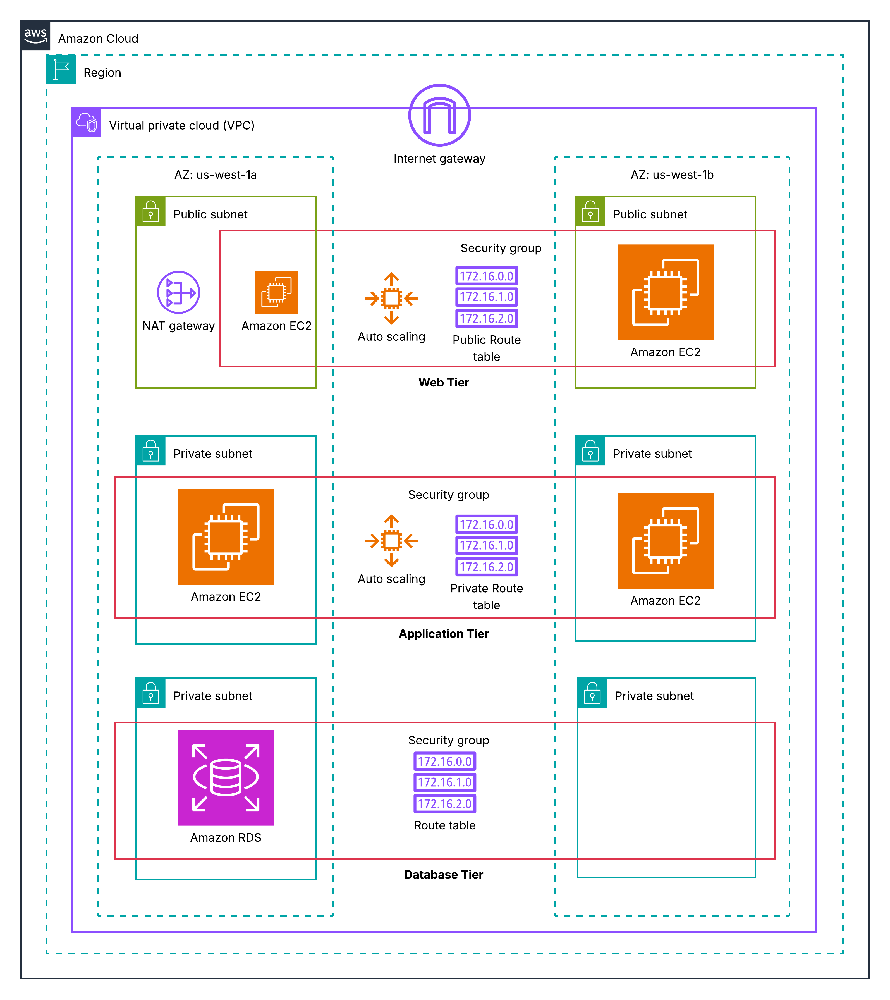

# Day7 - 3tier AWS Arch

## High level Overview

The diagram shows a **VPC** split across **two Availability Zones** (us-west-1a and us-west-1b) for high availability.

Inside the VPC, we have:

1. **Web Tier (public subnets)**
2. **Application Tier (private subnets)**
3. **Database Tier (private subnets)**

Each tier is isolated using **security groups**, **route tables**, and **subnets**.



## **Web Tier — Public Subnets (Top Layer)**

- Public subnets in AZ-1a and AZ-1b
- NAT Gateway (for outbound internet access)
- EC2 instances (or Auto Scaling Group) hosting:
    - Nginx/Apache
    - or a Load Balancer (missing in this diagram but often added)

### **Why public?**

Web tier must accept traffic **from users on the internet**, so they need public IPs.

### **Route Table**

Public route table includes:

```
0.0.0.0/0 → Internet Gateway
```

### **Responsibility**

- Serve static content
- Forward API requests to the Application tier

## **Application Tier — Private Subnets (Middle Layer)**

- Private subnets in both AZs
- EC2 Auto Scaling group (backend logic: Node.js, Python, Java, etc.)
- A private route table (no internet access)

### **Why is it private?**

To protect backend code and API endpoints from direct internet exposure.

### **Route Table**

Private route table:

- **No direct Internet Gateway**
- If needed, outbound traffic goes → NAT Gateway (in Web tier)

### **Responsibility**

- Handle business logic
- Communicate securely with:
    - Web tier (above)
    - DB tier (below)

## **Database Tier — Private Subnets (Bottom Layer)**

### **What it contains**

- RDS instance (MySQL, Postgres, etc.)
- Private subnets (multi-AZ ideally)

### **Why private?**

The database must never be exposed to the internet.

### **Route Table**

Private:

- **No internet**
- Only internal communication allowed

### **Security Groups**

DB SG only allows incoming traffic from **Application Tier SG**.

### **Responsibility**

- Store persistent data
- Stay isolated from public access