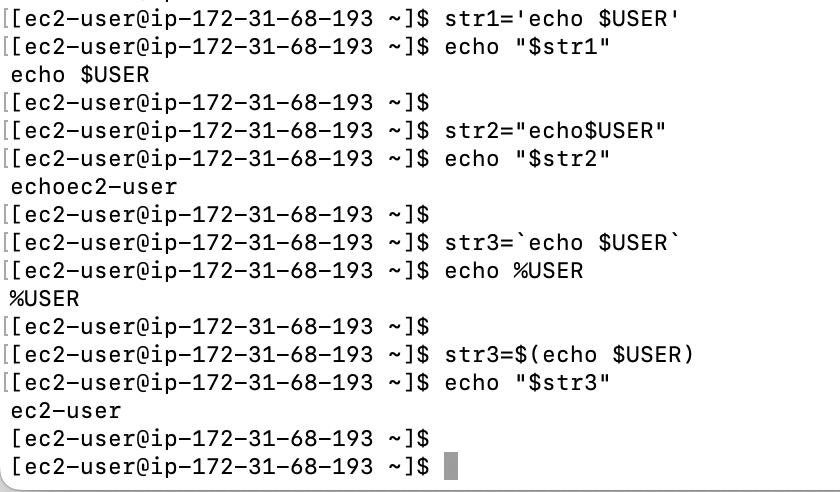
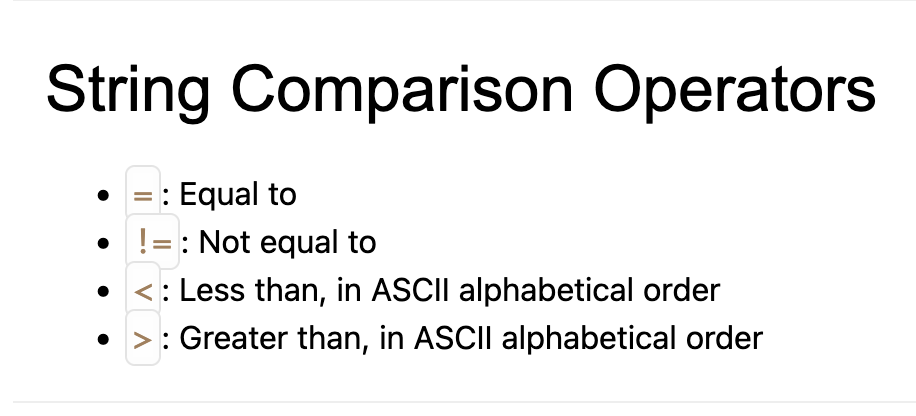

# Day 4 - 20 Nov 2025

## Basic Shell Scripting

```bash
echo $0 → gives which shell we’re using

date → gives date

cat /etc/shells

sh → changes the shell to sh
```

## **Interactive vs Non-Interactive Shells**

A **shell** is basically a command-line interpreter that lets you interact with your operating system. Depending on how it is started and used, a shell can be **interactive** or **non-interactive**.

### **Interactive Shell**

- **Definition:** A shell that interacts directly with the user.
- **How you use it:** You type commands, and it executes them immediately.
- **Characteristics:**
    - Reads commands from **stdin** (your keyboard).
    - Shows prompts (like `$` or `#`).
    - Allows job control (e.g., Ctrl+C to stop a process).
    - Usually reads initialization files like `~/.bashrc` or `~/.zshrc`.
- **Example:** Opening a terminal and typing `ls`, `cd`, `echo $USER`.

### **Non-Interactive Shell**

- **Definition:** A shell that runs commands without direct user interaction.
- **How you use it:** Typically through scripts, automation, or cron jobs.
- **Characteristics:**
    - Reads commands from a **file** or **pipeline**, not from user input.
    - Does **not** display prompts.
    - Often skips interactive-only startup files (`~/.bashrc`) unless explicitly sourced.
- **Example:** Running a script:

```
bash runscript.sh
```

## Subshells

A subshell in Linux is a child process of an existing shell, often referred to as the parent shell. It is a new, separate instance of the shell environment that inherits characteristics from its parent but operates independently.

Key characteristics of subshells:

- **Inheritance:** A subshell inherits the environment variables, current working directory, and file descriptors from its parent shell at the time of its creation.
- **Isolation:** Any changes made to variables (unless exported), functions, or settings
within a subshell are local to that subshell and do not affect the
parent shell's environment once the subshell terminates.
- **Process Separation:** Subshells typically run as distinct processes, allowing for isolated execution of commands and scripts.

How subshells are created:

- **Parentheses** `()`: Enclosing commands within parentheses executes them in a subshell. For example: `(command1; command2)`.
- **Command Substitution:** Using `$(command)` or backticks `` `command` `` creates a subshell to execute the command and capture its output.
- **Executing Scripts:** Running a shell script (e.g., `./myscript.sh`) typically launches a new subshell to execute the script's commands.
- **Pipelining:** Each command in a pipeline (e.g., `command1 | command2`) often runs in its own subshell.
- **Background Processes:** Commands executed in the background using `&` are typically run in a subshell.

Here's an example of using a subshell to set a temporary variable:


## Global Variables:

- **Definition:** Global variables are declared outside of any function or block and are accessible throughout the entire program or script. In the context of the shell, global environment variables are inherited by child processes.
- **Scope:** Their scope extends across the entire script and, if exported, to any sub-shells or child processes spawned by that shell.
- **Usage:** They are useful for storing values that need to be shared or accessed by multiple parts of a program or script.

```bash
name="Karim"

greet() {
  echo "Hello, $name"
}

greet

export name
bash -c 'echo "From subshell: $name"'
```

- **`export name`**→ Makes a shell variable **available to child processes or subshells**.
- **`bash -c`**→ creating a new shell and **accessing variables from the parent shell**:

## Local Variables:

- **Definition:** Local variables are declared within a specific function or block of code.
- **Scope:** Their accessibility is limited to the function or block where they are defined. They cease to exist once the function or block finishes execution.
- **Usage:** They are used to store temporary values needed only within a specific 
function, preventing naming conflicts and promoting modularity.

```bash
greet() { local name="Ali"; echo "Hello, $name"; }; greet; echo "This is $name"
```


Use **`local`** when you want to **avoid affecting global variables**.

Since name is local var, calling it outside the func, returns null

## Inheritance in var

Inherit var in scripts → source <.sh file> → it will make the export var available globally to use

When you run a shell script normally using `./script.sh`, it executes in a **subshell**, which means any variables defined inside the script exist only in that subshell and are **not available** in your current shell after the script finishes. 

However, if you use `source script.sh` (or `. script.sh`), the script runs **in your current shell** instead of a new subshell. This causes all variables and functions defined in the script to be **available globally in your current shell**, as if you had typed them directly in the terminal. If a variable inside the script is marked with `export`, it also becomes available to any **child processes or subshells** started from your shell. Essentially, `source` is used to “inherit” the variables and functions from the script into your current environment, and `export` ensures they are visible to processes spawned from that environment.

test.sh

```bash
#!/bin/bash
export name="Lee Jung Jae"
country="South Korea"
```

terminal

```bash
source test.sh      # Load variables into current shell
echo $name          # Output: Lee Jung Jae
echo $country       # Output: South Korea
bash -c 'echo $name' # Output: Lee Jung Jae (because exported)
bash -c 'echo $country' # Output: (empty, not exported)
```

## Quotations

single, double, back ticks



## Arrays

- An **array** is a variable that can hold **multiple values** in a single variable.
- Each value has an **index** starting from `0`.
- Useful for storing lists, multiple options, or related data.

```bash
fruits=("Apple" "Banana" "Mango")
```

Here, fruits is an array with 3 elements

Use spaces not commas as In Bash arrays, **commas are treated as part of the string**, NOT separators.

Assigning the elements indiviudally

```bash
fruits[0]="Litchi"
fruits[1]="Pineapple"
fruits[2]="Guava"
```

Accessing array elements

```bash
echo ${fruits[0]}   # Output: Apple
echo ${fruits[1]}   # Output: Banana
```

Listing all elements 

```bash
echo ${fruits[@]}   # Output: apple banana cherry
echo ${fruits[*]}   # Output: apple banana cherry
```

Getting Array length

```bash
echo ${#fruits[@]}
```

Adding `#` in front gives **the number of elements**.

## Flow control (if else, loops, switch case)

The condition is enclosed in square brackets `[ ]` and the statement ends with `fi`, which is `if` spelled backward, marking the end of the if block.

```bash
# Basic if statement
num=15
if [ $num -gt 10 ]; then
  echo "Number is greater than 10"
fi
```

```bash
# If...else statement
num=8
if [ $num -gt 10 ]; then
  echo "Number is greater than 10"
else
  echo "Number is 10 or less"
fi
```

```bash
# If...elif...else statement
num=10
if [ $num -gt 10 ]; then
  echo "Number is greater than 10"
elif [ $num -eq 10 ]; then
  echo "Number is exactly 10"
else
  echo "Number is less than 10"
fi
```





For Loops

```bash
for args in $(seq 1 4); do
    echo $args
    touch test.$args
done
```

$(seq 1 4) is sequence of numbers from 1 to 4

```bash
for item in apple banana mango
do
    echo "Fruit: $item"
done
```

```bash
for i in {1..5}
do
    echo $i
done
```

While loops

```bash
counter=5
while [ $counter -ge 0 ]
do
    echo $counter
    ((counter--))
done
```

```bash
counter=5; while [ $counter -ge 0 ]; do echo $counter; ((counter --)); done;
```

- every line inside the loop must be separated. So use ; for each line inside the do
- **`(( ))` is Bash’s arithmetic operator**.

```bash
while read line
do
    echo "Line: $line"
done < file.txt
```

## Functions

```bash
x=5
y=3

sum=$((x + y))   # adds x and y
echo $sum  
```

In Bash, `$(( expression ))` is used to **perform arithmetic calculations**.

- Anything inside `(( ))` is treated as **an integer math expression**.
- Bash normally treats variables as strings. `$(( ))` forces it to treat them as numbers.

## Cron Jobs

The `cron` system is a time-based job scheduler in Unix-like operating systems.

It automates the execution of tasks (known as cron jobs) at specified intervals.

While `cron` is the background service that runs these tasks, `crontab` is the command used to manage them.

There is no direct "cron" command; instead, you use `crontab` to set up and control cron jobs.


```bash
crontab [options]
```

- `e`: Edit the crontab file for the current user.
- `l`: List the crontab entries for the current user.
- `r`: Remove the crontab file for the current user.

```bash
*/2 * * * * rsync -av --delete /home/karim/testDir/ /home/karim/backupDir >> /home/karim/backup.log 2>&1
```

**`/2 * * * *`** → Runs every **2 minutes**.

**`rsync -av --delete source/ destination/`**

- `a` → archive mode (preserve permissions, timestamps, etc.)
- `v` → verbose
- `-delete` → delete files in backupDir that were deleted in testDir
    
    (keeps them perfectly in sync)
    

**`>> /home/karim/backup.log 2>&1`** → Sends all output AND errors to `backup.log`.