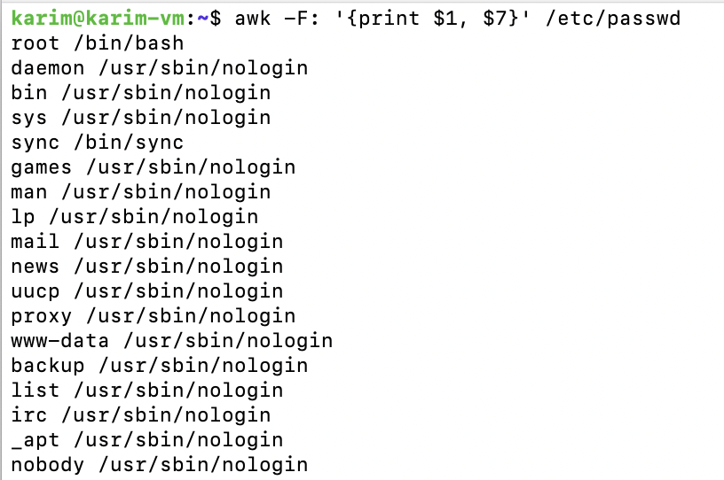

# Day 5 - 21 Nov 2025

`grep`, `awk`, and `sed` are three of the most powerful text‑processing tools in Linux. Every DevOps engineer should know them well. This document explains each tool, their common use cases, essential commands, and examples.

## grep

`grep` is a command-line tool used to **search for text patterns inside files or output**.

### **Common Options**

- `grep "text" file.txt` – search for exact text
- `grep -i` – case‑insensitive search
- `grep -r` – recursive search in directories
- `grep -v` – invert match (show lines *not* matching)
- `grep -n` – show line numbers
- `grep -E` – use extended regex (same as `egrep`)

Showing lines that dont contain the word “success”

```bash
grep -v "success" app.log
```

grep can be used with regex.

```bash
grep -E "\.conf$" files.txt
```

\.conf → matches to .conf

if we dont use \ the . will be interpreted as “any character”

the $ at the ending signifies Lines that **end** with .conf

## awk

`awk` is a **text processing and reporting** tool.

It is mainly used to:

- extract **columns**
- filter **rows**
- perform **calculations**
- format **output**

`awk` treats each line like a **record** and automatically splits it into **columns** (called *fields*).

Basic Syntax

```bash
awk 'pattern { action }' filename
```

printing first col of each line

```bash
aws '{print $1}' file.txt
```

```bash
awk -F: '{print $1, $7}' /etc/passwd
```



printing process with more than 50% cpu usage.

```bash
ps aux | awk '$3 > 50'
```


## sed

`sed` = **S**tream **ED**itor

It reads a file **line by line** and allows you to:

- **edit text**
- **search and replace**
- **delete lines**
- **insert new lines**
- **modify output without opening the file**

By default, sed **does not change the file** unless you use `-i`.

Basic Syntax

```bash
sed 'command' filename
```

Replacing the first hello with bye

```bash
sed 's/hello/bye/' file.txt
```

Replacing all hello with bye

```bash
sed 's/hello/bye/g' file.txt
```

Editing the file

```bash
sed -i 's/dev/prod/g' config.txt
```

`-i`  → rewrites the file directly.

change `port 80` to `port 8080` only if line contains “nginx”

```bash
sed '/nginx/s/80/8080/' logfile.log
```