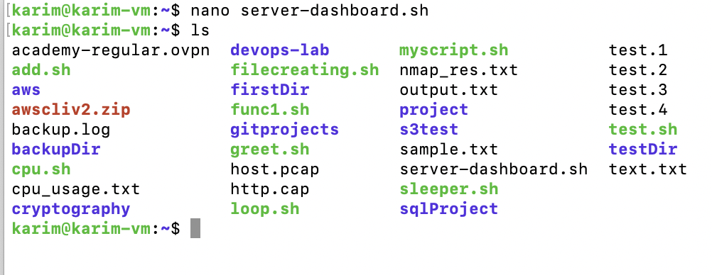

# Weekend Task1

Create a bash script that shows everything at once [server-dashboard.sh](http://onceserver-dashboard.sh/)

- clears screen and shows in color:
- Server name & uptime
- Current user & date
- Disk, memory & CPU usage
- Your external IP
- Last 3 login attempts

Create a bash file

```bash
nano server-dashboard.sh
```



```bash
#!/bin/bash   

# Clear screen
clear #clears the screen

# Colors
# These variables store color codes so you can write readable text like ${GREEN}text${NC} instead of ugly \e[32mtext\e[0m.
RED="\e[31m"
GREEN="\e[32m"
YELLOW="\e[33m"
CYAN="\e[36m"
MAGENTA="\e[35m"
NC="\e[0m" # No Color

# Server name & uptime
echo -e "${CYAN}=== SERVER INFO ===${NC}"
echo -e "${GREEN}Server Name: ${NC}$(hostname)"    #shows hostname
echo -e "${GREEN}Uptime: ${NC}$(uptime -p)"       #shows the uptime
echo                                              #Just spacing

# Current user & date
echo -e "${CYAN}=== USER & DATE ===${NC}"
echo -e "${YELLOW}Current User: ${NC}$(whoami)"     #shows the logged in user
echo -e "${YELLOW}Date: ${NC}$(date '+%Y-%m-%d %H:%M:%S')"    #shows date
echo

# Disk, memory & CPU usage
echo -e "${CYAN}=== SYSTEM USAGE ===${NC}"
echo -e "${MAGENTA}Disk Usage:${NC}"
df -h | awk 'NR==1 || /^\/dev\// {print}'        #shows only the /dev/ disk usage
echo
echo -e "${MAGENTA}Memory Usage:${NC}"
free -h
echo
echo -e "${MAGENTA}CPU Usage:${NC}"
top -bn1 | grep "Cpu(s)" | awk '{print "CPU Load: " $2 + $4 "%"}'   #adds only user + system %) 
echo

# External IP
echo -e "${CYAN}=== NETWORK ===${NC}"
EXT_IP=$(curl -s ifconfig.me)
echo -e "${GREEN}External IP: ${NC}${EXT_IP}"
echo

# Last 3 login attempts
echo -e "${CYAN}=== LAST 3 LOGIN ATTEMPTS ===${NC}"
last -n 3    #Shows the last 3 successful logins (user, terminal, IP, date/time).
echo
```

<aside>
🔥

df -h → print the disk usage for all mounted filesystems in human readable format

I takes the output of df -h ****and sends it as input to awk

awk 'NR==1 || /^\/dev\// {print}’ → If a line matches either NR==1 (header) **or** /^\/dev\// and print it.

</aside>

Make it executable

```bash
chmod +x server-dashboard.sh
```

