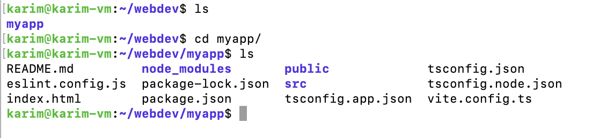
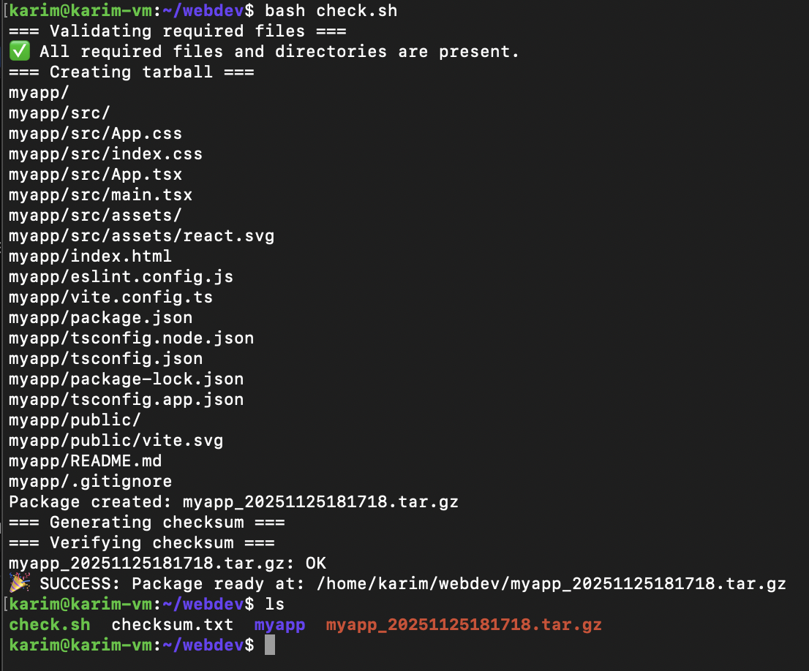

# Assignment: Linux Week 2 day 2

Create a script to:

- Package application code into a versioned tarball.
- Exclude directories like `node_modules` or `.git`.
- Validate required files exist before packaging.
- Generate a checksum file for integrity verification.
- Print the package path on success.

**Expected skills:** `tar`, exclusion patterns, validation, output formatting.

First install npm and node

```bash
# Download Node.js 20.x LTS setup script
curl -fsSL https://deb.nodesource.com/setup_20.x | sudo -E bash -

# Install Node.js (includes npm)
sudo apt install nodejs -y

node -v   # Check Node.js version
npm -v    # Check npm version
```

install git

```bash
sudo apt install git -y
```

check version

```bash
git --version
```

Create react app

```bash
npm create vite@latest myapp
```



initialize git

```bash
git init
```

- Validate required files exist before packaging.

```bash
#!/bin/bash

set -e  # exit if any command fails

APP_DIR="myapp"
PKG_NAME="myapp_$(date +%Y%m%d%H%M%S).tar.gz"   # versioned tarball
CHECKSUM_FILE="checksum.txt"

# List of required files
REQUIRED_FILES=(
    "$APP_DIR/package.json"
    "$APP_DIR/package-lock.json"
    "$APP_DIR/tsconfig.json"
)

# List of required directories
REQUIRED_DIRS=(
    "$APP_DIR/src"
)

echo "=== Validating required files ==="

# Check required files
for file in "${REQUIRED_FILES[@]}"; do
    if [ ! -f "$file" ]; then
        echo "❌ ERROR: Required file missing: $file"
        exit 1
    fi
done

# Check required directories
for dir in "${REQUIRED_DIRS[@]}"; do
    if [ ! -d "$dir" ]; then
        echo "❌ ERROR: Required directory missing: $dir"
        exit 1
    fi
done

echo "✅ All required files and directories are present."

echo "=== Creating tarball ==="

tar -czvf "$PKG_NAME" --exclude="$APP_DIR/node_modules" "$APP_DIR"

echo "Package created: $PKG_NAME"

echo "=== Generating checksum ==="

sha256sum "$PKG_NAME" > "$CHECKSUM_FILE"

echo "=== Verifying checksum ==="

sha256sum --check "$CHECKSUM_FILE"

echo "🎉 SUCCESS: Package ready at: $(realpath $PKG_NAME)"

```

- Package application code into a versioned tarball.
- Exclude directories like `node_modules` or `.git`.

```bash
tar -czvf myapp.tar.gz   --exclude="myapp/node_modules"   --exclude="./.git"   myapp
```

Creating Zip and Archiving

```bash
tar -czvf <filename>.tar.gz <filepath/filepath>
```

Extracting

```bash
tar -xzvf <filename>.tar.gz
```

Reading without extracting

```bash
tar -tzvf <filename>.tar.gz
```

Excluding certain file and folders from tar zip

```bash
tar -czvf archive.tar.gz --exclude='file1.txt' --exclude='directory_to_exclude/' /path/to/directory
```

Checksum

A **checksum** is a **short string of numbers and letters** that represents the contents of a file.

- It’s generated using a **hash function** (like `SHA-256` or `MD5`).
- Even a **tiny change in the file** will produce a completely different checksum.
- It’s used to **verify file integrity** — i.e., to check if the file has been **altered or corrupted**.

- Generate a checksum file for integrity verification.

```bash
#creating a hash and storing in checksum.txt
sha256sum /path/to/file > checksum.txt    
```

```bash
# Verifying file against a checksum
sha256sum --check checksum.txt 
```

## Output

```bash
	chmod +x chech.sh
```

