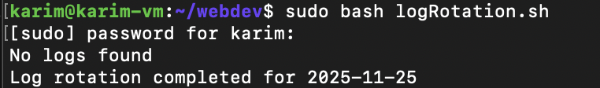
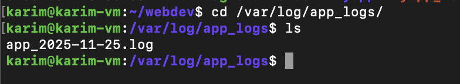

# Assignment 2- week2 day2

***Log Rotation and Cleanup Description:*** 

You need to implement a log rotation system on your server where logs older than 30 days are deleted, and a new log file is created every day. This should be applied to application logs in `/var/log/app_logs/`.**Requirements**:

- Create a script that checks for log files older than 30 days and removes them.
- Ensure that a new log file is created every day with a timestamp.
- Ensure that logs are compressed for archival.

final code

```bash
#!/bin/bash

# Run as root
if [ $EUID -ne 0 ]; then
    echo "Please run as root: sudo $0"
    exit 1
fi

# Declaring vars
log_dir="/var/log/app_logs"
aaja=$(date '+%Y-%m-%d')
hijo=$(date -d "yesterday" '+%Y-%m-%d')

# Creating dir 
mkdir -p "$log_dir"

# Delete logs older than 30 days
find "$log_dir" -type f -mtime +30 -exec rm -f {} \;

if [ -f "$log_dir/app_$hijo.log" ]; then
	tar -czvf "$log_dir/app_$hijo.log.tar.gz" "$log_dir/app_$hijo.log"
	rm -f "$log_dir/app_$hijo.log"  
	echo "Logs are compressed and archieved!"
else
	echo "No logs found"
fi

#Creating todays logs
touch "$log_dir/app_$aaja.log"

echo "Log rotation completed for $aaja"
```

Running the bash script



Checking if new log file is created or not.



Make sure that `/var/log/app_logs/`  exists.

```bash
sudo mkdir -p /var/log/app_logs/
```

Finding files older than 30 days

```bash
find /var/log/app_logs/ -type f -mtime +30
```

One liner for removing files older than 30 days

```bash
find /var/log/app_logs/ -type f -mtime +30 -exec rm -f {} \;
```

OR

Removing those files using loop

```bash
old_files=( $(find /var/log/app_logs/ -type f -mtime +30) )

if [ ${#old_files[@]} -eq 0 ]; then
    echo "No old log files to delete."
else
    for old in "${old_files[@]}"; do
        rm -f "$old"
        echo "Deleted $old"
    done
fi

```

new log file is created every day with a timestamp.

```bash
touch "app_$(date '+%Y-%m-%d').log"
```

Ensure that logs are compressed for archival

```bash
tar -czvf "app_$(date '+%Y-%m-%d').log.tz.gz" "app_$(date '+%Y-%m-%d').log"
```

Use cronjob to run the script everyday

```bash
crontab -e 

0 0 * * * webdev/logRotation.sh
```

