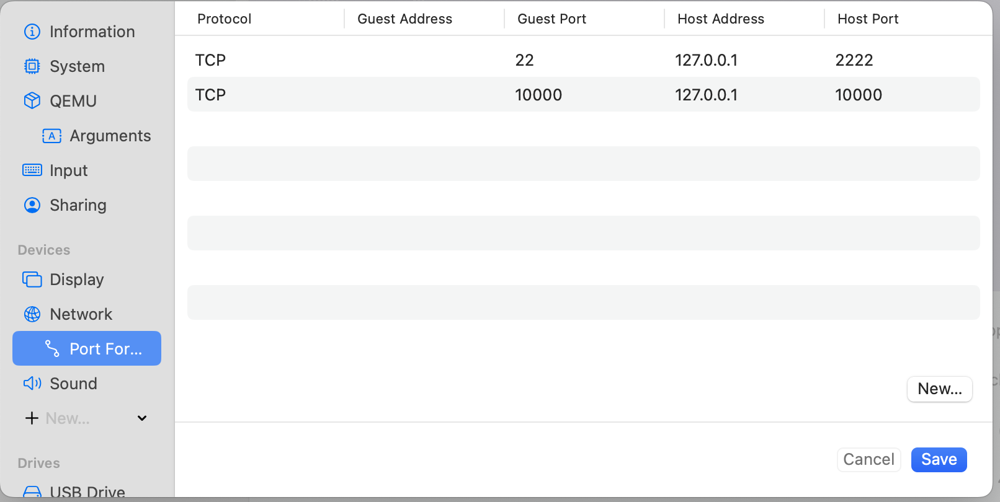
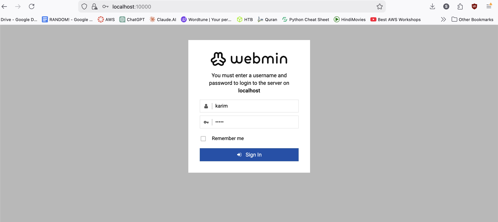
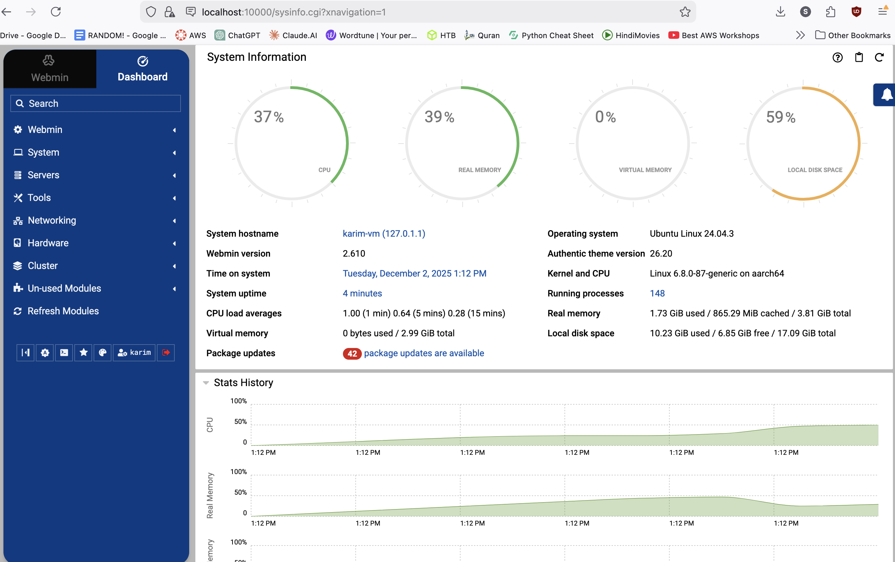

# Webmin

[https://webmin.com/download/](https://webmin.com/download/)

Webmin is a web-based control panel for system administrators to manage Unix-like servers, such as Linux and FreeBSD.

It provides a graphical, browser-based interface for tasks that are typically performed using the command line, such as creating user accounts, configuring services like Apache and BIND, managing software packages, and monitoring system performance. 

This makes server management easier, especially for users who are not familiar with all 
the command-line syntax.

```bash
sudo apt update

sudo apt upgrade
```

```bash
curl -o webmin-setup-repo.sh https://raw.githubusercontent.com/webmin/webmin/master/webmin-setup-repo.sh

sudo sh webmin-setup-repo.sh
```


```bash
sudo apt-get install webmin --install-recommends
```

```bash
systemctl status webmin.service
```


Setting port forwarding



Since Host Port for SSH is set at 2222, with [localhost](http://localhost) as host address, we have to do ssh this way

```yaml
ssh -p 2222 <username>:localhost
```


To connect to the webmin page, use [localhost:10000](http://localhost:10000) (as we have done port mapping)

Use the ubuntu username and password with root privs



