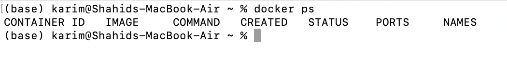
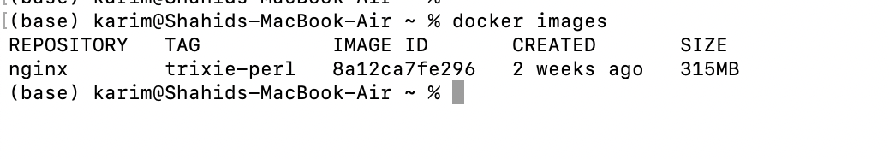
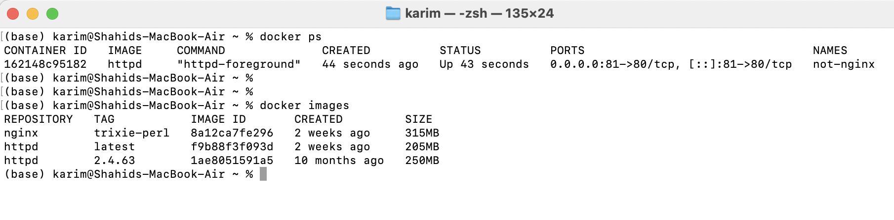
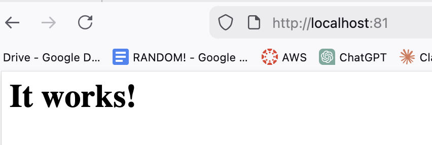
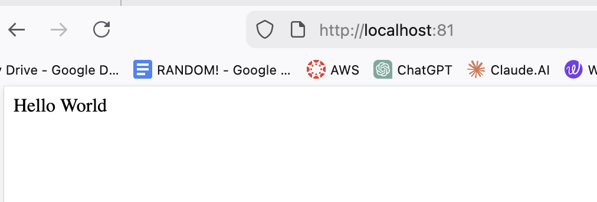
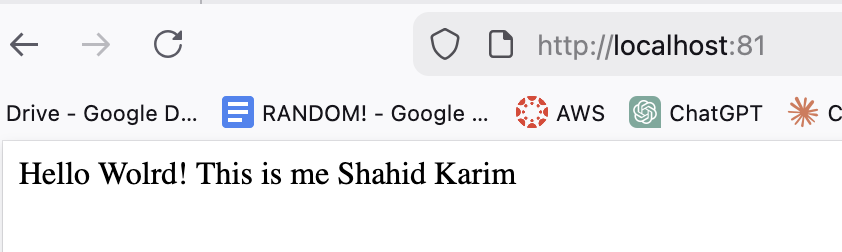
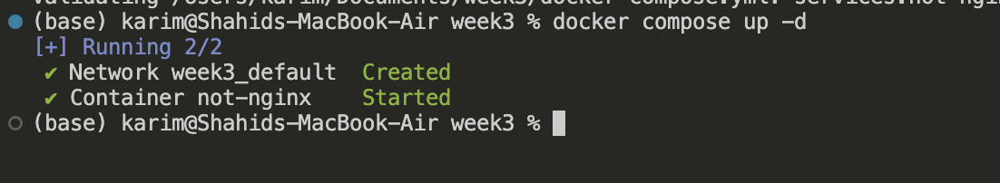
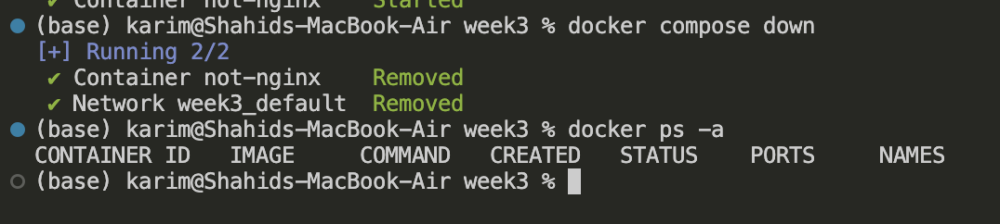
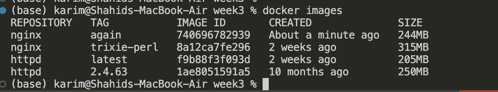
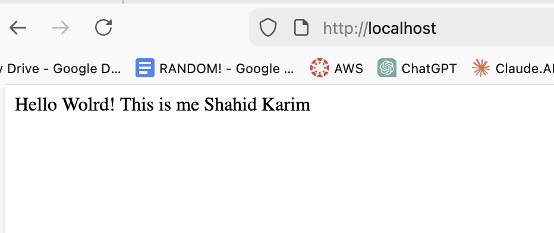

# Docker Basics

Make sure docker is installed.

```bash
docker system ps
```



Check the available images



Remove images

```bash
docker rmi <image_name>
```

Pull image

```bash
docker pull nginx
```

This will pull the nginx with latest tag.

Docker run

```bash
docker run --name not-nginx -p 81:80 -d httpd
```

since httpd:latest is not available locally, it will pull from the remote repo.





Changing the default index.html

/usr/local/apache2/htdocs/index.html  is the default root dir for Apache

edit that file to see the changes.

```bash
echo "Hello World" > index.html

docker cp index.html not-nginx:/usr/local/apache2/htdocs/index.html
```

Container name: `not-nginx` 

File location inside container: `/usr/local/apache2/htdocs/index.html` 



OR we can also use

```bash
docker exec -it <container_name> bash

docker exec -it not-nginx bash

# We will be logged in as root inside the container's file system.
# We can just go to /htdocs/index.html
# do echo "hello world!" > index.html
```

## How to make persistent content?

→ Volume mount binding

make a dir → cd into the dir → create index.html → run the code below

the ./ means current dir

```bash
docker run --name not-nginx -p 81:80 -d -v "./index.html:/usr/local/apache2/htdocs/index.html" httpd
```



→ docker-compose.yml (the best way)

make sure that you are inside the same dir where index.html is present

```bash
services:
  not-nginx:
    image: httpd
    container_name: not-nginx
    ports:
      -"81:80"
    volumes:
      -./index.html:/usr/local/apache2/htdocs/index.html
```

Starting the container

```bash
docker compose up -d
```



Stopping the container and removing it

```bash
docker compose down
```



Lets build docker image

Create Dockerfile

```docker
FROM nginx:latest

COPY index.html /usr/share/nginx/html/index.html

EXPOSE 81
```

Building the image using Dockerfile

```bash
docker build -t nginx:again . 
```



Run the image

```bash
docker run --name not-nginx -p 80:80 -d nginx:again
```

