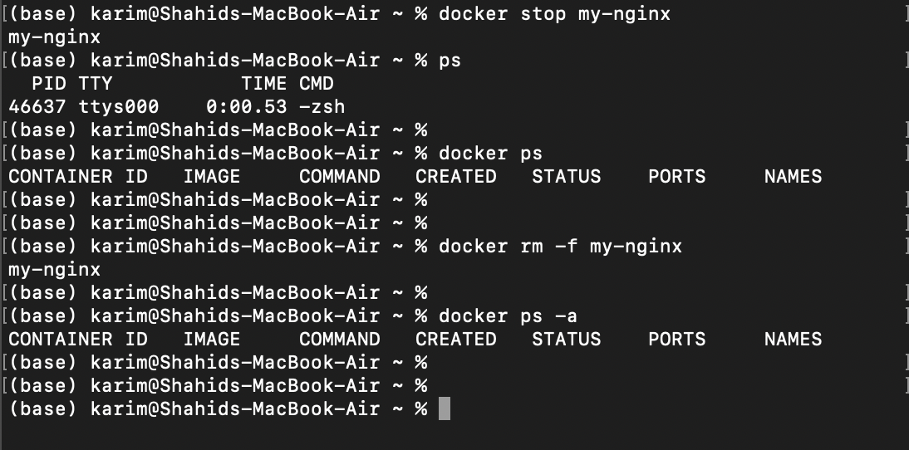
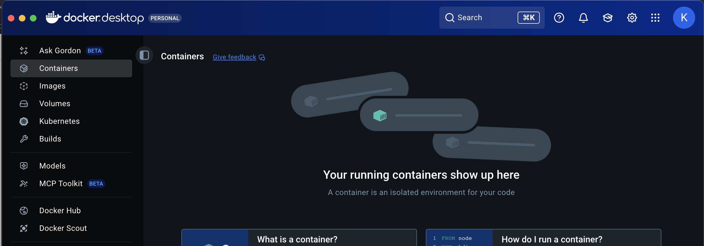

# Docker Assignment

<aside>
📌

## TASK

Pull a NGINX or httpd container.

Browse the default page in [http://localhost](http://localhost/)

Alter the default content.

Stop and start the container again and check if the content persists.

Remove the container and spin it again and check the persistence again.

If content does not persist, try different ways to make it persistence.

</aside>


Pre-requisites

- Docker should be installed
- Should have account in docker hub

Pulling nginx image from Docker Hub

```docker
docker pull nginx:trixie-perl
```


To see the images created

```docker
docker images
```


Creating container and running the image

```docker
docker run --name my-nginx -p 80:80 -d nginx:trixie-perl
```

- `-name my-nginx` → container name
- `-p 80:80` → map container port 80 to host port 80
- `d` → run in detached mode
- `nginx:trixie-perl` → name of image (the tag has to be mentioned)


Alter the default content

Open a bash shell inside the nginx container

```docker
docker exec -it my-nginx bash
```


Nginx serves its default page from /usr/share/nginx/html/index.html

Editing this file will bring changes to the default page.

Stopping and starting nginx container

```docker
docker stop my-nginx

docker start my-nginx
```


Remove the container and spin it again

```docker
docker rm -f my-nginx

docker ps
```


```docker
docker run --name my-nginx -p 80:80 -d nginx:trixie-perl

docker ps
```


My content has changed


The /usr/share/nginx/html/index.html file has returned to default.


Create volume to make data persistent

```docker
docker volume create nginx-data
```


Mount the volume to the container

```bash
docker run -d -p 80:80 --name my-nginx -v nginx-data:/usr/share/nginx/html nginx:trixie-perl
```

**`v`** → Stands for **volume**.

- It tells Docker: “Mount some storage into the container.”

**`nginx-data`** → This is the **name of the volume**.

- It can be an **existing named volume**, or Docker will **create it automatically** if it doesn’t exist.

**`/usr/share/nginx/html`**→ This is the **path inside the container** where the volume will be mounted.

- For NGINX, this is the **default folder for web content** (the default `index.html` lives here).

Anything written to `/usr/share/nginx/html` inside the container is actually stored in the **volume `nginx-data`**.

<aside>
📌

This means:

- Changes **persist** even if the container is removed.
- You can reuse the same volume with a new container to keep the website content.
</aside>

Editing the index.html 

```bash
docker exec -it my-nginx bash
cd /usr/share/nginx/html
echo "Ive written this message with a permanent pen!" > index.html
exit
```


Stopping the container, removing it and again running it

```bash
docker stop my-nginx

docker rm -f my-nginx
```



No containers are found



Running a container

```bash
docker run -d -p 80:80 --name my-nginx -v nginx-data:/usr/share/nginx/html nginx:trixie-perl
```


The data has persisted.

