# Docker Assignment: NGINX Container with Persistent Data

<aside>
📌

## TASK

- Pull a NGINX or httpd container.
- Browse the default page at [http://localhost](http://localhost/).
- Modify the default content.
- Stop and start the container and check if the changes persist.
- Remove the container and spin it up again to verify persistence.
- If content does not persist, explore ways to make it persistent.

</aside>

## Prerequisites

- Docker must be installed.
- Docker Hub account is required.

---

## 1. Pull NGINX Image

```bash
docker pull nginx:trixie-perl
```

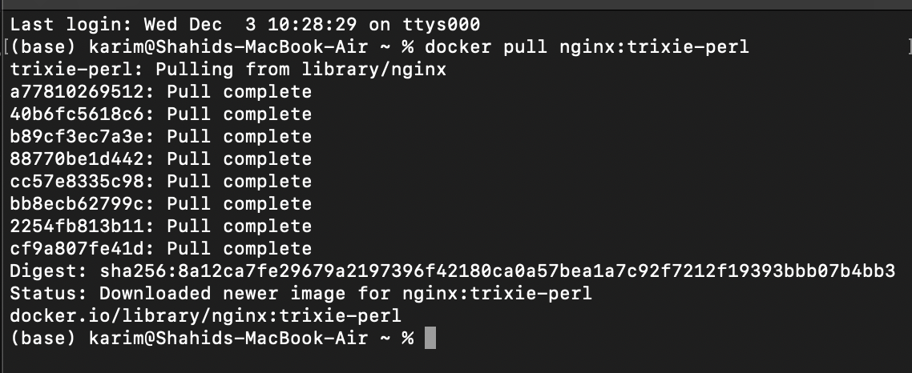
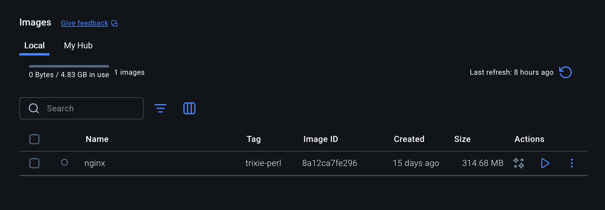

Check downloaded images:

```bash
docker images
```

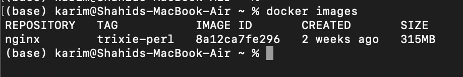

---

## 2. Create and Run Container

```bash
docker run --name my-nginx -p 80:80 -d nginx:trixie-perl
```

- `--name my-nginx` → assigns a name to the container
- `-p 80:80` → maps container port 80 to host port 80
- `-d` → runs container in detached mode
- `nginx:trixie-perl` → specifies the image and tag

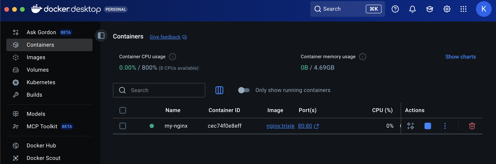
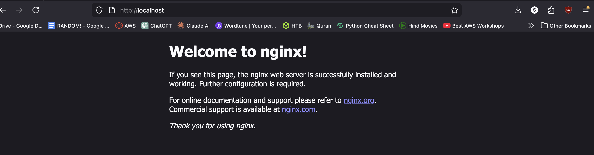

---

## 3. Modify Default Content

Open a shell in the container:

```bash
docker exec -it my-nginx bash
```

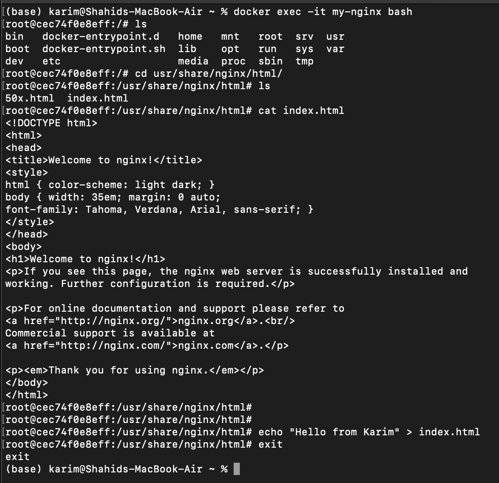

Default NGINX page path:

```
/usr/share/nginx/html/index.html
```

Edit this file to modify the default page.

---

## 4. Stop and Start Container

```bash
docker stop my-nginx
docker start my-nginx
```

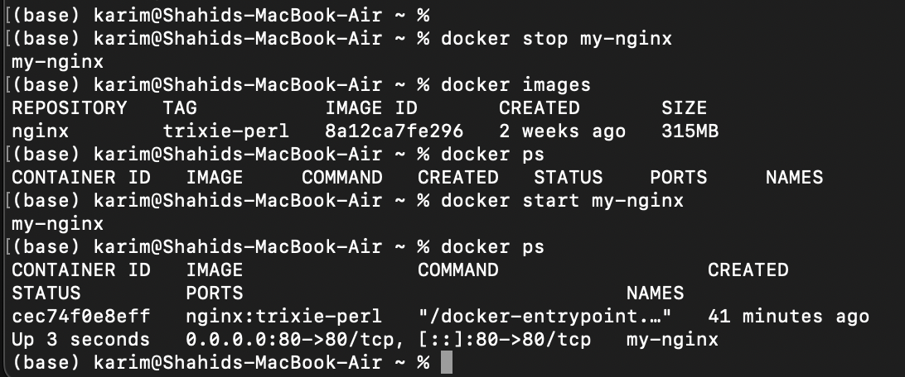
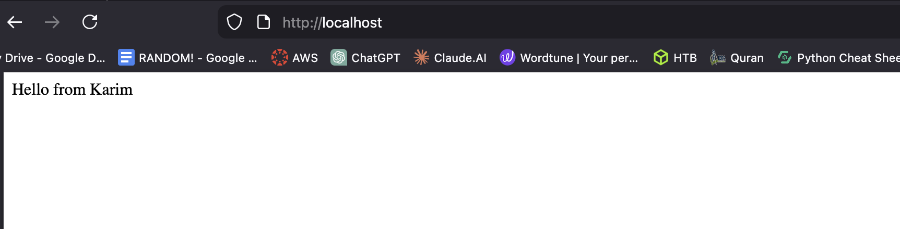

Without a volume, changes do not persist.

---

## 5. Remove Container and Create Again

```bash
docker rm -f my-nginx
docker ps
```

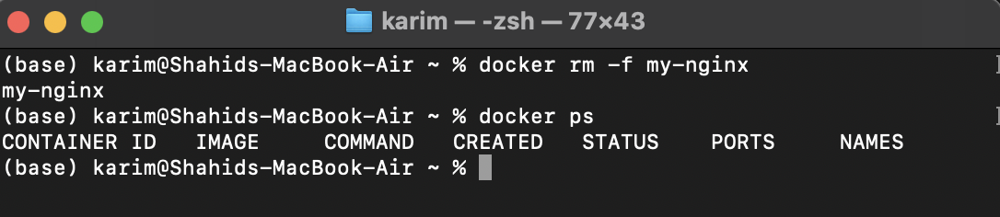
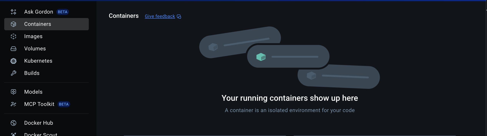

Run new container:

```bash
docker run --name my-nginx -p 80:80 -d nginx:trixie-perl
docker ps
```

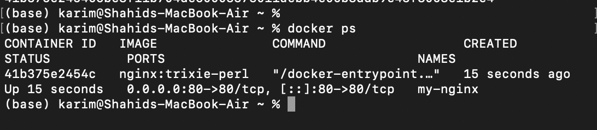
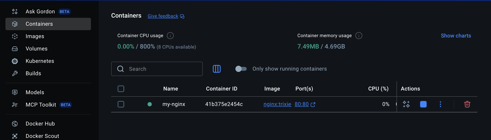

Default content is restored.

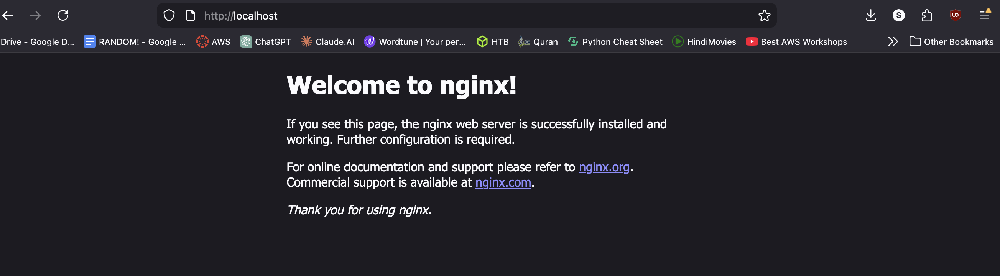


---

## 6. Make Data Persistent Using Docker Volume

### Create Volume

```bash
docker volume create nginx-data
```

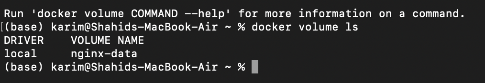

### Run Container with Volume

```bash
docker run -d -p 80:80 --name my-nginx -v nginx-data:/usr/share/nginx/html nginx:trixie-perl
```

- `-v` → mounts storage into the container
- `nginx-data` → name of the volume
- `/usr/share/nginx/html` → container path for web content

> Any changes made here are stored in `nginx-data` and persist across container removal.

---

## 7. Edit index.html in Volume

```bash
docker exec -it my-nginx bash
cd /usr/share/nginx/html
echo "I've written this message with a permanent pen!" > index.html
exit
```

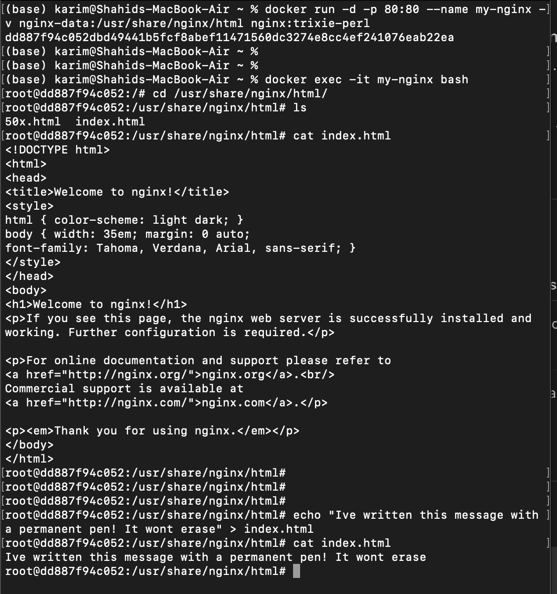
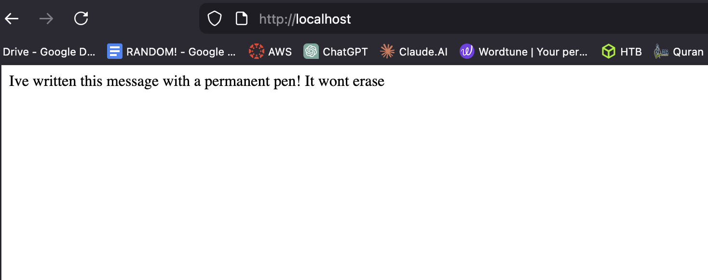

---

## 8. Stop, Remove, and Run Again

```bash
docker stop my-nginx
docker rm -f my-nginx
docker run -d -p 80:80 --name my-nginx -v nginx-data:/usr/share/nginx/html nginx:trixie-perl
```

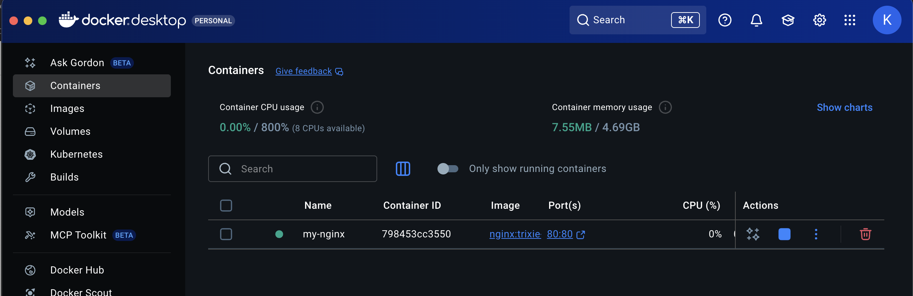
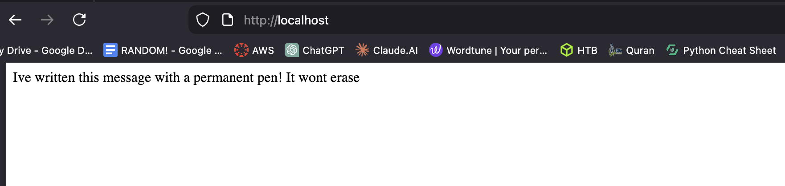

Your changes persist because they are stored in the Docker volume.

---

## ✅ Key Takeaways

- Mounting a volume overrides the container's folder.
- Named volumes copy default container content when first created.
- Changes inside the mounted volume persist even if the container is removed.
- The same volume can be reused for new containers to maintain content.

