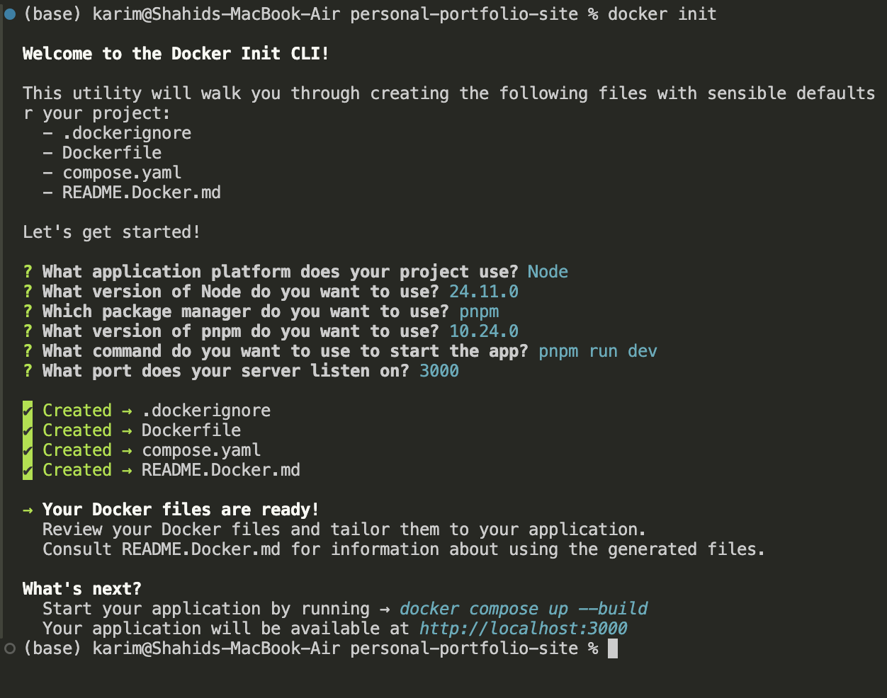
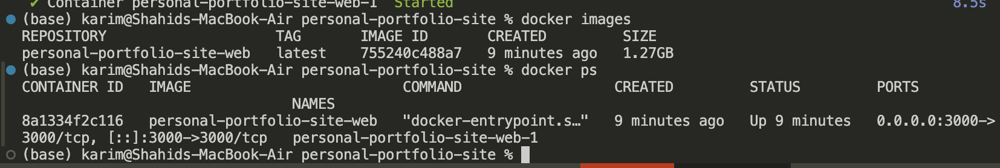
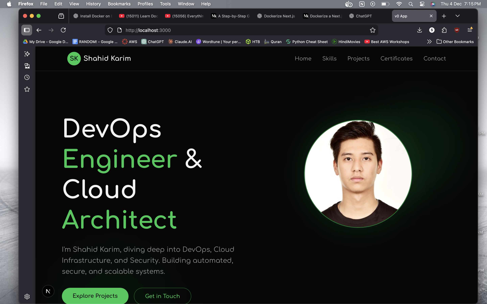
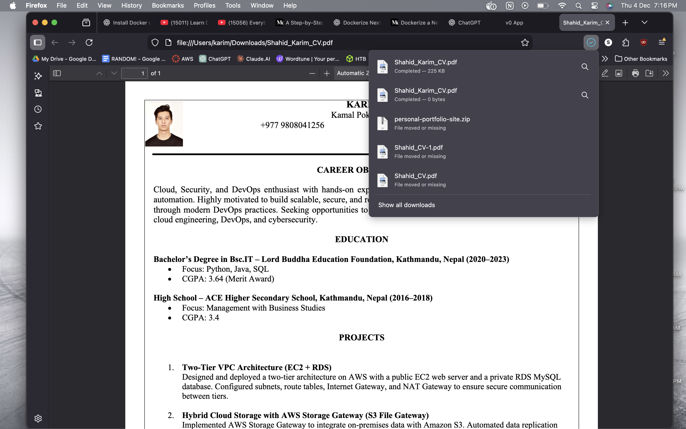
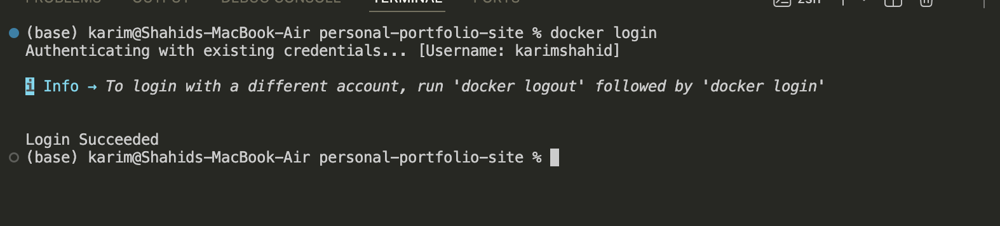
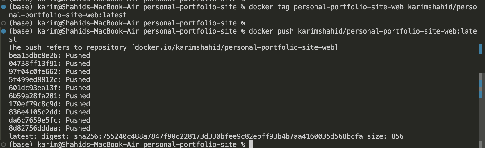
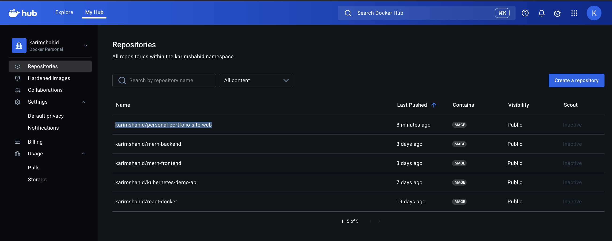
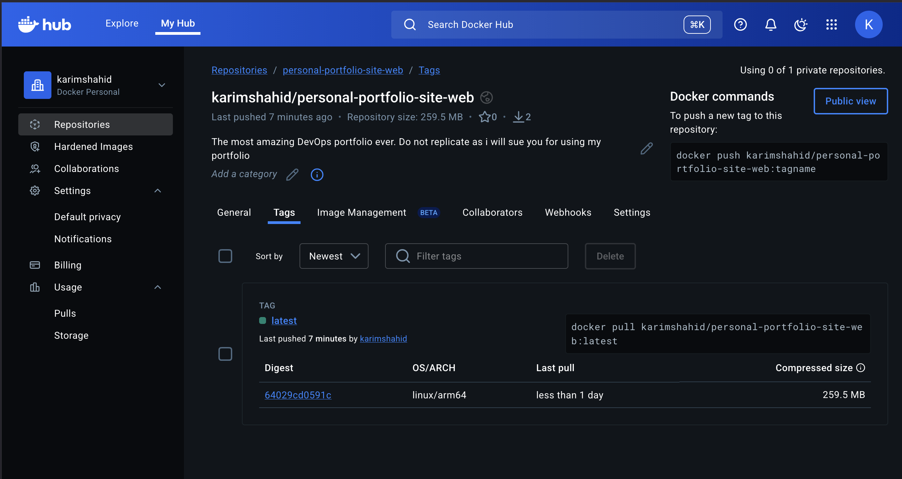

# Dockerize NextJs App

Pre-requisistes:

- Have a next js app ready
- Understand the workflow in the app
- Docker is installed and running

<aside>
📌

im using macOS so the docker engine will start running once i open the docker desktop

</aside>

Initialize the docker files

```bash
cd personal-portfolio-site

docker init
```



<aside>
📌

- Edit the Dockerfile
- dont need package-lock.json as the project uses pnpm
- the “npm install -g pnpm” → for installing pnpm later on
</aside>

Dockerfile

```docker
ARG NODE_VERSION=24.11.0
ARG PNPM_VERSION=10.24.0

FROM node:${NODE_VERSION}-alpine

# Install pnpm.
# buildkit mounts for caching npm downloads**, which speeds up rebuilds.
# Pinning `PNPM_VERSION` ensures reproducible builds. 
RUN --mount=type=cache,target=/root/.npm \
    npm install -g pnpm@${PNPM_VERSION}
   

WORKDIR /app

COPY package.json pnpm-lock.yaml ./
RUN pnpm install

# Copy the rest of the source files into the image.
COPY . .

# Expose the port that the application listens on.
EXPOSE 3000

# Run the application.
CMD ["pnpm", "run", "dev"]

```

docker-compose.yml

```yaml
services:
  web:
    build:
      context: .
    environment:
      NODE_ENV: development
    volumes:
      - .:/app
      - /app/node_modules
    ports:
      - 3000:3000
```

.:/app

- This mounts your **local project folder** (`.`) into the container at `/app`.
- Why:
    - Any code you edit locally (JS/TS, components, styles) **instantly updates** inside the container.
    - Allows **hot-reload** with `pnpm dev`.
- Without this, you’d have to rebuild the Docker image every time you change code — very slow.

/app/node_modules

- This is a **named or anonymous volume** that **overrides the mounted `/app/node_modules` from your local machine**.
- Why:
    - You **don’t want to use local `node_modules`** inside the container, because:
        - Your host machine is macOS (x86/arm)
        - The container is Linux (arm64 or x86_64)
        - Native packages may **not be compatible**
- By creating a volume for `/app/node_modules`, the container uses its own **Linux-compatible dependencies**, while still letting your code stay live with `.:/app`.

Build and start the container

```bash
docker compose up -d
```

Check if image and container are created.

```bash
docker images

docker ps
```



The nextjs app is working perfectly in localhost:3000



Make sure that download cv button actually works.



Push to docker hub

```bash
docker login
```



```bash
docker tag personal-portfolio-site-web karimshahid/personal-portfolio-site-web:latest
```

personal-portfolio-site-web → local image name

karimshahid → docker hub username

karimshahid/personal-portfolio-site-web:latest → remote image name

```bash
docker push karimshahid/personal-portfolio-site-web:latest
```



Docker Hub



