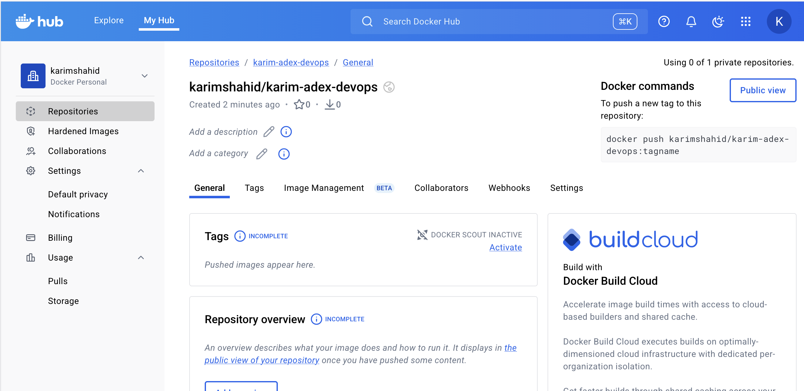
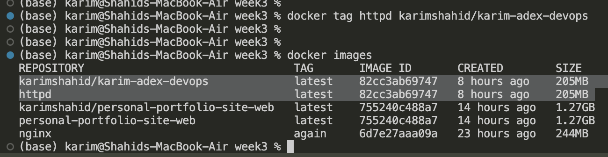
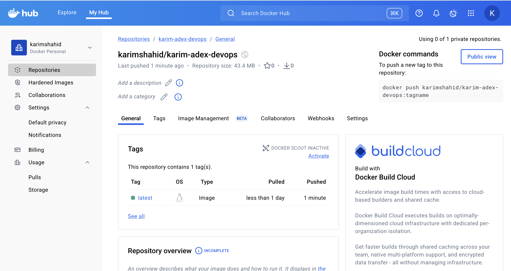

# Docker Hub

Create account → match with Docker Desktop

Login

Create repo



Login

```bash
docker login
```

Creating Docker Hub Repo

```bash
docker tag <local_image_name> <Username>/<repo_name>:<tag>

docker tag httpd karimshahid/karim-adex-devops
```



Push to DockerHub

```bash
docker push <username>/<Repo_name>:<tag>

docker push karimshahid/karim-adex-devops
```



Pulling someones image

Since im running ARM64 and the image is AMD64, we need to change the platform with pulling it.

```bash
docker pull --platform linux/amd64 yshakya/adex-devops
```

Running container

```bash
docker run --platform linux/amd64 -p 81:80 -d yshakya/adex-devops
```


Best practise

```bash
docker buildx build --platform linux/amd64,linux/arm64 -t <you>/<image>:latest --push .
docker compose up
```