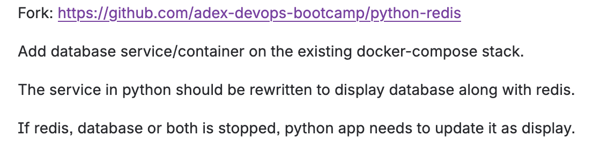
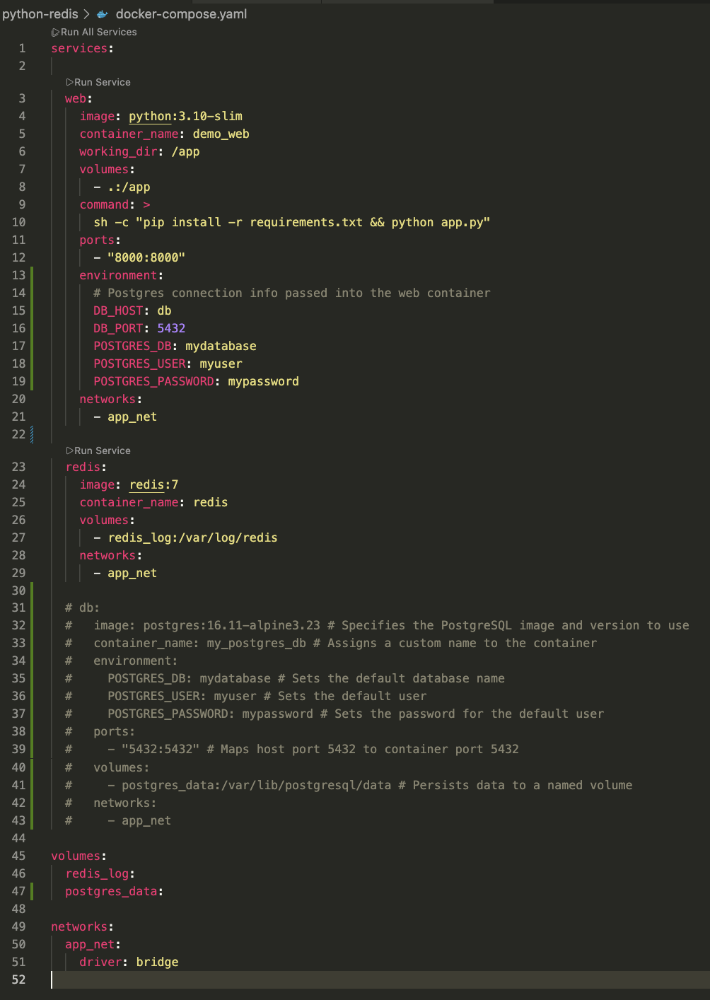
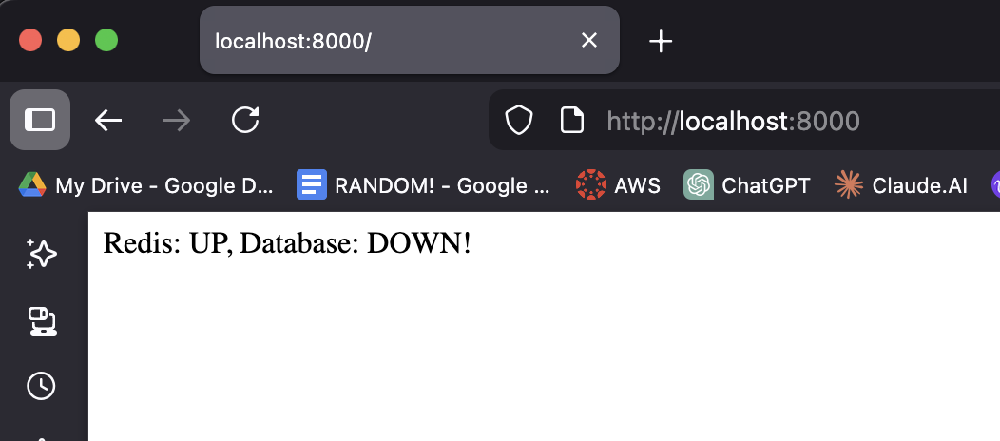
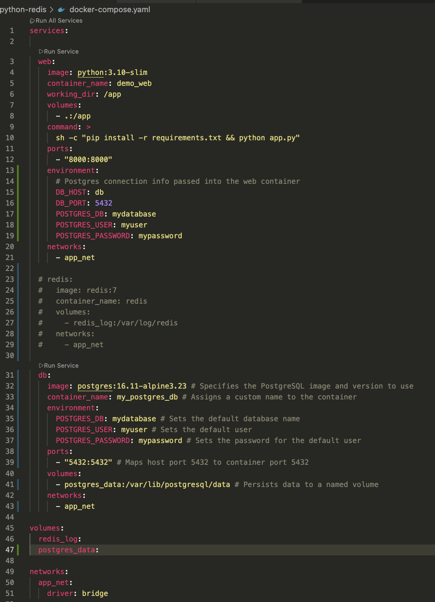
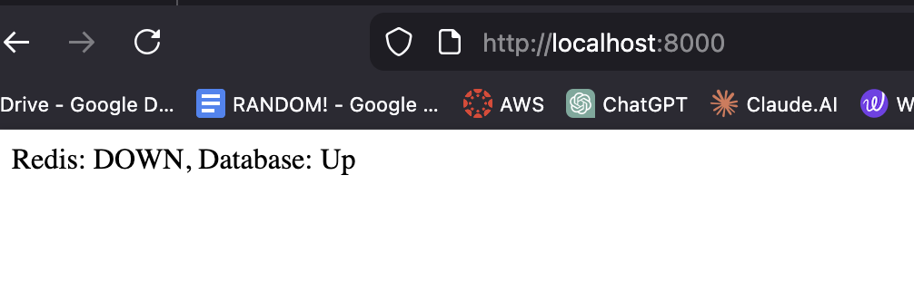

# Python-Redis Docker

## Task:



app.py

```python
from flask import Flask
import redis

app = Flask(__name__)

r = redis.Redis(host="redis", port=6379)

@app.route("/")
def check_redis():
    try:
        r.ping()
        return "Redis is UP!"
    except:
        return "Redis is DOWN!"

if __name__ == "__main__":
    app.run(host="0.0.0.0", port=8000)
```

- `Flask` → a lightweight Python web framework for building web servers.
- `Redis` → in-memory key-value store often used for caching or quick data lookups.

- `r=redis.Redis(host="redis", port=6379)` → creating a Redis client that connects to a Redis server.
- `host="redis"` → this name must match the service name in `docker-compose.yml`.
    - In Docker Compose, services can reach each other by service name.
    - So the Redis container is called `redis`, and your Python app connects to it using that name.
- `port=6379` → Redis always runs on this default port.

- `@app.route("/")` → defines what happens when a browser visits the root path (`/`).
- Inside the function:
    - `r.ping()` → sends a "ping" command to redis.
    - If Redis responds → `"Redis is UP!"`
    - If redis is not reachable → `"Redis is DOWN!"`

docker-compose.yml

```yaml
services:

  web:
	  #This service will run a container based on the official Python 3.10 slim image
    image: python:3.10-slim
    
    container_name: demo_web
    
    #Inside the container, the directory /app becomes the working directory.
    working_dir: /app
    
    # This mounts your current folder (where docker-compose.yml is) into the container at /app.
		#This is called a bind mount.
    volumes:
      - .:/app
	  #This overrides the containers default command.
    command: >
      sh -c "pip install -r requirements.txt && python app.py"
    ports:
      - "8000:8000"
    # Places this container on a Docker network named app_net
		# Containers on the same network can talk to each other
		# So the web container can reach the redis container by its name redis
    networks:
      - app_net

  redis:
	  # Uses the official Redis version 7 (stable) image.
    image: redis:7
    container_name: redis
    
    #A named volume called redis_log stores Redis log files permanently in /var/log/redis.
    volumes:
      - redis_log:/var/log/redis
      
    # Places Redis on the same network so your Flask app can reach it.
    networks:
      - app_net

volumes:
  redis_log:

# Creating a custom network using the bridge driver.
networks:
  app_net:
    driver: bridge
```

- `sh -c` → run a shell command.
- `"pip install -r requirements.txt && python app.py"` →
    - Step 1: install everything from requirements.txt
    - Step 2: run your Flask app

So every time you run `docker compose up`, it installs dependencies fresh.

requirements.txt

```
flask
redis
```

Run the compose file

```bash
docker compose up -d
```

Use http:localhost:8000


## Adding database (postgres) service container

new docker-compose.yml

```bash
services:

  web:
    image: python:3.10-slim
    container_name: demo_web
    working_dir: /app
    volumes:
      - .:/app
    command: >
      sh -c "pip install -r requirements.txt && python app.py"
    ports:
      - "8000:8000"
    environment:
      # Postgres connection info passed into the web container
      DB_HOST: db
      DB_PORT: 5432
      POSTGRES_DB: mydatabase
      POSTGRES_USER: myuser
      POSTGRES_PASSWORD: mypassword    
    networks:
      - app_net
      
  redis:
    image: redis:7
    container_name: redis
    volumes:
      - redis_log:/var/log/redis
    networks:
      - app_net
      
  db:
    image: postgres:16.11-alpine3.23 # Specifies the PostgreSQL image and version to use
    container_name: my_postgres_db # Assigns a custom name to the container
    environment:
      POSTGRES_DB: mydatabase # Sets the default database name
      POSTGRES_USER: myuser # Sets the default user
      POSTGRES_PASSWORD: mypassword # Sets the password for the default user
    ports:
      - "5432:5432" # Maps host port 5432 to container port 5432
    volumes:
      - postgres_data:/var/lib/postgresql/data # Persists data to a named volume
    networks:
      - app_net 

volumes:
  redis_log:
  postgres_data:

networks:
  app_net:
    driver: bridge

```

New app.py

```bash
from flask import Flask
import redis
import psycopg2
from psycopg2 import OperationalError
import os

app = Flask(__name__)

r = redis.Redis(host="redis", port=6379)
    
def check_db():
     """Try connecting to PostgreSQL to see if it's running"""
     try:
        conn = psycopg2.connect(
            host=os.getenv("DB_HOST", "db"),
            database=os.getenv("POSTGRES_DB"),
            user=os.getenv("POSTGRES_USER"),
            password=os.getenv("POSTGRES_PASSWORD"),
            port=int(os.getenv("DB_PORT",5432))
        )
        conn.close()
        return True
     except OperationalError:
         return False
            

@app.route("/")
def health():
    try:
        r.ping()
        redis_stats = "UP"
    except redis.exceptions.ConnectionError:
        redis_stats = "DOWN"

    db_stats = "Up" if check_db() else "DOWN!"
    return f"Redis: {redis_stats}, Database: {db_stats}"

if __name__ == "__main__":
    app.run(host="0.0.0.0", port=8000)

```

new requirements.txt

```bash
flask
redis
psycopg2-binary
```

Running the compose file

```bash
docker compose up -d
```


## Stopping the database





## Stopping Redis



