# Multi Stage Docker

Basic Project Structure

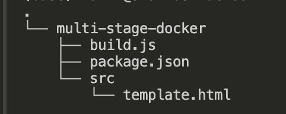

build.js

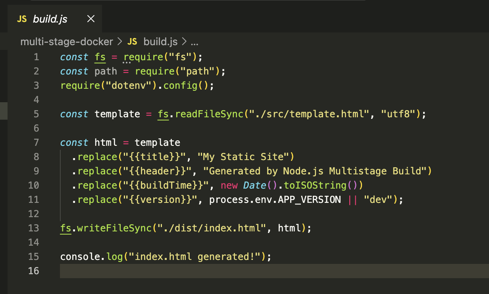

src/template.html

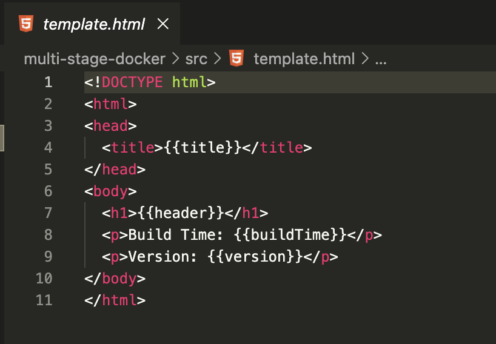

package.json

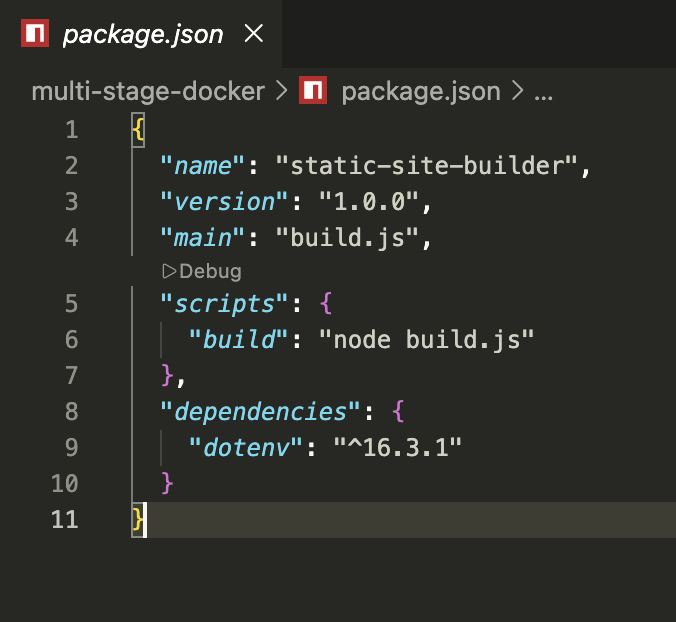

Summary:

- This project is a **Node.js static site generator**.
- `build.js` reads a template, replaces placeholders dynamically, and outputs `dist/index.html`.
- The generated HTML can be served as a static file, possibly as part of a **multi-stage Docker build** to produce a lightweight production image.

Create Dockerfile

```bash
FROM node:20-alpine as builder

# ARG APP_VERSION=1.0.0.1
# ENV APP_VERSION=$APP_VERSION

WORKDIR /app

# Copy only package.json first
COPY package*.json ./

# Install deps as root (default)
RUN npm install

# Copy rest of the code
COPY . .

# make sure that dist dir is present
RUN mkdir -p dist

# Run the build script to generate index.html
RUN npm run build

#--------- stage 2 ------------

FROM nginx:stable-alpine

COPY --from=builder /app/dist /usr/share/nginx/html

EXPOSE 80
```

Edit the .env file

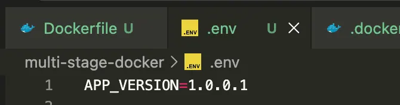

Create the image

```bash
docker build -t my-web:1.0.0.1 .
```


Spinning the container

```bash
docker run -p 80:80 -d --name my-web-container my-web:1.0.0.1

```

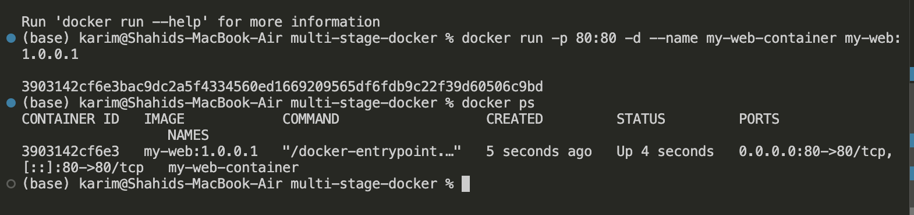

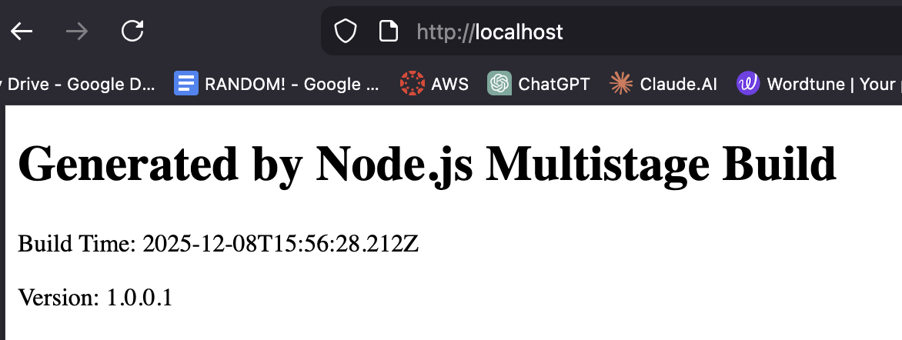

Edit the .env file

Since we have edited the .env → its used during the build time so we have to build new image

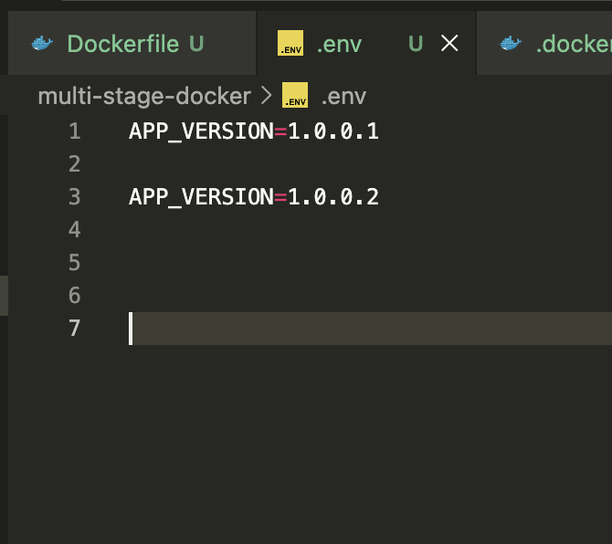

Create new image

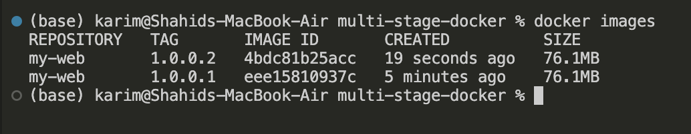

Spin new container

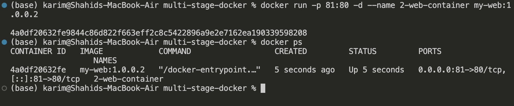

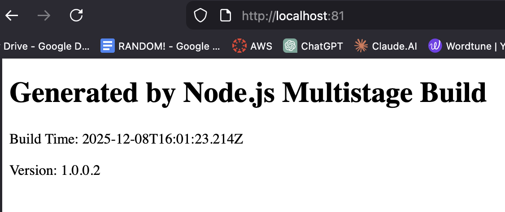