# AWS CLI Setup

## Task

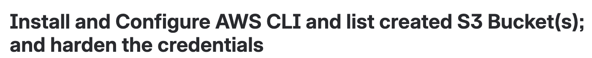

Install aws cli on MacOS 🍎

```bash
brew install awscli
```

check version

```bash
aws --version
```

Configure the cli

```bash
aws configure
```

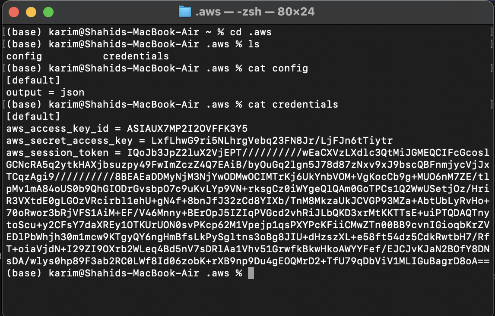

## Creating a bucket via clickops

- Click on create a bucket

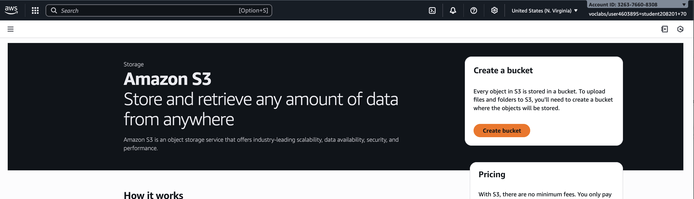

- The bucket name should be unique
- Keep everything default

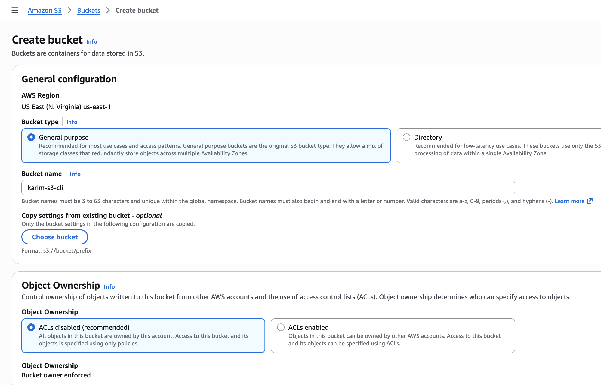

- click on create bucket

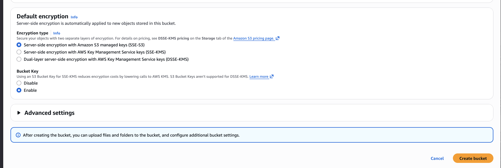

Bucket is ready

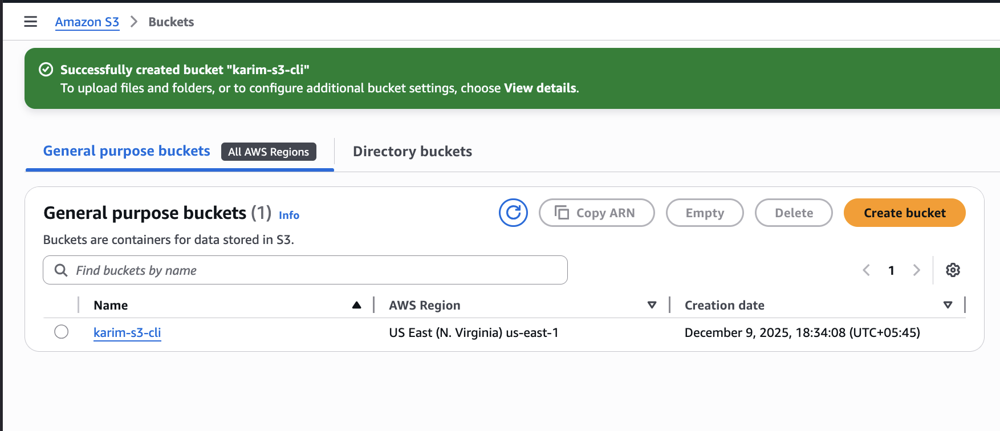

Using CLI to check if bucket is available

```bash
aws s3 ls
```

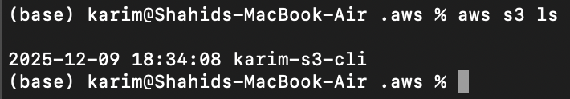

## Creating a s3 bucket using CLI

```bash
aws s3 mb s3://<bucket-name> --region <region_name>

aws s3 mb s3://unique-bucket-9990 --region us-east-1
```

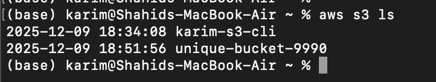

Copying files into s3

```bash
aws s3 cp <file-name> s3://<bucket_name> 

aws s3 cp <directory-name> s3://<bucket_name> --recursive
```

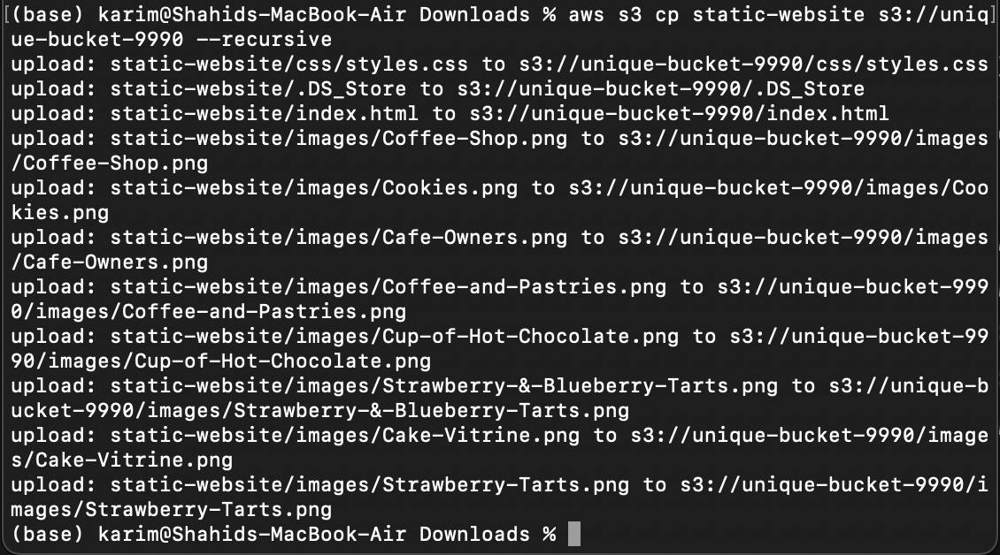

Checking inside the bucket

```bash
aws s3 ls s3://<bucket_name>/

# Lists all the dirs and files inside the bucket
aws s3 ls s3://<bucket_name>/ --recursive
```

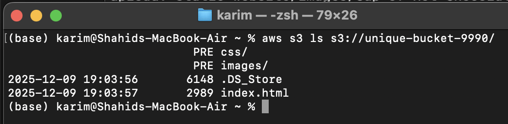

Remember to use “/” to see the contents of a dir


## Hardening Tactics

1. DO NOT store credentials inside your project folders → Instead, AWS credentials must only live in 

~/.aws/credentials
~/.aws/config

1. Only your user should be able to read them.

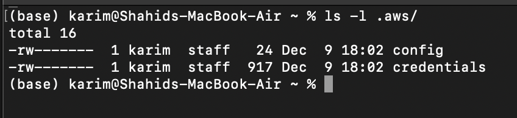

2. Only your user should be able to read them. (Principle of Least Priviledge)
3. Rotate your Access Keys every 60–90 days
4. DO NOT export credentials in shell environment
5. Use AWS generated short term temporary credentials e.g via STS or Instance Role, instead of creating long term Access Keys for IAM users
6. Disabled/Delete unused Access Keys
7. Enable Two-factor authentication on IAM users