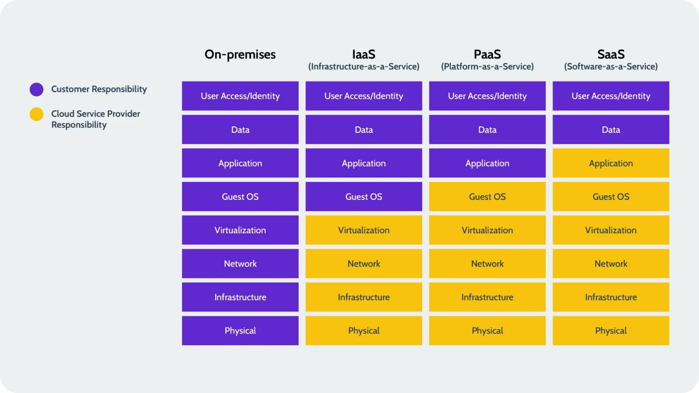

# Cloud Service Model

Cloud computing provides different levels of services to organizations and individuals. These services are generally categorized into three main models: **IaaS (Infrastructure as a Service)**, **PaaS (Platform as a Service)**, and **SaaS (Software as a Service)**. Each model offers a different level of control, flexibility, and management responsibility.

---

## **1. IaaS – Infrastructure as a Service**

**Definition:**

IaaS provides virtualized computing resources over the internet. This includes virtual machines, storage, networks, and operating systems. The user manages applications, data, and runtime, while the provider manages the underlying infrastructure.

**Key Features:**

- On-demand access to resources
- Highly scalable and flexible
- Pay-as-you-go pricing
- Full control over the OS and software stack

**Examples of IaaS:**

- **Amazon Web Services (AWS) EC2** – Provides virtual servers to run applications.
- **Microsoft Azure Virtual Machines** – Deploy and manage Windows/Linux VMs.
- **Google Cloud Compute Engine** – Offers VMs with customizable CPU, memory, and storage.

**Use Case:**

- Hosting a custom web application with full control over the server environment.

## **2. PaaS – Platform as a Service**

**Definition:**

PaaS provides a platform allowing customers to develop, run, and manage applications without dealing with infrastructure. It abstracts underlying hardware and operating systems while providing tools for application development and deployment.

**Key Features:**

- Simplifies development and deployment
- Includes runtime, middleware, and development tools
- Supports scalability and collaboration
- Focused on developers

**Examples of PaaS:**

- **Google App Engine** – Deploy web apps without managing servers.
- **Microsoft Azure App Service** – Supports multiple programming languages and frameworks.
- **Heroku** – Platform to deploy, manage, and scale applications quickly.

**Use Case:**

- Developing a web app where the developer focuses only on code, not on server management.

## **3. SaaS – Software as a Service**

**Definition:**

SaaS provides software applications over the internet on a subscription basis. Users access software through a web browser without worrying about infrastructure, platforms, or maintenance.

**Key Features:**

- No installation or maintenance required
- Accessible from anywhere with internet
- Subscription-based pricing
- Automatic updates

**Examples of SaaS:**

- **Google Workspace (Docs, Gmail, Drive)** – Productivity apps online.
- **Salesforce** – CRM software for sales and marketing.
- **Zoom** – Online video conferencing platform.

**Use Case:**

- Using an email service or CRM without installing software locally.

## **Comparison Table of Cloud Models**

| Feature / Model | IaaS | PaaS | SaaS |
| --- | --- | --- | --- |
| User Control | High | Medium | Low |
| Provider Responsibility | Hardware, Network | Hardware, Network, OS, Middleware | Everything except user data |
| Scalability | High | High | High |
| Examples | AWS EC2, Azure VMs | Google App Engine, Heroku | Gmail, Salesforce, Zoom |
| Use Case | Custom app hosting | App development platform | Ready-to-use applications |

---

**Summary:**

- **IaaS:** Provides infrastructure, full control over OS and apps.
- **PaaS:** Provides platform for app development without managing servers.
- **SaaS:** Provides ready-to-use software over the internet.