# Jack and the AWS BeanStalk

Open ElasticBean Stalk in AWS console

→ Create Application

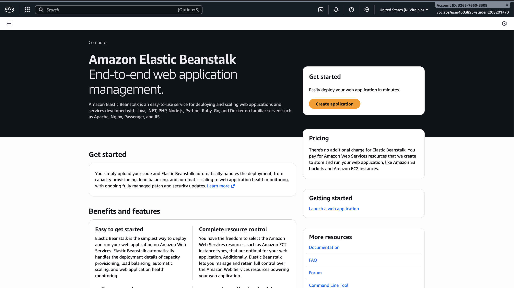

Configure the environment

→ Add app name

→ Add domain name

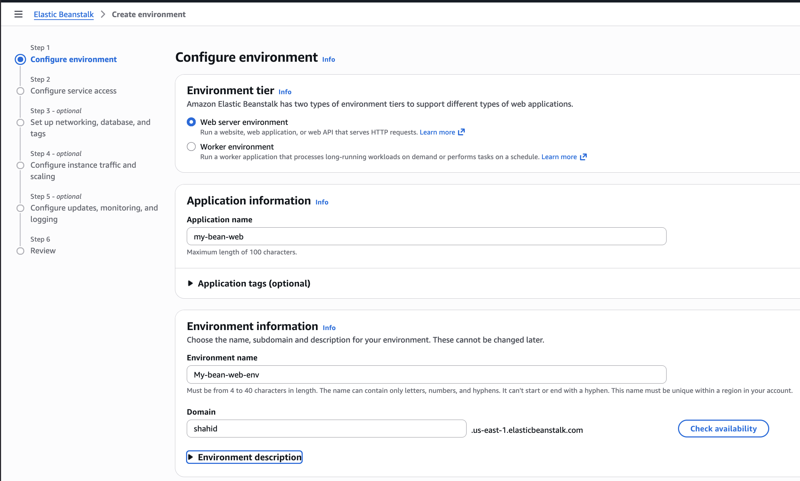

Choose the platform

Add the code

→ Make sure that app is zipped

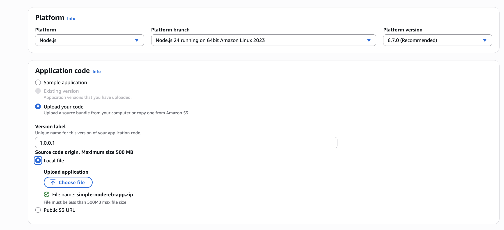

Single instance cause its free tier

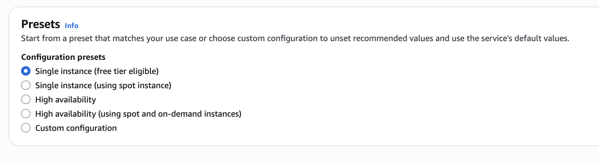

Select roles

and Key pair (optional)

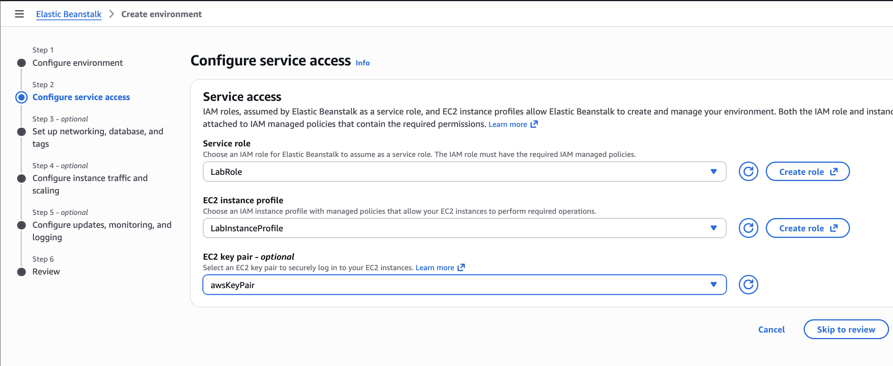

Select the default VPC or create your own

Select the required subnets

Leaving The db section empty

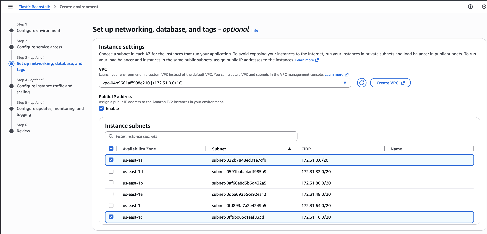

Root Volume → General Purpose SSD

SG → default sg

Leave everything as default

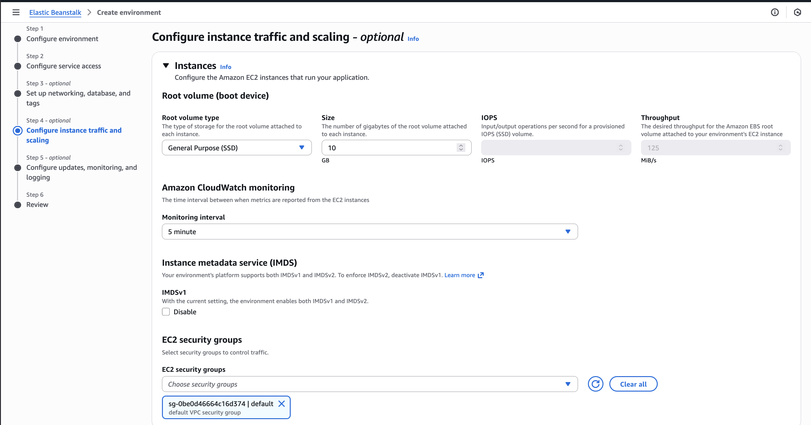

Small Changes.

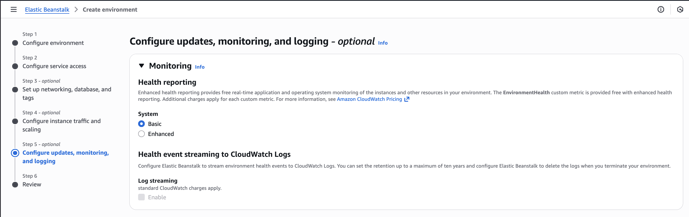

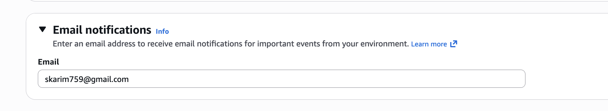

It works!

## Changing the version

Edited the index.html to show “*Version:2.0.0.0”*

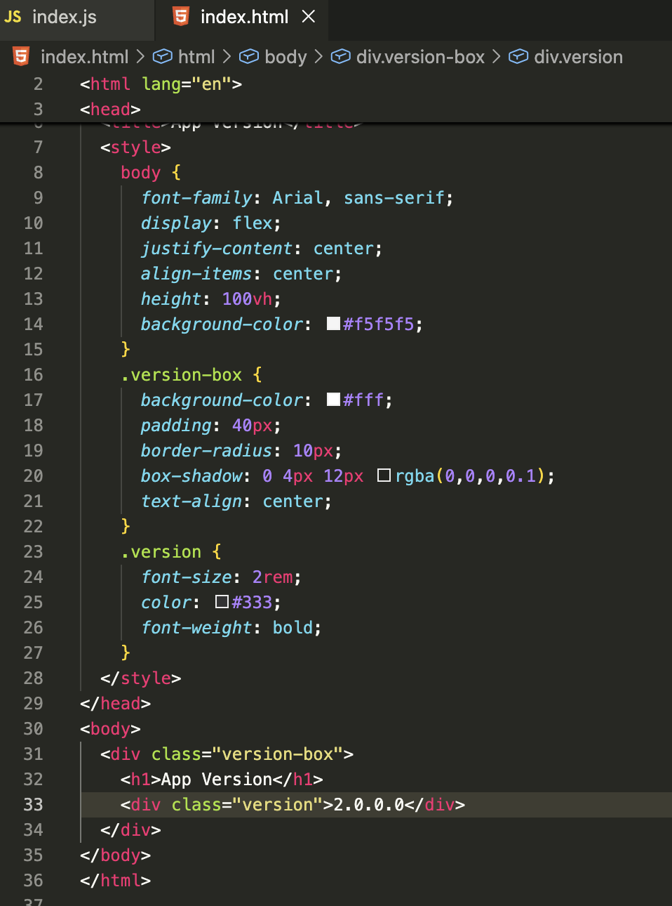

Compress and deploy again

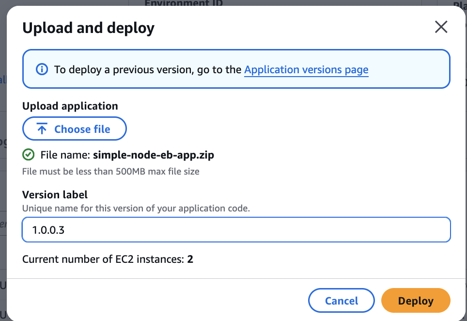

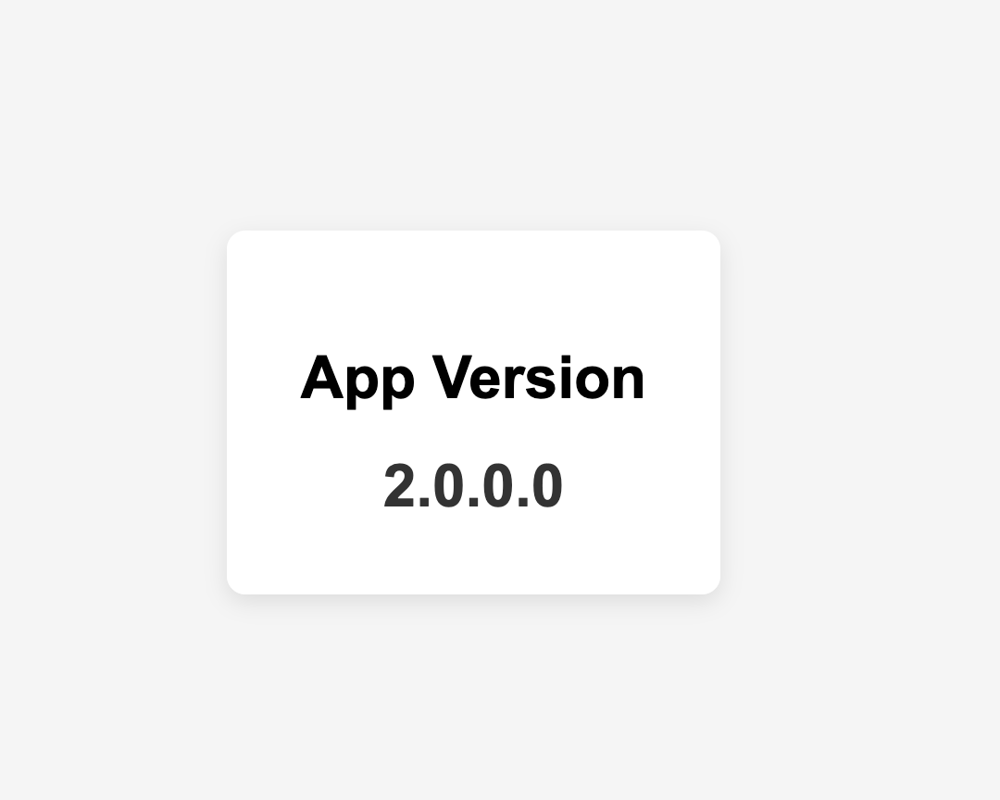

To Rollback to previous versions

Elastic Beanstalk → Applications → my-bean-web → Application versions

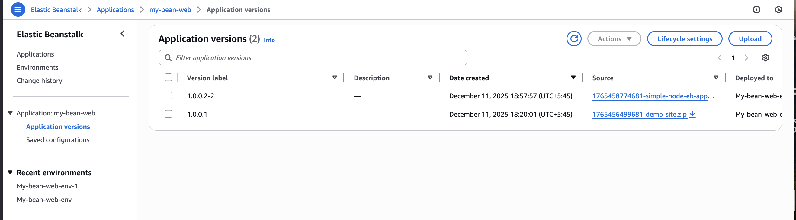

Select the version to rollback to and click on deploy

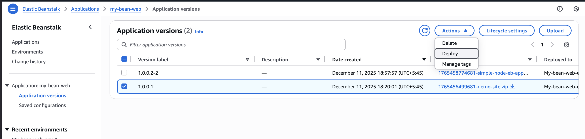

The version goes back to the first one.

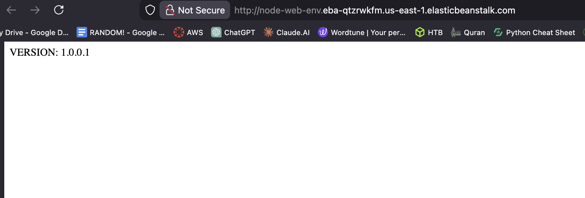