# EC2 creation via IAC → CloudFormation

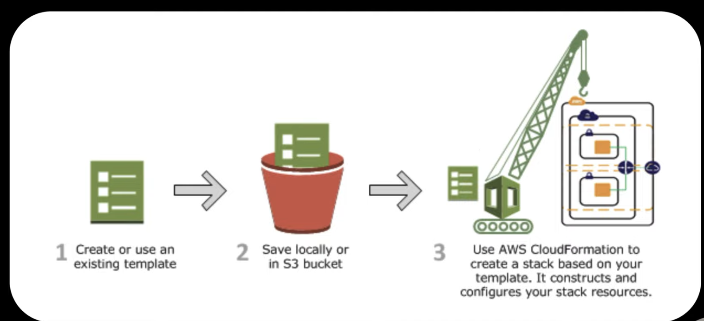

Creating a cloudformation template

ec2-cft.yaml

```yaml
AWSTemplateFormatVersion: "2010-09-09"
Description: CloudFormation template to create EC2 instance with EIP.

Parameters:
  SubnetId:
    Type: AWS::EC2::Subnet::Id
    Description: Select a subnet in the chosen VPC

  SecurityGroupId:
    Type: AWS::EC2::SecurityGroup::Id
    Description: Select an existing Security Group

  KeyName:
    Description: Name of an existing EC2 KeyPair to enable SSH access to the instance
    Type: AWS::EC2::KeyPair::KeyName
    ConstraintDescription: must be the name of an existing EC2 KeyPair.

  InstanceType:
    Description: WebServer EC2 instance type
    Type: String
    AllowedValues:
      - t3.micro
      - t3.small
    Default: t3.micro
    ConstraintDescription: must be a valid EC2 instance type.

Resources:
  EC2Instance:
    Type: AWS::EC2::Instance
    Properties:
      ImageId: ami-068c0051b15cdb816   # Amazon Linux
      InstanceType: !Ref InstanceType
      KeyName: !Ref KeyName
      SubnetId: !Ref SubnetId
      SecurityGroupIds: 
      - !Ref SecurityGroupId 
      #Advanced Tab
      CreditSpecification:
        CPUCredits: standard      
      Tags:
      - Key: Name
        Value: Karim-EC2
      - Key: ManagedBy
        Value: CloudFormation 

  ElasticIP:
    Type: AWS::EC2::EIP
    Properties:
      Domain: vpc
      Tags:
        - Key: Name
          Value: Karim-ElasticIP

  EIPAssociation:
    Type: AWS::EC2::EIPAssociation
    Properties:
      InstanceId: !Ref EC2Instance
      EIP: !Ref ElasticIP
  
Outputs:
  InstanceId:
    Description: InstanceId of the newly created EC2 instance
    Value: !Ref EC2Instance

  AZ:
    Description: Availability Zone of the newly created EC2 instance
    Value: !GetAtt EC2Instance.AvailabilityZone

  PublicDNS:
    Description: Public DNSName of the newly created EC2 instance
    Value: !GetAtt EC2Instance.PublicDnsName

  PublicIP:
    Description: Public IP address of the newly created EC2 instance. (Elastic IP)
    Value: !GetAtt EC2Instance.PublicIp
```

## Uploading to cloudFormation via console

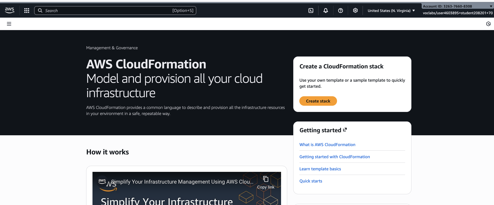

Add the required .yaml file

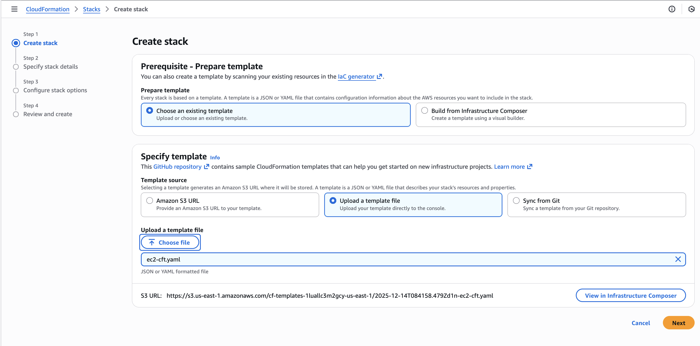

View in Infrastructure Composer and validate the template

Keep in mind that Infrastructure doesnt like Description in resources.

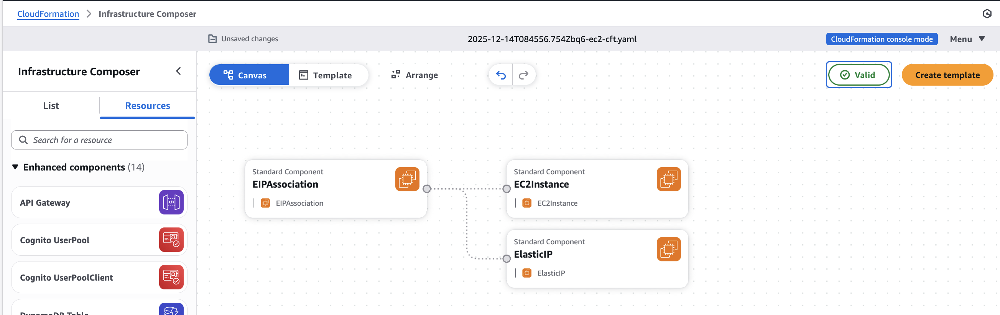

Select the required Parameters

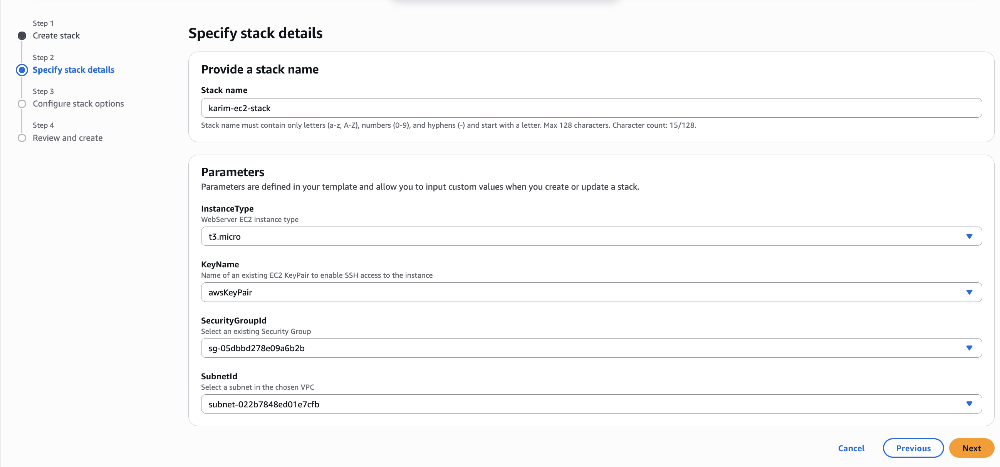

Keep things default

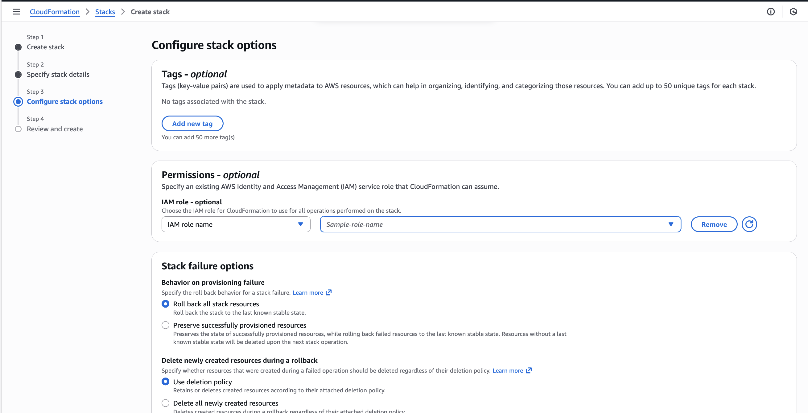

Stack Created Sucessfully.

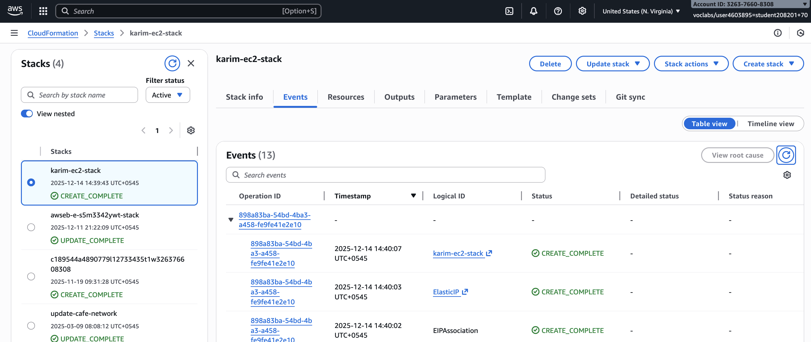

Resources Created

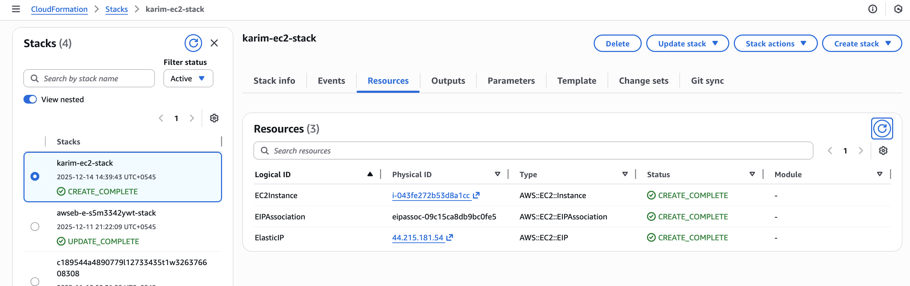

Updating the Stack

Select the stack → Update Stack → Create Change set

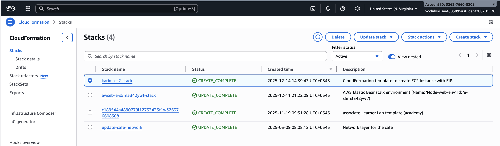

Edit in Composer

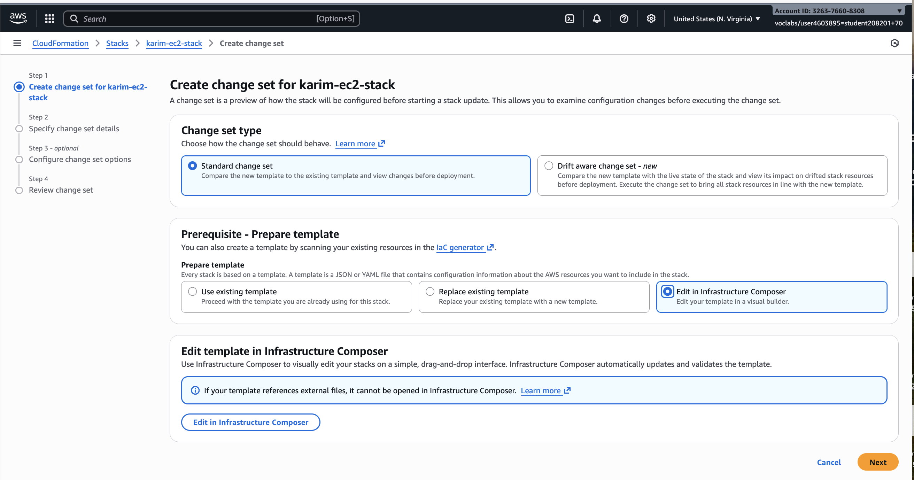

Make small update

Update the tag “Karim-EC2” → “Updated-Karim-EC2”

Save → Create Change Set

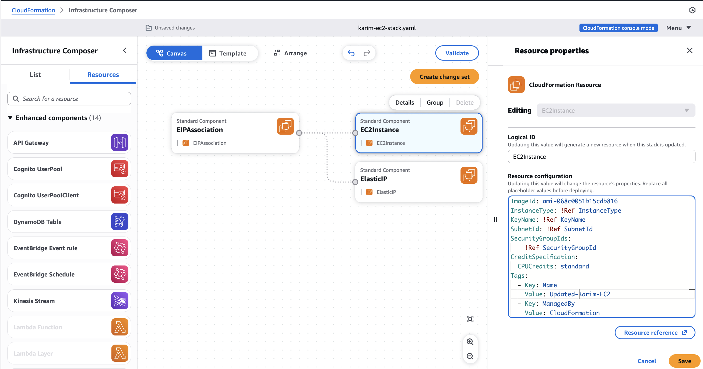

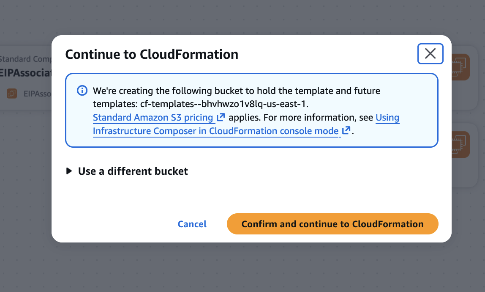

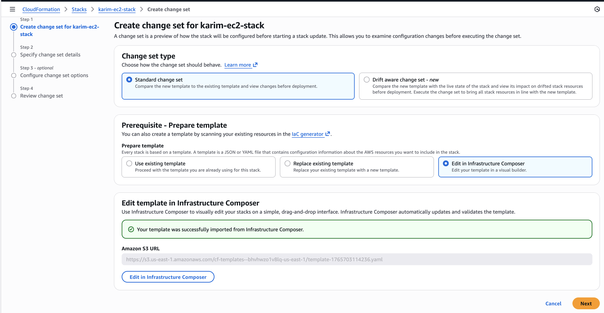

Change Set Details

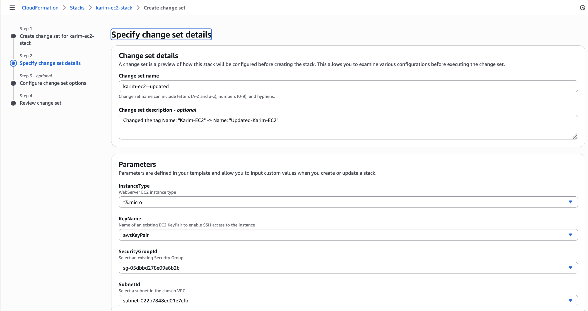

Review

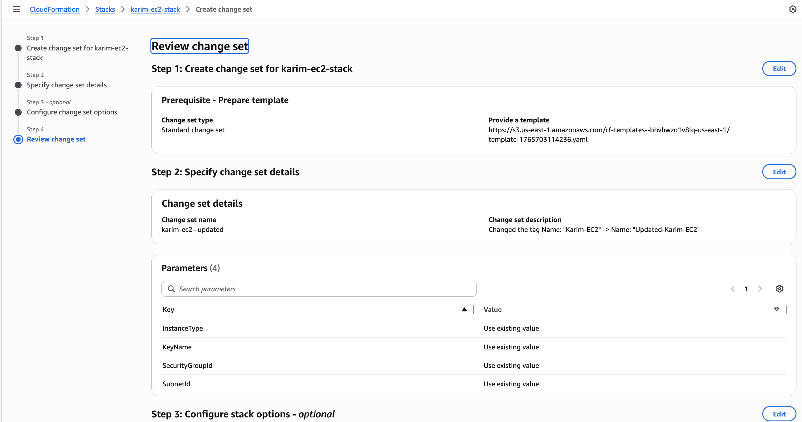

Execute Change Set

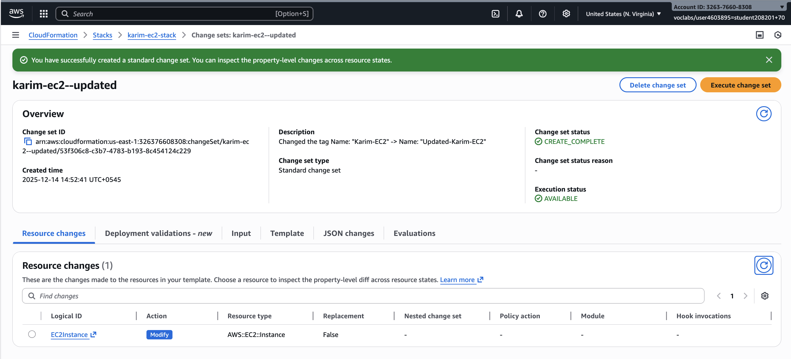

Update Complete

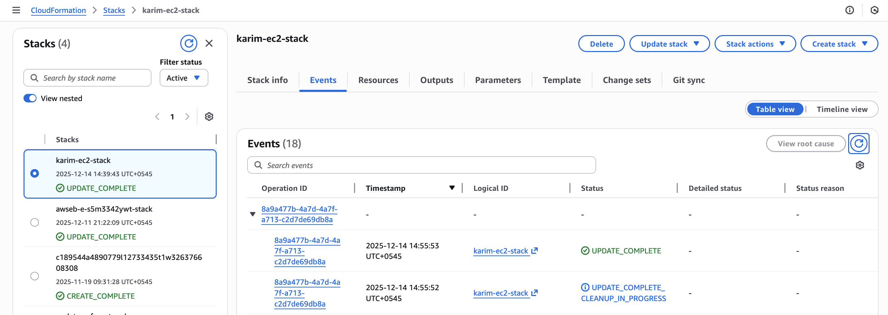

Tags are changed

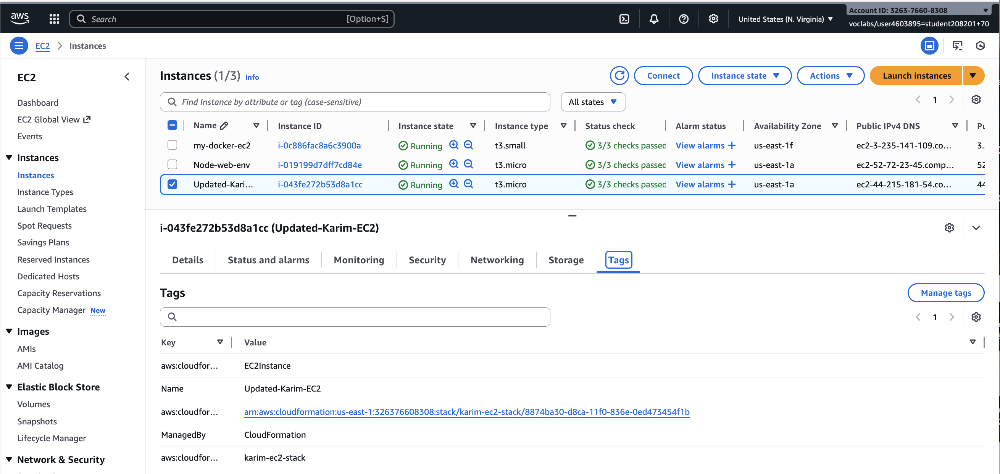

Delete the stack/resources

Click “Delete”

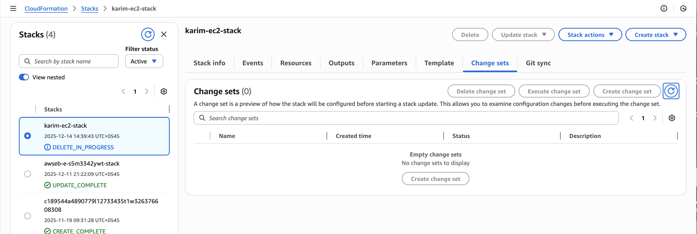

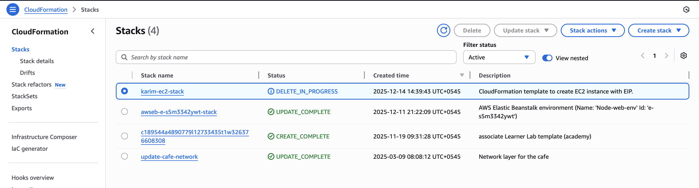

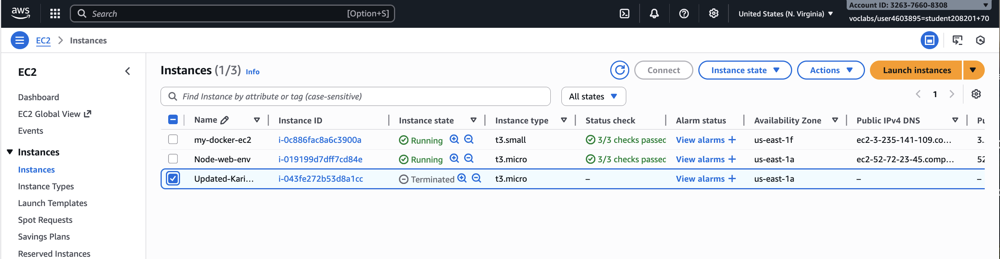

# Using AWS - CLI

Add UserData to ec2-cft.yaml

```yaml
AWSTemplateFormatVersion: "2010-09-09"
Description: CloudFormation template to create EC2 instance with EIP.

Parameters:
  SubnetId:
    Type: AWS::EC2::Subnet::Id
    Description: Select a subnet in the chosen VPC

  SecurityGroupId:
    Type: AWS::EC2::SecurityGroup::Id
    Description: Select an existing Security Group

  KeyName:
    Description: Name of an existing EC2 KeyPair to enable SSH access to the instance
    Type: AWS::EC2::KeyPair::KeyName
    ConstraintDescription: must be the name of an existing EC2 KeyPair.

  InstanceType:
    Description: WebServer EC2 instance type
    Type: String
    AllowedValues:
      - t3.micro
      - t3.small
    Default: t3.micro
    ConstraintDescription: must be a valid EC2 instance type.

Resources:
  EC2Instance:
    Type: AWS::EC2::Instance
    Properties:
      ImageId: ami-068c0051b15cdb816   # Amazon Linux
      InstanceType: !Ref InstanceType
      KeyName: !Ref KeyName
      SubnetId: !Ref SubnetId
      SecurityGroupIds: 
      - !Ref SecurityGroupId 
      #Advanced Tab
      CreditSpecification:
        CPUCredits: standard      
      Tags:
      - Key: Name
        Value: Karim-EC2
      - Key: ManagedBy
        Value: CloudFormation 
      UserData:    # must be exactly 'UserData'
        Fn::Base64: |
          #!/bin/bash
          dnf update -y 
          dnf install -y nginx
          systemctl enable nginx
          systemctl start nginx
          echo "Hello World" > /usr/share/nginx/html/index.html

  ElasticIP:
    Type: AWS::EC2::EIP
    Properties:
      Domain: vpc
      Tags:
        - Key: Name
          Value: Karim-ElasticIP

  EIPAssociation:
    Type: AWS::EC2::EIPAssociation
    Properties:
      InstanceId: !Ref EC2Instance
      EIP: !Ref ElasticIP
  
Outputs:
  InstanceId:
    Description: InstanceId of the newly created EC2 instance
    Value: !Ref EC2Instance

  AZ:
    Description: Availability Zone of the newly created EC2 instance
    Value: !GetAtt EC2Instance.AvailabilityZone

  PublicDNS:
    Description: Public DNSName of the newly created EC2 instance
    Value: !GetAtt EC2Instance.PublicDnsName

  PublicIP:
    Description: Public IP address of the newly created EC2 instance. (Elastic IP)
    Value: !GetAtt EC2Instance.PublicIp
```

Make sure that aws configure has the proper credentials

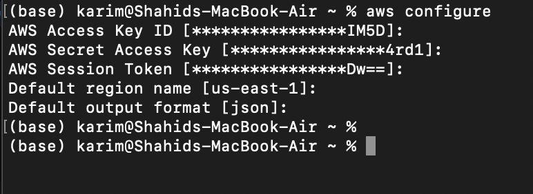

Make sure that template is valid 

```bash
aws cloudformation create-stack --stack-name MyStack --template-body file://ec2-cft.yaml
```

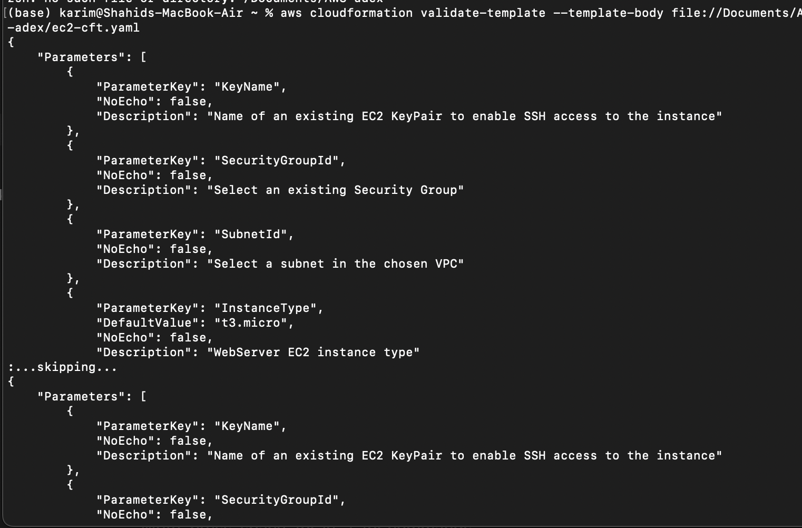

Create the stack using the template

```bash
aws cloudformation create-stack \
  --stack-name MyEC2Stack \
  --template-body file://~/Documents/AWS-adex/ec2-cft.yaml \
  --parameters \
      ParameterKey=KeyName,ParameterValue=awsKeyPair \
      ParameterKey=SubnetId,ParameterValue=subnet-0fd893a7a2e4249b5 \
      ParameterKey=SecurityGroupId,ParameterValue=sg-05dbbd278e09a6b2b \
      ParameterKey=InstanceType,ParameterValue=t3.micro
```

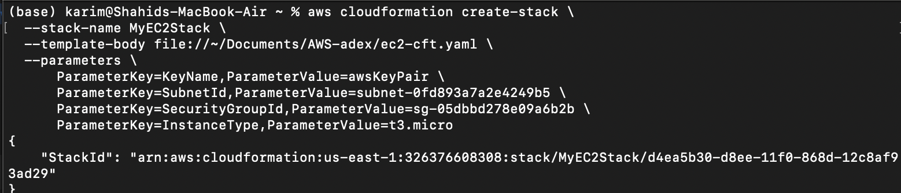

Check Status

```bash
aws cloudformation describe-stacks --stack-name Karim-EC2Stack --query "Stacks[0].StackStatus"
```

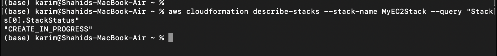


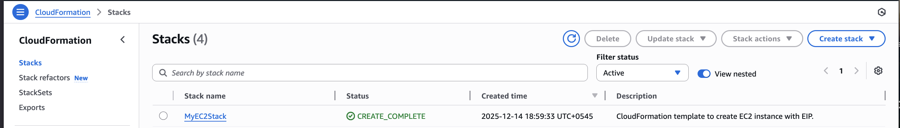

Outputs

```bash
aws cloudformation describe-stacks --stack-name MyEC2Stack --query "Stacks[0].Outputs"
```

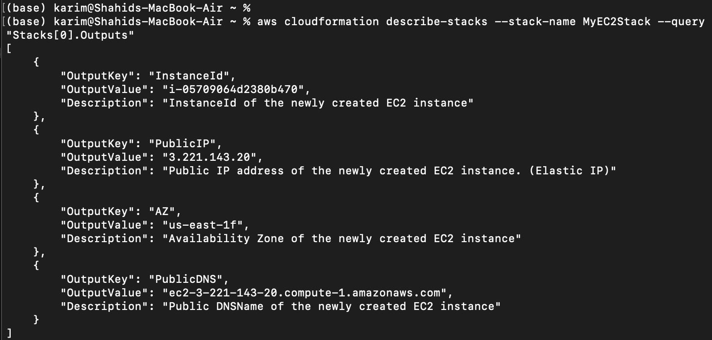

Using the EIP to access the web-site

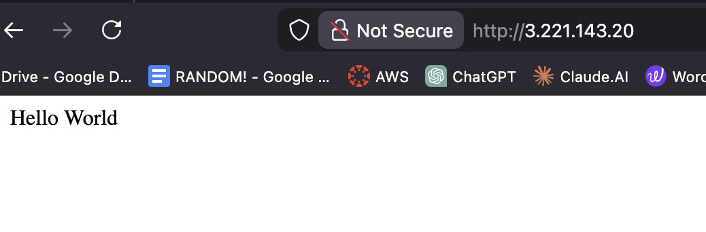