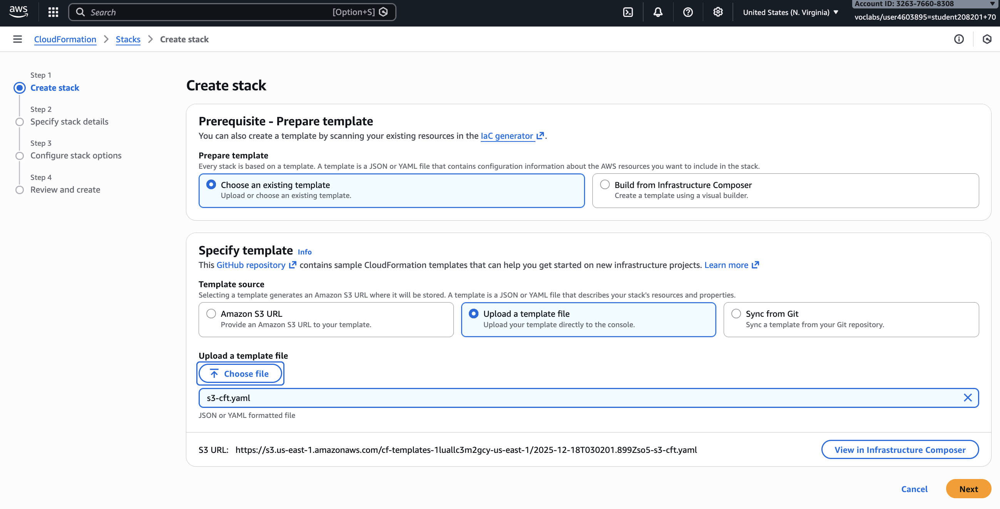
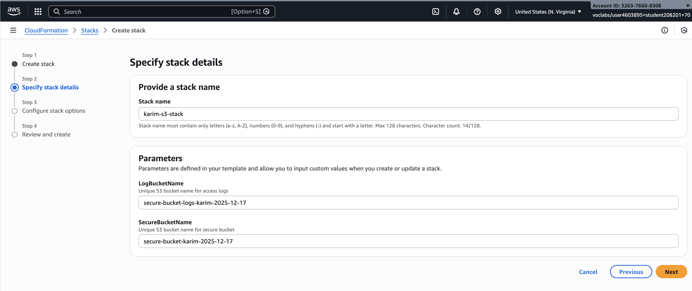
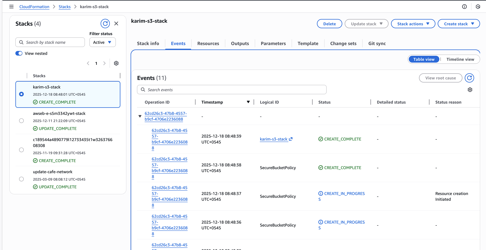
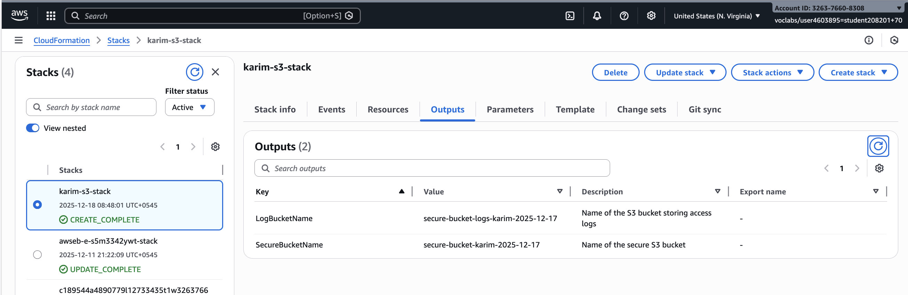

# Creating S3 via CFT

## s3-cft.yaml

```yaml
AWSTemplateFormatVersion: "2010-09-09"
Description: >
  Production-ready secure S3 bucket:
  - HTTPS-only access
  - Deny unencrypted uploads
  - Access logging
  - Server-side encryption (SSE-S3)
  - Versioning
  - Ownership controls
  - Fully private (Block Public Access enforced)

Parameters:
  SecureBucketName:
    Type: String
    Description: Unique S3 bucket name for secure bucket
    Default: "secure-bucket-karim-2025-12-17"

  LogBucketName:
    Type: String
    Description: Unique S3 bucket name for access logs
    Default: "secure-bucket-logs-karim-2025-12-17"

Resources:

  # Log bucket for access logging
  LogBucket:
    Type: AWS::S3::Bucket
    Properties:
      BucketName: !Ref LogBucketName
      PublicAccessBlockConfiguration:
        BlockPublicAcls: true
        IgnorePublicAcls: true
        BlockPublicPolicy: true
        RestrictPublicBuckets: true
      BucketEncryption:
        ServerSideEncryptionConfiguration:
          - ServerSideEncryptionByDefault:
              SSEAlgorithm: AES256
      VersioningConfiguration:
        Status: Enabled
      OwnershipControls:
        Rules:
          - ObjectOwnership: BucketOwnerEnforced
      Tags:
        - Key: Name
          Value: s3-logs
        - Key: ManagedBy
          Value: CloudFormation

  # Main secure S3 bucket
  SecureBucket:
    Type: AWS::S3::Bucket
    Properties:
      BucketName: !Ref SecureBucketName
      LoggingConfiguration:
        DestinationBucketName: !Ref LogBucket
        LogFilePrefix: access-logs/
      VersioningConfiguration:
        Status: Enabled
      BucketEncryption:
        ServerSideEncryptionConfiguration:
          - ServerSideEncryptionByDefault:
              SSEAlgorithm: AES256
      OwnershipControls:
        Rules:
          - ObjectOwnership: BucketOwnerEnforced
      PublicAccessBlockConfiguration:
        BlockPublicAcls: true
        IgnorePublicAcls: true
        BlockPublicPolicy: true
        RestrictPublicBuckets: true
      Tags:
        - Key: Name
          Value: s3-secure
        - Key: ManagedBy
          Value: CloudFormation

  # Bucket policy: HTTPS-only + deny unencrypted uploads
  SecureBucketPolicy:
    Type: AWS::S3::BucketPolicy
    Properties:
      Bucket: !Ref SecureBucket
      PolicyDocument:
        Version: "2012-10-17"
        Statement:
          # Deny all HTTP traffic
          - Sid: DenyInsecureTransport
            Effect: Deny
            Principal: "*"
            Action: "s3:*"
            Resource:
              - !Sub "${SecureBucket.Arn}"
              - !Sub "${SecureBucket.Arn}/*"
            Condition:
              Bool:
                aws:SecureTransport: false

          # Deny unencrypted object uploads
          - Sid: DenyUnencryptedObjectUploads
            Effect: Deny
            Principal: "*"
            Action: "s3:PutObject"
            Resource: !Sub "${SecureBucket.Arn}/*"
            Condition:
              StringNotEquals:
                "s3:x-amz-server-side-encryption": "AES256"

Outputs:
  SecureBucketName:
    Description: Name of the secure S3 bucket
    Value: !Ref SecureBucket

  LogBucketName:
    Description: Name of the S3 bucket storing access logs
    Value: !Ref LogBucket

```

## Explaination

Log Bucket

```yaml
LogBucket:
    Type: AWS::S3::Bucket
    Properties:
      BucketName: !Ref LogBucketName
      PublicAccessBlockConfiguration:
        BlockPublicAcls: true
        IgnorePublicAcls: true
        BlockPublicPolicy: true
        RestrictPublicBuckets: true
      BucketEncryption:
        ServerSideEncryptionConfiguration:
          - ServerSideEncryptionByDefault:
              SSEAlgorithm: AES256
      VersioningConfiguration:
        Status: Enabled
      OwnershipControls:
        Rules:
          - ObjectOwnership: BucketOwnerEnforced
```

- This bucket stores **S3 server access logs** from the main bucket.
- Completely prevents public access
- Protects against accidental exposure
- Encrypts all objects at rest using **SSE-S3**
- No customer-managed key required
- Preserves object history
- Protects against accidental deletion or overwrite
- Ensures the bucket owner owns all objects
- Disables ACLs entirely (modern AWS best practice)

Main Secure Bucket

```yaml
  SecureBucket:
    Type: AWS::S3::Bucket
    Properties:
      BucketName: !Ref SecureBucketName
      LoggingConfiguration:
        DestinationBucketName: !Ref LogBucket
        LogFilePrefix: access-logs/
      VersioningConfiguration:
        Status: Enabled
      BucketEncryption:
        ServerSideEncryptionConfiguration:
          - ServerSideEncryptionByDefault:
              SSEAlgorithm: AES256
      OwnershipControls:
        Rules:
          - ObjectOwnership: BucketOwnerEnforced
      PublicAccessBlockConfiguration:
        BlockPublicAcls: true
        IgnorePublicAcls: true
        BlockPublicPolicy: true
        RestrictPublicBuckets: true
```

- This is the **primary protected bucket**.
- Sends detailed access logs to the log bucket
- Useful for:
    - Security audits
    - Incident investigation
    - Compliance requirements
- Enforces **automatic encryption** for all stored objects
- Users cannot upload unencrypted data
- Enables object versioning
- Protects data from accidental loss or overwrite
- Bucket owner automatically owns all uploaded objects
- Eliminates ACL-related security issues
- Guarantees the bucket is **fully private**
- Prevents public policies or ACLs from being applied

Bucket Policy

```yaml
SecureBucketPolicy:
    Type: AWS::S3::BucketPolicy
    Properties:
      Bucket: !Ref SecureBucket
      PolicyDocument:
        Version: "2012-10-17"
        Statement:
          # Deny all HTTP traffic
          - Sid: DenyInsecureTransport
            Effect: Deny
            Principal: "*"
            Action: "s3:*"
            Resource:
              - !Sub "${SecureBucket.Arn}"
              - !Sub "${SecureBucket.Arn}/*"
            Condition:
              Bool:
                aws:SecureTransport: false

```

- Denies **all requests over HTTP**
- Only allows HTTPS (TLS-encrypted) traffic

**Why this matters:**

- Prevents data interception
- Enforces secure network transport

```yaml
          # Deny unencrypted object uploads
          - Sid: DenyUnencryptedObjectUploads
            Effect: Deny
            Principal: "*"
            Action: "s3:PutObject"
            Resource: !Sub "${SecureBucket.Arn}/*"
            Condition:
              StringNotEquals:
                "s3:x-amz-server-side-encryption": "AES256"
```

- Denies any `PutObject` request that does not explicitly specify **SSE-S3 (AES256)**
- Guarantees that all objects stored in the bucket are encrypted at rest

**Why this matters:**

- Prevents accidental storage of unencrypted data
- Enforces compliance and security standards

## Create the template



Using default parameters



Keeping the rest as default and creating the stack.



Outputs



In the **CloudFormation Outputs section**, **Export name** is used to make an output value **globally available to other CloudFormation stacks** within the **same AWS account and region**.

Think of it as **sharing a value between stacks**.

---

***Not need rn → Maybe in the future.***

- KMS KeyPolicy (optional)

```yaml
Version: '2012-10-17'
Id: key-consolepolicy-3
Statement:
- Sid: Enable IAM User Permissions
  Effect: Allow
  Principal:
    AWS: arn:aws:iam::326376608308:root
  Action: kms:*
  Resource: "*"
- Sid: Allow access for Key Administrators
  Effect: Allow
  Principal:
    AWS: arn:aws:iam::326376608308:role/LabRole
  Action:
  - kms:Create*
  - kms:Describe*
  - kms:Enable*
  - kms:List*
  - kms:Put*
  - kms:Update*
  - kms:Revoke*
  - kms:Disable*
  - kms:Get*
  - kms:Delete*
  - kms:TagResource
  - kms:UntagResource
  - kms:ScheduleKeyDeletion
  - kms:CancelKeyDeletion
  - kms:RotateKeyOnDemand
  Resource: "*"
- Sid: Allow use of the key
  Effect: Allow
  Principal:
    AWS: arn:aws:iam::326376608308:role/LabRole
  Action:
  - kms:Encrypt
  - kms:Decrypt
  - kms:ReEncrypt*
  - kms:GenerateDataKey*
  - kms:DescribeKey
  Resource: "*"
- Sid: Allow attachment of persistent resources
  Effect: Allow
  Principal:
    AWS: arn:aws:iam::326376608308:role/LabRole
  Action:
  - kms:CreateGrant
  - kms:ListGrants
  - kms:RevokeGrant
  Resource: "*"
  Condition:
    Bool:
      kms:GrantIsForAWSResource: 'true'

```