# TerraForm ❗

## Architecture:

- Terraform CLI → runs on your local machine or CI
- terraform core → Engine that parses .tf files and compares desired vs actual state
- Providers → plugins that talk to APIs (AWS, K8s, Github)
- Terraform State → Local (.tfstate) and Remote (like S3 on the cloud)

### Terraform CLI:

- runs on Developers machine or CI/CD Runners ( runners → jata run huncha process)
- Core Commands:
    
    Reads the .tf files and sets up providers, backend, modules
    
    ```hcl
    terraform init
    ```
    

shows what terraform will change

```hcl
terraform plan
```

executes the plan and changes the real infra

```hcl
terrform apply
```

destroys resources tracked in state

```hcl
terraform destory
```

---

Create a dir for Terraform, and inside the dir;

Create terra/ main.tf

```hcl
terraform {
  required_providers {
    aws = {
      source  = "hashicorp/aws"
      version = "~> 5.0"
    }
  }
}

provider "aws" {
  region = "us-east-1"
}

```

```hcl
terrform init
```

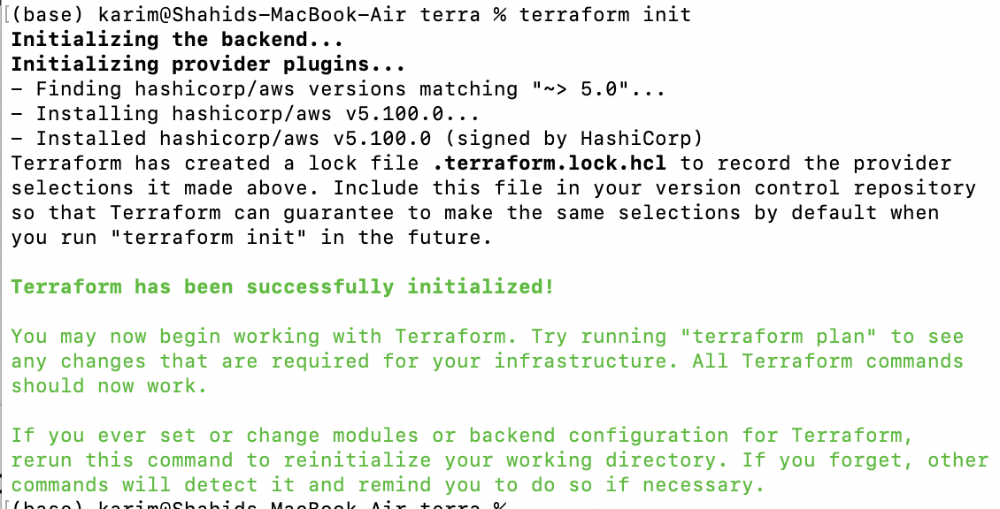

<aside>
📌

Just creates the dependencies like npm init

</aside>

```hcl
terraform plan
```

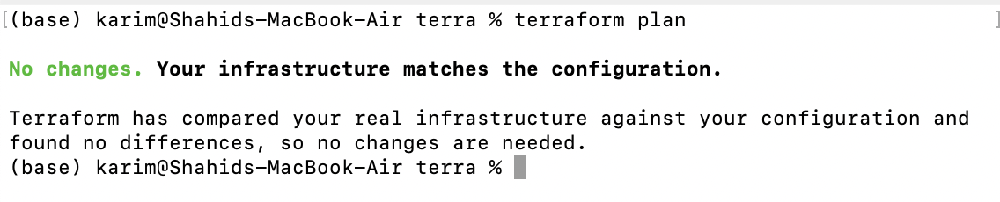

> Terraform is just for resource deployment.
> 

edit the [main.tf](http://main.tf) file

include resources

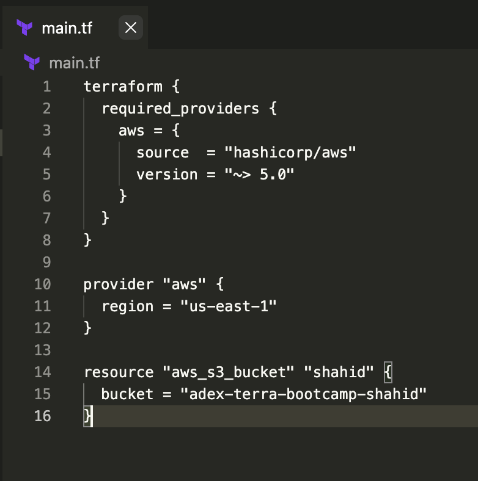

```hcl
terrform plan -out=shahids3
```

What does `terraform plan -out=s3bucketwow` actually do?

It **saves the execution plan to a file**, so you can apply **exactly what was planned**, with **no surprises**.

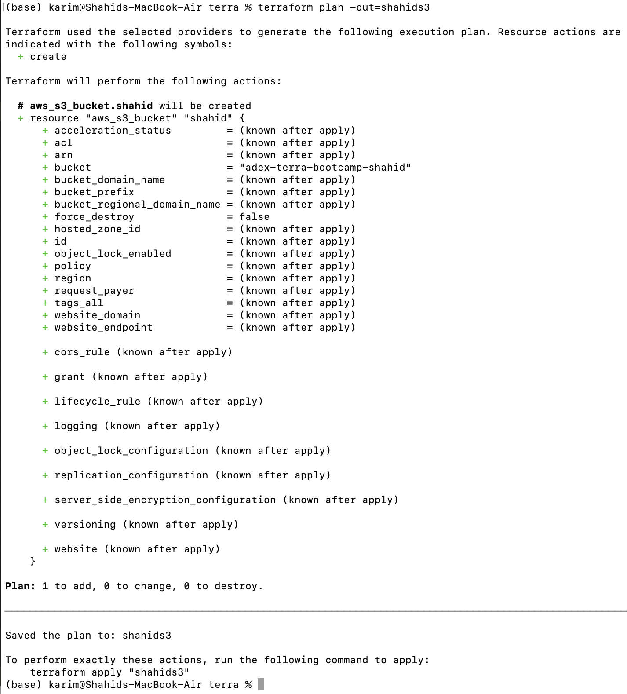

terraform apply

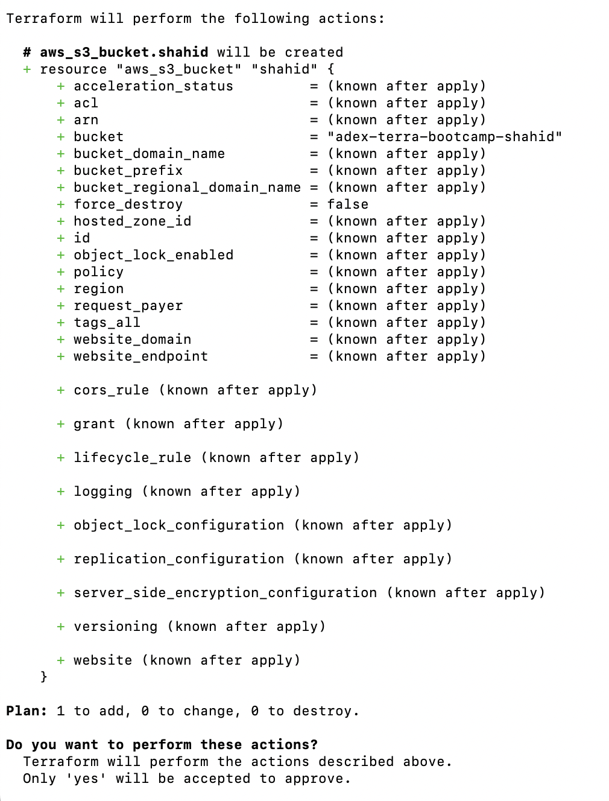

.tfstate 

- plan: compares .tfstate to your code and actual cloud resources tor see what must chnage
- apply: updates .tfsatete after successfully mkaing chnmages
- destroy: destroys the created resources.

```hcl
terraform destroy
```

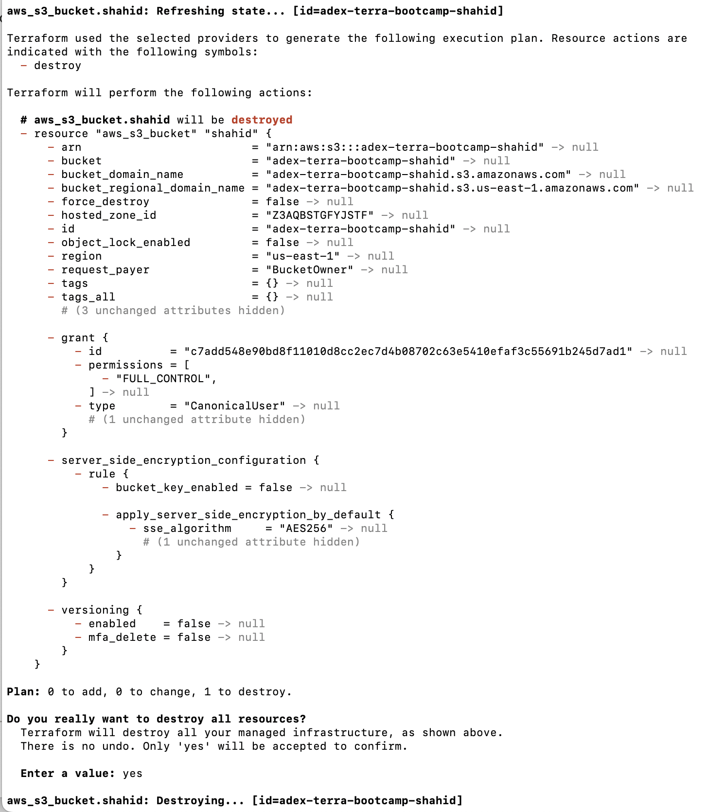

Add another S3 resource

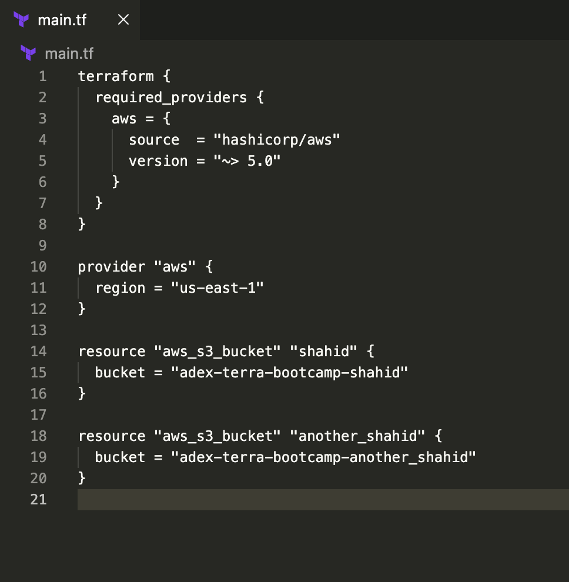

Creating a plan for new S3 bucket 

```hcl
terraform plan
```

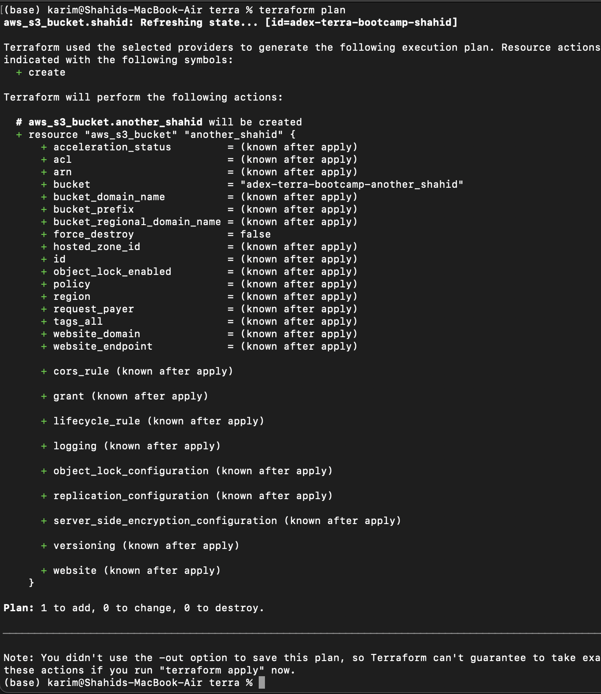

Pushing the changes to the remote 

This will update the terraform.tfstate

```hcl
terraform apply
```

The older bucket will be refreshed.

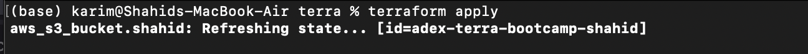

The newer will be created.

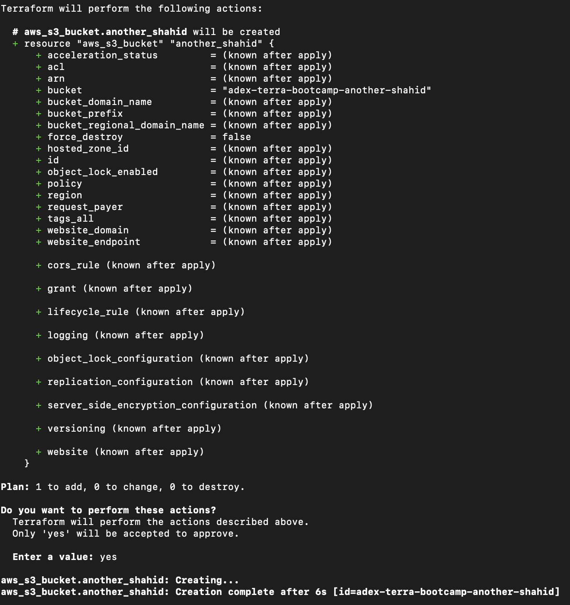

Output

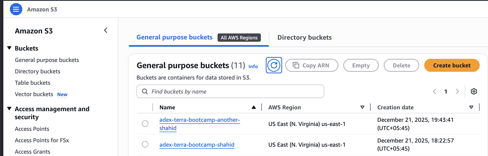