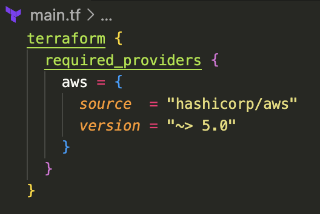
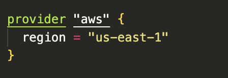
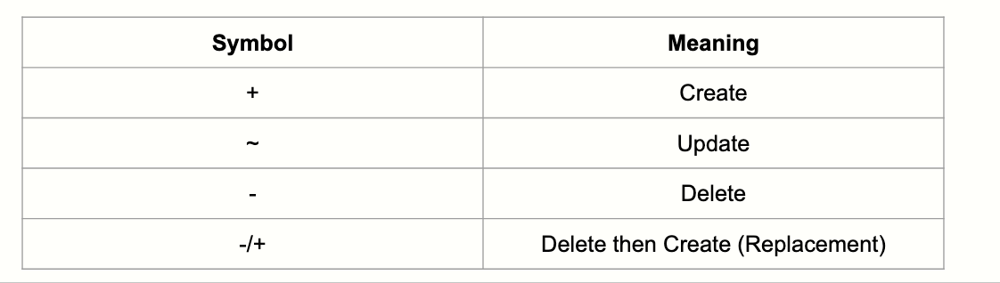

# Terraform: Providers, Resources, Data Sources and State Mgmt

## Providers

- Its a binary plugin
- Downloaded during Terraform init
- Responsible for
    - Authentication
    - Translates plans into API calls
    - Schema of Resources and Data Sources
- Terraform never talks to cloud API directly
- Terraform Core → Proider plugin → Cloud API

Providers have Requirements and Configurations

### Requirements



```hcl
terraform init
```

Terraform uses this to download the providers

### Configurations



Alias:

```hcl
provider "aws" {
		region = "ap-south-1"
	}
	
provider "aws" {
		region = "us-east-1"
		alias  = "ue1"
	}

```

Usage

```hcl
resource "aws_s3_bucket" "us_s3_bucket" {
		provider = aws.ue1
		bucket   = "my-us-s3-bucket-yay"
	}

```

## Resources

- these are declarative description
- terraform owns, manages the complete lifecycle of a resource.

```hcl
resource <PROVIDER>_<TYPE> <NAME>{
	<ARGS> = <VALUE>
}

resource "aws_s3_bucket" "log_bucket" {
		bucket = "my-logs-very-uniuqe-name"
	}
```

### Resource Address

<aside>
📌

Resource Address → aws_s3_bucket.log_bucket

</aside>

Terraform identifies a resource by its address, not by its name in AWS.

- Tf stores the real AWS ID (bucketName, ARN) in state
- Renaming the resource block will lead to old resources being destroyed and new resources being created.

Two types of Args; **Required** & **Optional.**

```hcl
resource "aws_instance" "webserver" {
	  ami           = "ami-0abc123"   # required
	  instance_type = "t3.micro"     # required
	  tags = {                        # optional
	    Name = "my-web-server"
	  }
	}
```

### Lifecycle

Tf follows CRUD for its lifecycle



## Data Sources

It allows TF to read existing infrastructure

Resource **create/manage** things while Data Sources only **Read** things

```hcl
data "aws_ami" "ubuntu" {
 		most_recent = true

  		filter {
    			name   = "name"
    			values = ["ubuntu/images/hvm-ssd/ubuntu-noble-*"]
			}		

  	owners = ["099720109477"]
	}
```

Calling it as reference in Resource:

```hcl
resource "aws_instance" "webserver" {
  	ami	=	data.aws_ami.ubuntu.id
  	instance_type = "t3.micro"
}
```

## State Management

- Without state, Terraform:
    - Wouldn’t know what it created
    - Would recreate everything every time
    - Couldn’t detect changes
- State does not store .tf files, rather is stores Resource Address and IDs, Attributes like IPs, names, ARNs and Provider Metadata.

State is NOT a Source of Truth, Code is.

State is Terraform’s memory.