# Terraform: EC2 + EIP + S3

## For EC2 + EIP + S3

main.tf

```hcl
terraform {
  required_providers {
    aws = {
      source  = "hashicorp/aws"
      version = "~> 5.0"
    }
  }
}

provider "aws" {
  region = "us-east-1"
}

# using latest ami
data "aws_ami" "amazon_linux"{
    most_recent = true

    owners = ["amazon"]

    filter {
      name = "name"
      values = ["al2023-ami-*-kernel-6.1-x86_64"]
    }
} 

# using existing vpc
data "aws_vpc" "default_vpc"{
    id = "vpc-04b9661aff908e210" 
}

# Using existing subnet
data "aws_subnet" "default_subnet"{
    id = "subnet-0591baba4adf985b9" 
}

# Using existing secuirty group
data "aws_security_group" "default_sg"{
    id = "sg-05dbbd278e09a6b2b"
}

##################################################################
####################### EC2 Portion ##############################
##################################################################

######### main ec2 resource ##############
resource "aws_instance" "shahid_ec2" {
    ami = data.aws_ami.amazon_linux.id
    instance_type = "t3.micro"
    key_name = "awsKeyPair"
    subnet_id = data.aws_subnet.default_subnet.id
    vpc_security_group_ids = [data.aws_security_group.default_sg.id]

    tags = {
        Name = "terraform-shahid-ec2"
        ManagedBy = "Terraform"
    }
    
}

######### Attaching EIP to the instance #############
resource "aws_eip" "shahid_eip" {
  instance = aws_instance.shahid_ec2.id
}

##################################################################
################ S3 bucket starts from here ######################
##################################################################

########### Log Bucket ###########
resource "aws_s3_bucket" "log_bucket" {
    bucket = "secure-bucket-logs-karim-2025-12-23"

    tags = {
        Name = "S3-Logs"
        ManagedBy = "Terraform"
    }
}

# Object Ownership
resource "aws_s3_bucket_ownership_controls" "log_bucket" {
    bucket = aws_s3_bucket.log_bucket.id
    
    rule {
      object_ownership = "BucketOwnerEnforced"
    }

}

# Block Public Access settings for this bucket
resource "aws_s3_bucket_public_access_block" "log_bucket" {
    bucket = aws_s3_bucket.log_bucket.id
        
    block_public_acls = true
    ignore_public_acls= true
    block_public_policy= true
    restrict_public_buckets= true
}

# Bucket Versioning
resource "aws_s3_bucket_versioning" "log_bucket" {
    bucket = aws_s3_bucket.log_bucket.id

    versioning_configuration {
      status = "Enabled"
    }
}

# Encryption
resource "aws_s3_bucket_server_side_encryption_configuration" "log_bucket" {
    bucket = aws_s3_bucket.log_bucket.id

    rule {
      apply_server_side_encryption_by_default {
        sse_algorithm = "AES256"
      }
    }
}

########### Secure Bucket ###########
resource "aws_s3_bucket" "secure_bucket" {
    bucket = "secure-bucket-karim-2025-12-23"

    tags = {
        Name = "S3-Secure"
        ManagedBy = "Terraform"
    }
}

# Server access logging
resource "aws_s3_bucket_logging" "secure_bucket" {
    bucket        = aws_s3_bucket.secure_bucket.id
    target_bucket = aws_s3_bucket.log_bucket.id
    target_prefix = "access-logs/"
}

# Object Ownership
resource "aws_s3_bucket_ownership_controls" "secure_bucket" {
    bucket = aws_s3_bucket.secure_bucket.id
    
    rule {
      object_ownership = "BucketOwnerEnforced"
    }

}

# Block Public Access settings for this bucket
resource "aws_s3_bucket_public_access_block" "secure_bucket" {
    bucket = aws_s3_bucket.secure_bucket.id
        
    block_public_acls = true
    ignore_public_acls= true
    block_public_policy= true
    restrict_public_buckets= true
}

# Bucket Versioning
resource "aws_s3_bucket_versioning" "secure_bucket" {
    bucket = aws_s3_bucket.secure_bucket.id

    versioning_configuration {
      status = "Enabled"
    }
}

# Encryption
resource "aws_s3_bucket_server_side_encryption_configuration" "secure_bucket" {
    bucket = aws_s3_bucket.secure_bucket.id

    rule {
      apply_server_side_encryption_by_default {
        sse_algorithm = "AES256"
      }
    }
}

# Bucket Policy
resource "aws_s3_bucket_policy" "secure_bucket"{
    bucket = aws_s3_bucket.secure_bucket.id

    policy = jsonencode({
        Version = "2012-10-17"
        Statement = [
            {
                Sid = "DenyInsecureTransport"
                Effect = "Deny"
                Principal = "*"
                Action = "s3:*"
                Resource = [
                    aws_s3_bucket.secure_bucket.arn,
                    "${aws_s3_bucket.secure_bucket.arn}/*"
                ]
                Condition = {
                    Bool = {
                        "aws:SecureTransport" = "false"
                    }
                }
            },
            {
                Sid = "DenyUnencryptedObjectUploads"
                Effect = "Deny"
                Principal = "*"
                Action = "s3:PutObject"
                Resource = "${aws_s3_bucket.secure_bucket.arn}/*"
                Condition = {
                    StringNotEquals = {
                        "s3:x-amz-server-side-encryption": "AES256"
                    }
                }
            }
        ]
    })
}
```

```hcl
terraform init
```

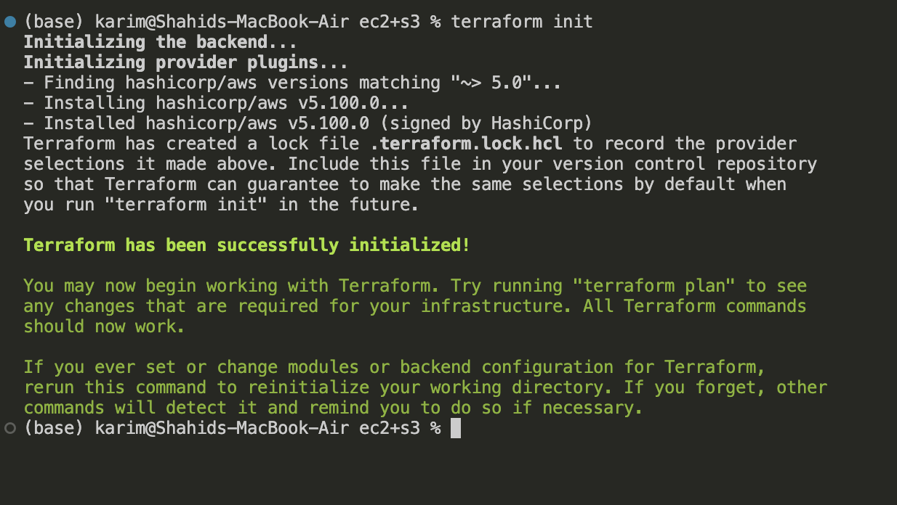

```hcl
terraform validate
```

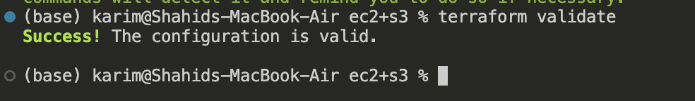

```hcl
terraform plan
```

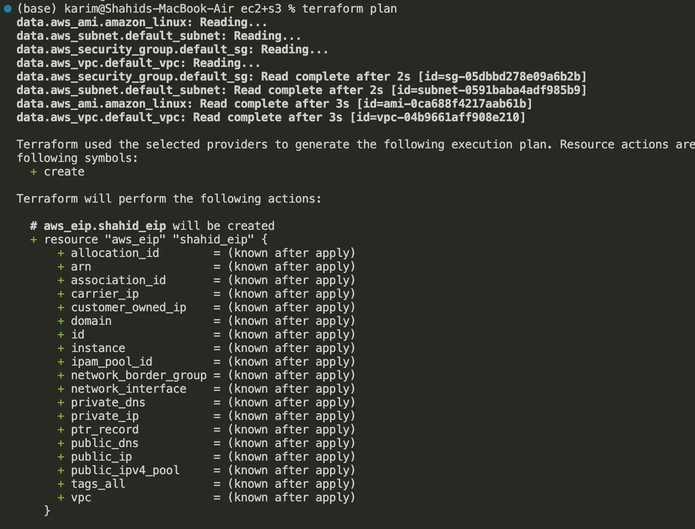


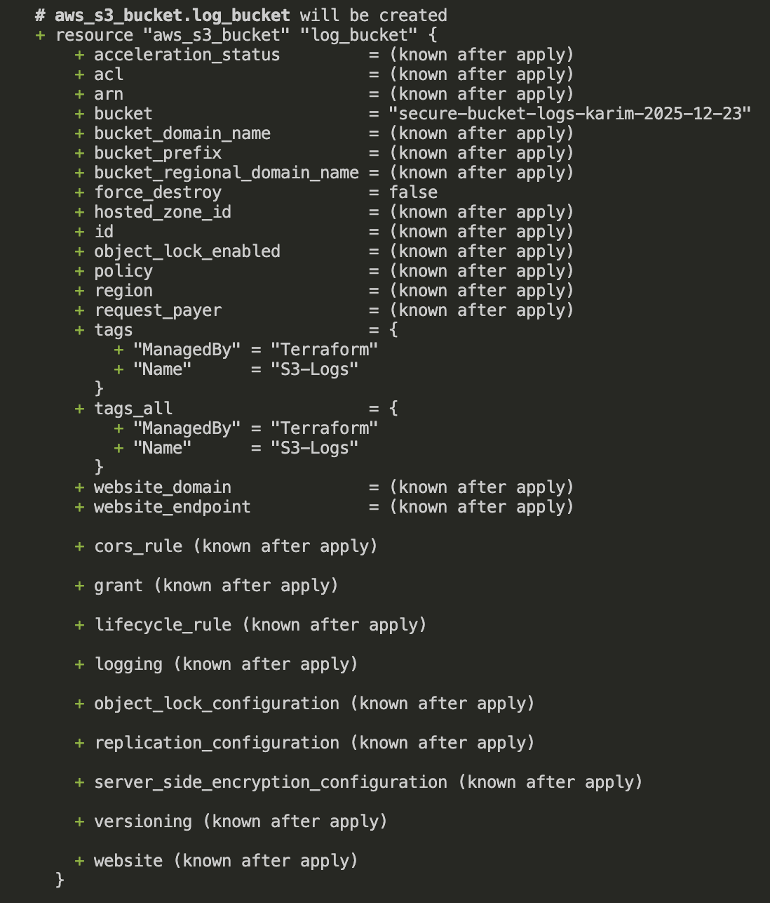

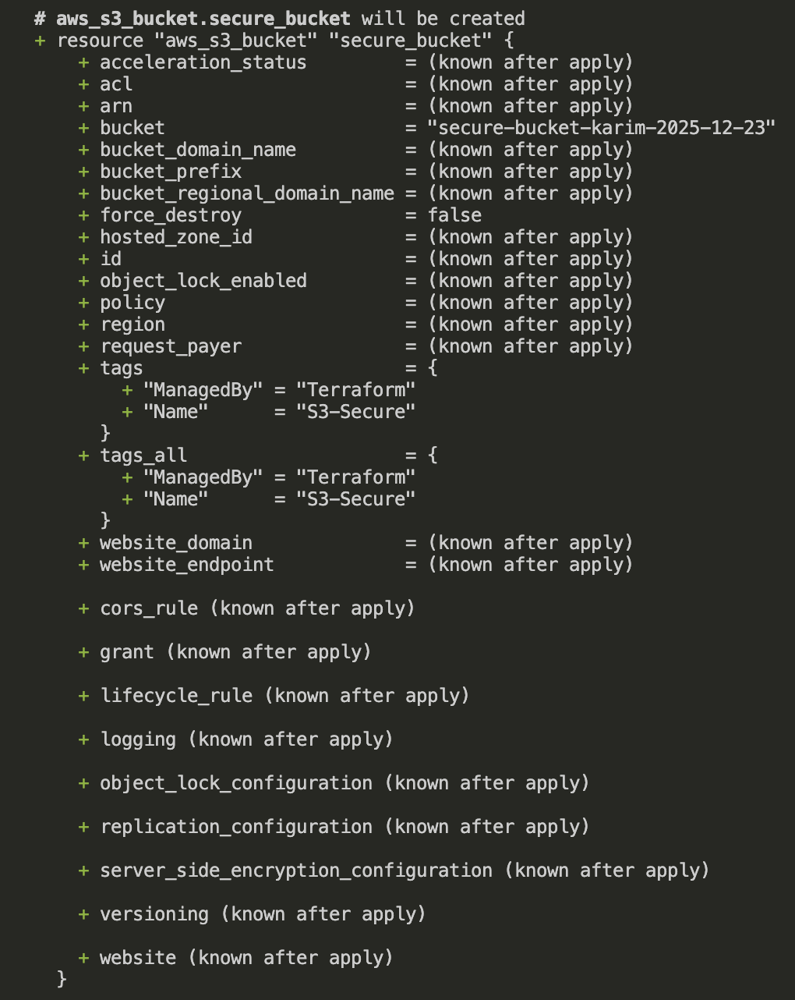

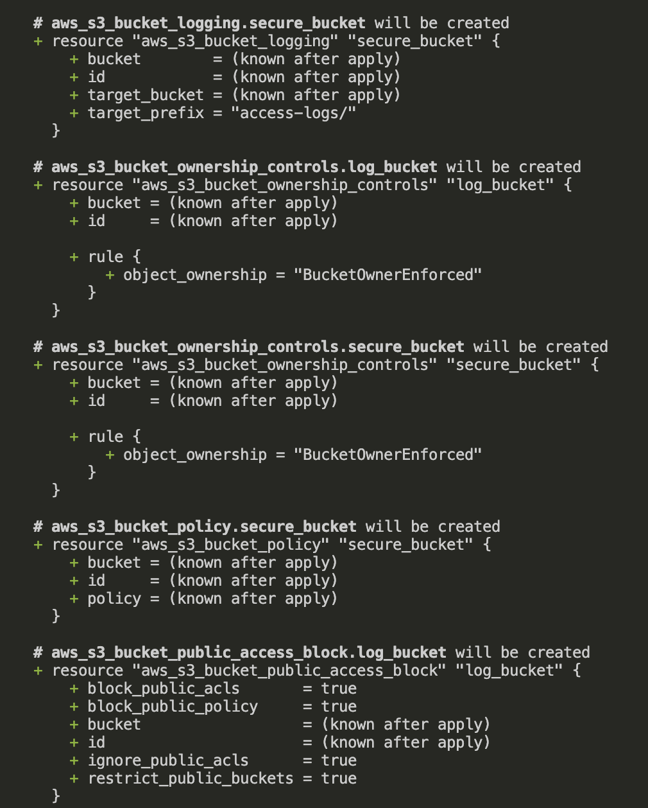

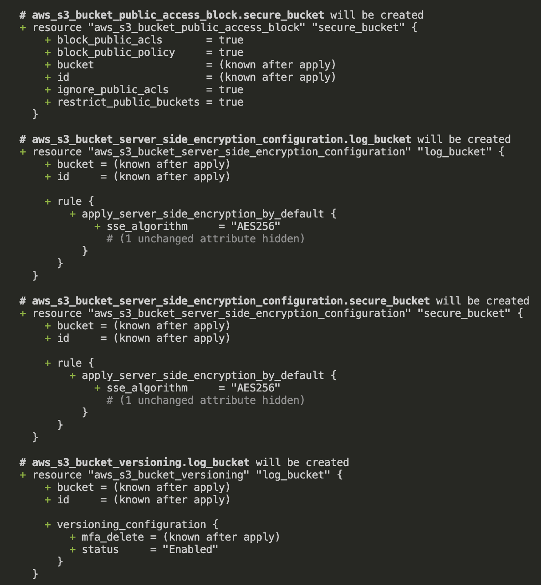

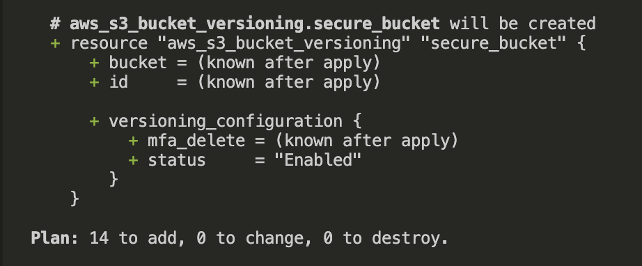

```hcl
terraform apply
```

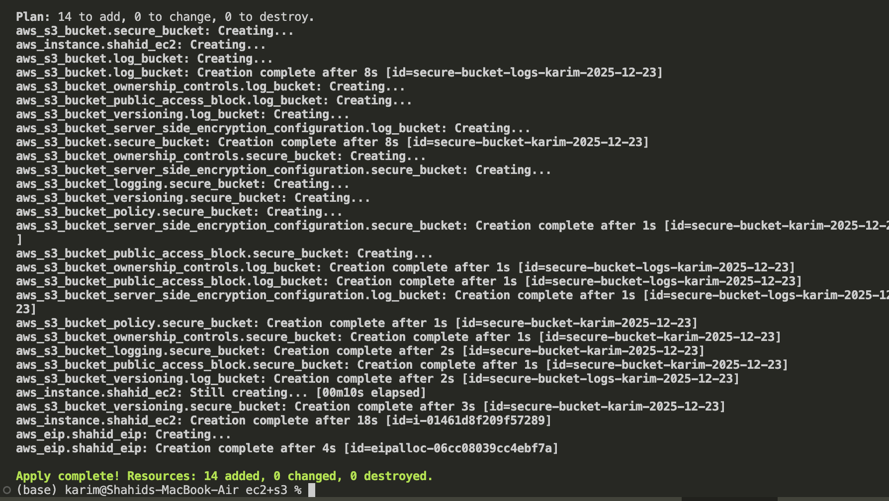

## AWS Console

### EC2

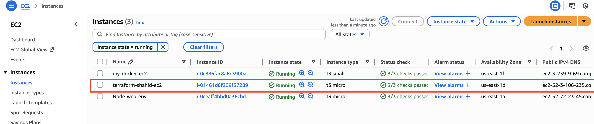

### EIP

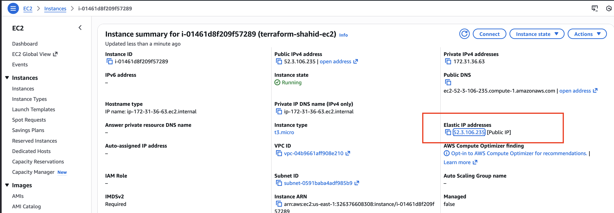

### S3

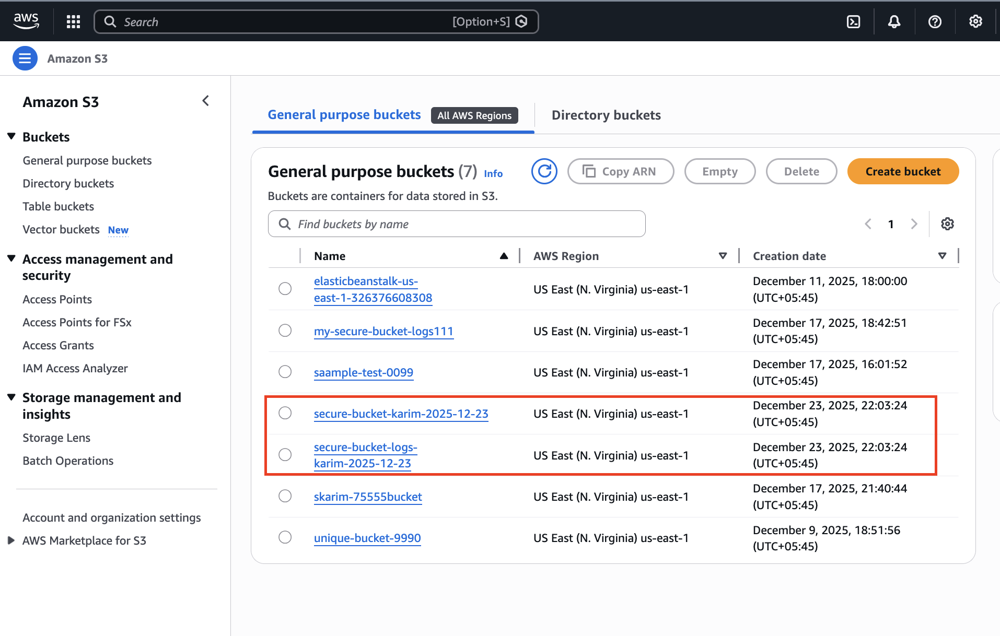

## TF State

Terraform state is a snapshot of our infrastructure that Terraform keeps to track:

- What resources exist.
- Their attributes (like IDs, ARNs, IPs, tags, etc.).
- How our configuration maps to real cloud resources.

Without state, Terraform **wouldn’t know what it created or needs to update**.

---

### How state works in our template

In our template, we have resources like:

- `aws_instance.shahid_ec2`
- `aws_eip.shahid_eip`
- `aws_s3_bucket.log_bucket`
- `aws_s3_bucket.secure_bucket`

When we run `terraform apply`:

1. Terraform creates these resources in AWS.
2. It stores a **state file** (`terraform.tfstate`) locally
3. Each resource is recorded with:
    - Resource type (`aws_instance`, `aws_eip`, `aws_s3_bucket`)
    - Resource ID (`i-0abc123...`, `eipalloc-0def456...`, bucket ARN)
    - Attributes (tags, subnet ID, versioning status, encryption, etc.)

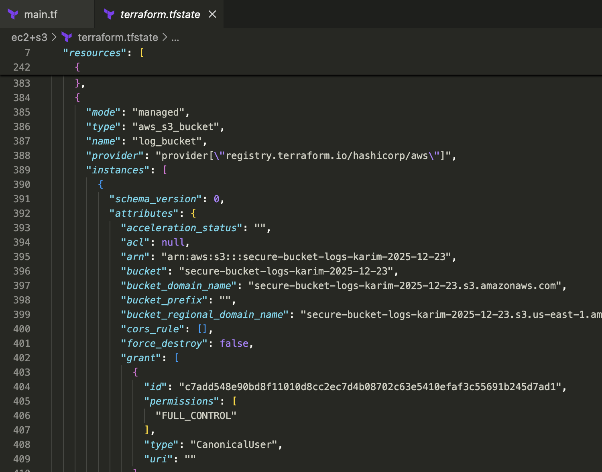

### Importance of state in the template

1. **EIP association**
    - Terraform uses the state to know which EC2 instance the EIP is attached to.
    - Without state, Terraform can’t tell which EIP belongs to which instance.
2. **S3 bucket updates**
    - Terraform tracks the bucket settings (logging, encryption, versioning).
    - If we change encryption or block public access, Terraform compares **desired config vs current state**.
3. **Resource IDs**
    - Terraform **needs IDs of existing resources** (VPC, subnet, and security group).
    - These are fetched via `data` blocks. State ensures that future applies **don’t recreate resources unnecessarily**.

### **Summary**

Terraform state is **the memory of our infrastructure**. In the main.tf:

- It tracks EC2, EIP, and S3 buckets.
- It ensures proper attachment of EIP and logging configuration.
- It prevents unnecessary recreation of resources.
- Losing the state file without remote backup can lead to **destructive consequences**