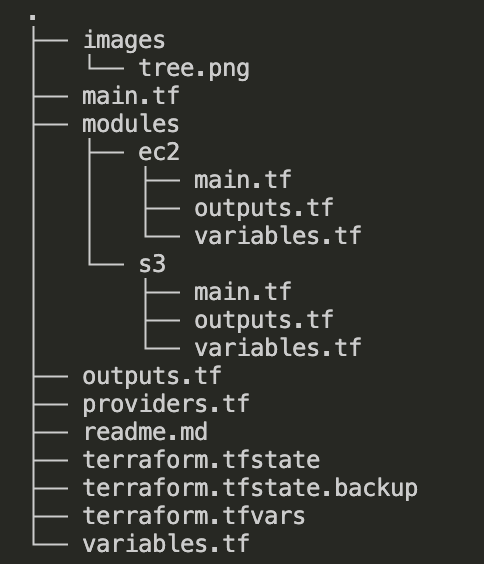
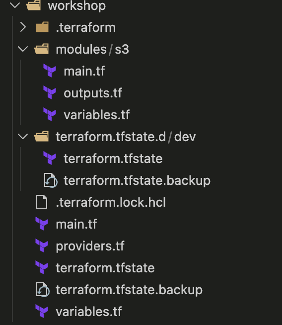
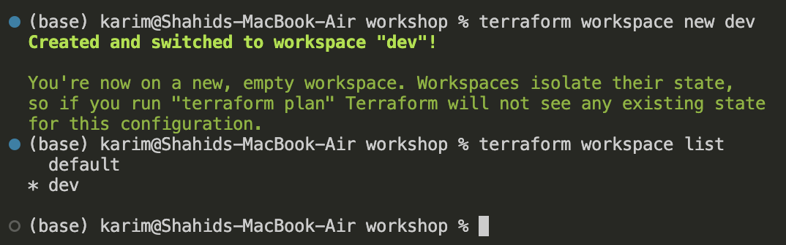

# Terraform: Modules and Reusability, Workspaces and Remote Backend

## Modules

- container for multiple resources that are used togethere and parameterized via variables.
- Like a function in programming

> Bottom line → Any terraform config is a module as we can use them again and again
> 

### Structure

- The Root Module is where you run terraform init/plan/apply
- Any module called via module "..." {} is a Child Module.



### Importance

- DRY logic → Dont Repeat Yourself
- Defaults
- Centralized fixes
- Consistent security posture.

<aside>
📌

**Terraform doesn't care about your structure → It is declarative**

Structuring is just for convenience.

</aside>

### Module Behavior

- Modules do not create providers!
- Providers are passed down → child modules inherit providers from root modules.

### Module Reusability

a reusable module needs:

- Meaningful variables
- sensible defaults
- validations
- Efficient and non-sensitive outputs

## Workspaces

- It is for local usage.
- A Terraform workspace allows you to use the same Terraform configuration while maintaining separate state files.
- The concept of Workspaces is to have One Source of configuration (.tf files) with…

…Multiple states (terraform.tfstate per workspace) under terraform.tfstate.d directory



```hcl
terraform.tfstate.d/dev
```

The dev is the workspace created

terraform.tfstate inside the ***terraform.tfstate.d/dev***  is state for dev workspace

### Benefits

- env seperation
- testing the changes without affecting the main state
- temporary or parallel experiments
- reduce Copy-pasting terraform code
- Maintaining multiple identical dir for small variations

### Workshop

in the terraform init dir/project

```hcl
terraform workspace show
```

Create new workspace

```hcl
terraform workspace new dev
```

```hcl
terraform workspace list
```



Make changes now.

Final file structure 


## Remote Backend

- storing .tfstate outside your local machine.

eg: in s3, GCS, terraform cloud

### Allows:

- Team Collaboration
- State Locking
- Safer State Management

Example

```hcl
terraform {
  backend "s3" {
    bucket         = "bootcamp-tf-state-bucket"
    key            = "prod/network/terraform.tfstate"
    region         = "ap-south-1"
    dynamodb_table = "terraform-locks"
    encrypt        = true
  }
}
```

<aside>
⚠️

- **S3** → stores the state file
- **DynamoDB** → stores the lock
- Only one Terraform process can write state at a time
</aside>

### **STATE LOCKING — vvimpt**

prevents multiple Terraform runs from modifying the same state file at the same time. It exists to avoid corruption, race conditions, and broken infrastructure.

Terraform uses a **state file (`terraform.tfstate`)** to track real infrastructure.

Without locking:

- Two people run `terraform apply` at the same time
- Both read the same old state
- Both try to change resources
- State gets **overwritten or corrupted**
- Infrastructure becomes inconsistent

👉 **State locking ensures only ONE operation can change state at a time.**