# Jenkins: Static Web App CICD


## Objectives

- Push code to **GitHub**
- **Jenkins** detects the push
- Jenkins copies files to **EC2 Server (ubuntu)**
- Files are served by **Nginx**

## Create a simple static site

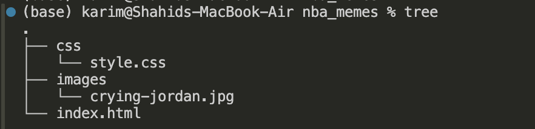

## Push to github

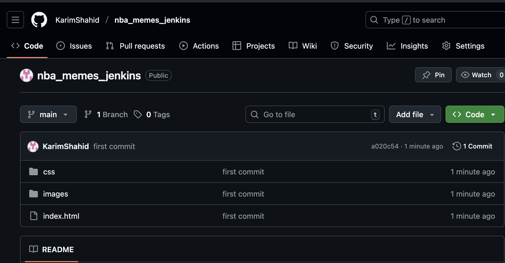

## Create EC2 server

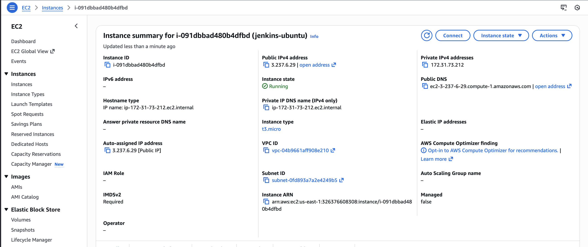

## Install nginx in the server

ssh in the server

```bash
sudo apt update
sudo apt install -y nginx
```

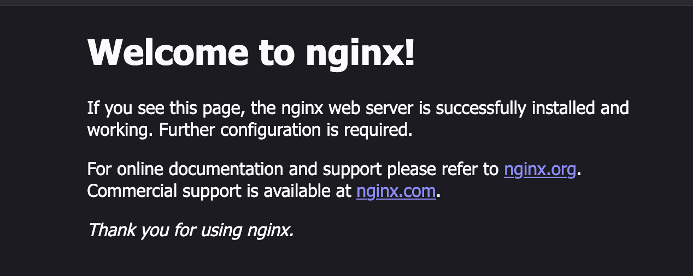

## Configuring EC2

### Editing the dir permission

```bash
chown -R ubuntu:ubuntu /var/www/html
```

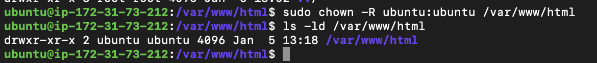

### Git Clone

```bash
git clone https://github.com/KarimShahid/nba_memes_jenkins.git .
```


## Jenkins

### deploy.groovy

```groovy
pipeline {
    agent any

    parameters {
        string(
            name: 'SERVER_IP',
            defaultValue: '3.237.6.29',
            description: 'EC2 public IP'
        )
    }

    environment {
        SSH_KEY64 = credentials('SSH_KEY64')
    }

    stages {
        stage('Configure SSH') {
            steps {
                sh '''
                mkdir -p ~/.ssh
                chmod 700 ~/.ssh
                printf "Host *\n\tStrictHostKeyChecking no\n\n" > ~/.ssh/config  
                cat ~/.ssh/config   #to verify
                touch ~/.ssh/known_hosts
                chmod 600 ~/.ssh/known_hosts
                '''
            }
        }

        stage('Prepare SSH Key') {
            steps {
                sh """
                touch mykey.pem
                echo "$SSH_KEY64" | base64 -d > mykey.pem && chmod 400 mykey.pem
                ssh-keygen -R ${params.SERVER_IP} 
                """
            }
        }

        stage('Deploy') {
            steps {
                sh """
                ssh -i mykey.pem ubuntu@${SERVER_IP} 'cd /var/www/html && git pull origin main'
                """
            }
        }
    }

    post {
        always {
            sh 'rm -f mykey.pem'
        }
        success {
            echo "✅ Deployment completed successfully"
        }
        failure {
            echo "❌ Deployment failed"
        }
    }
}

```

### Create new item: nba_memes

select pipeline

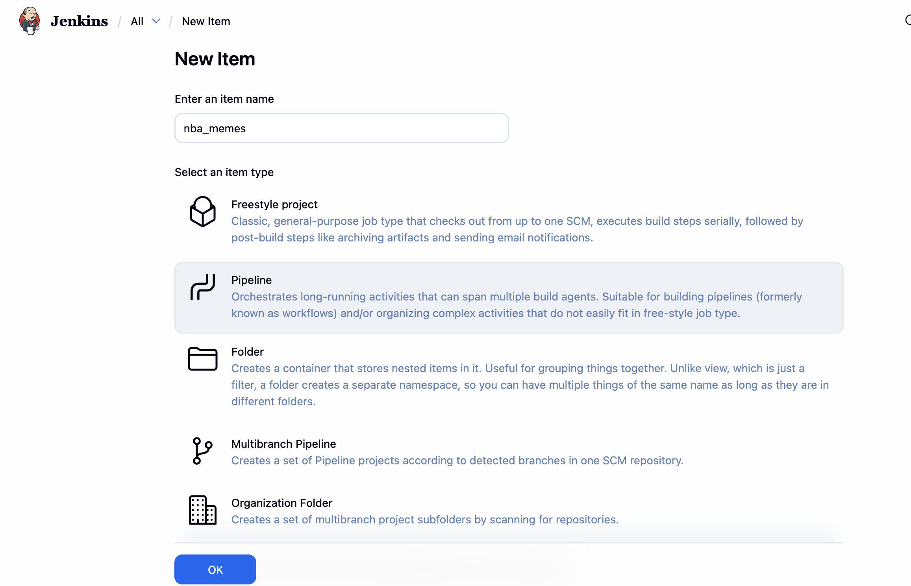

### Parameterize

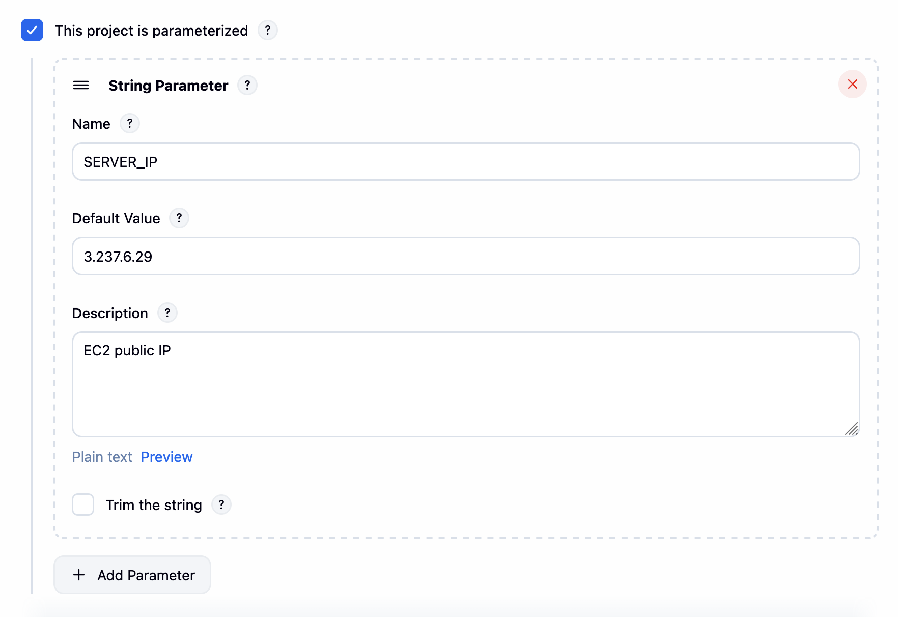

### Configuring Pipeline

Add git repo

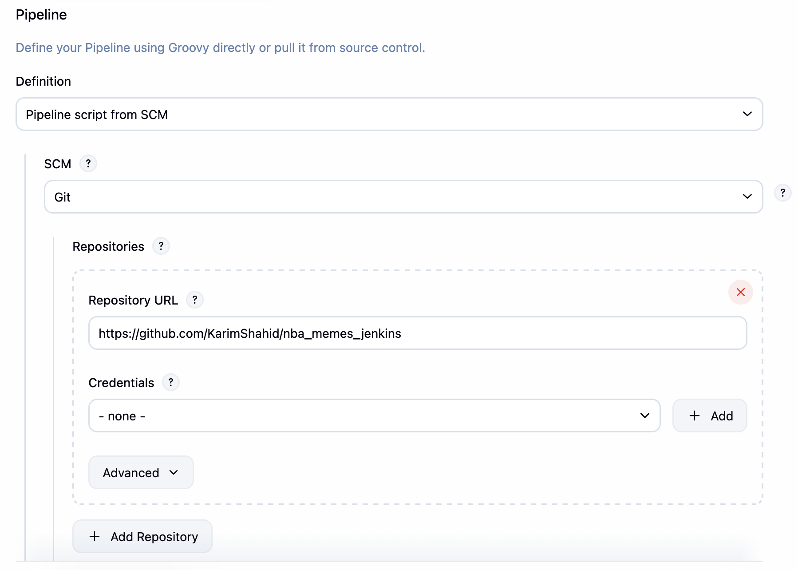

Add branch name

Add Script path mentioned in the repo

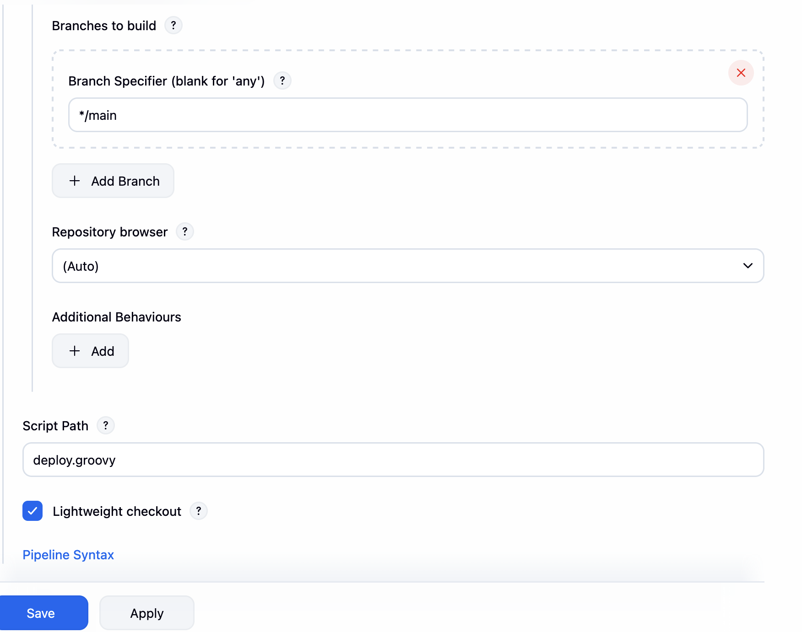

### Create SSH_KEY64 credential

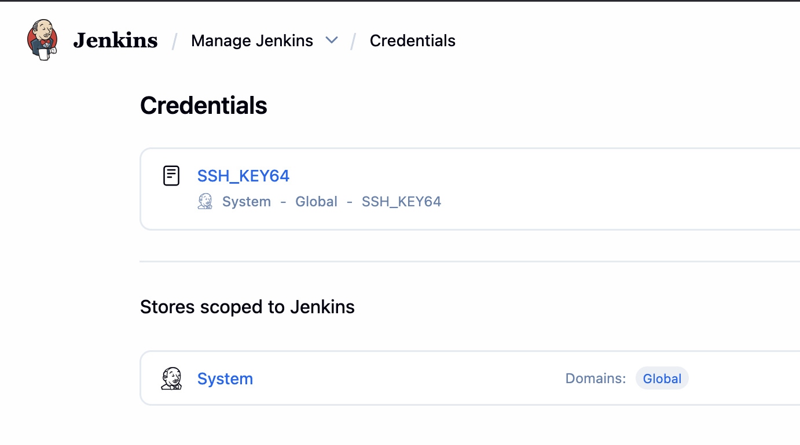

### Make changes to the file and push to git

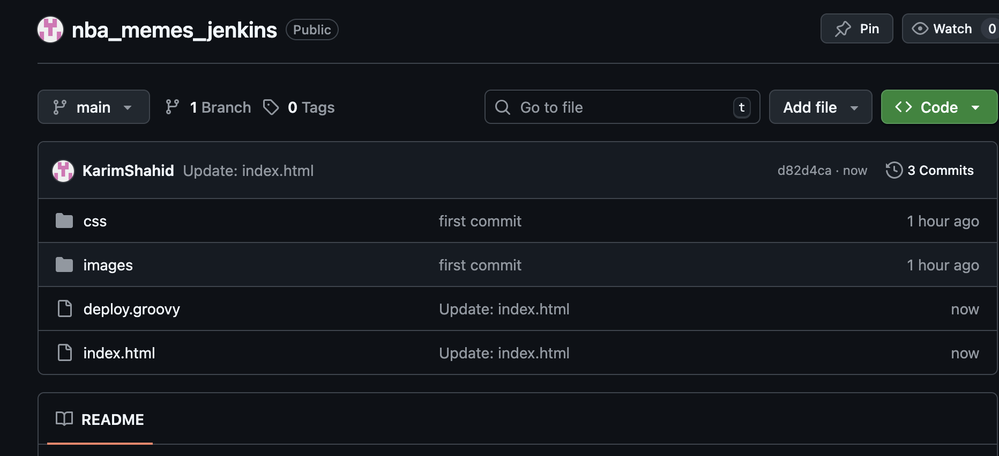

### Run the workflow

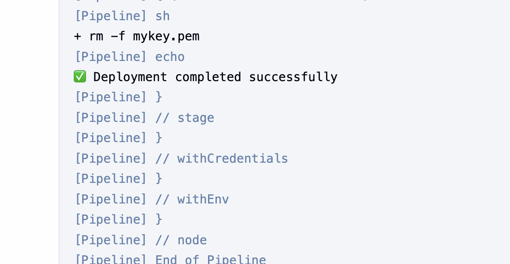

## Output!

