# Jenkin: Docker CICD

## Objectives

GitHub → Jenkins → Docker Build (multi-stage)
→ Push to Docker Hub
→ SSH into EC2 Ubuntu
→ Pull image
→ Run container

## Pre-requisites

### Need a working web app

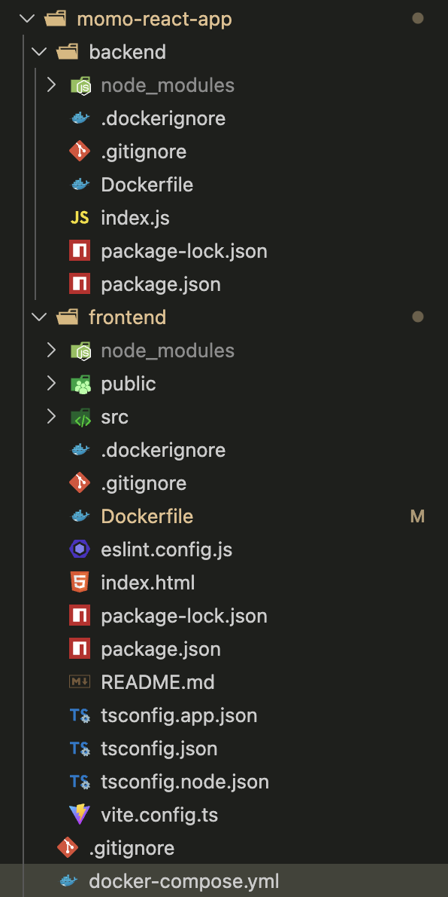

### EC2 (ubuntu)

Make sure that proper permissions are given

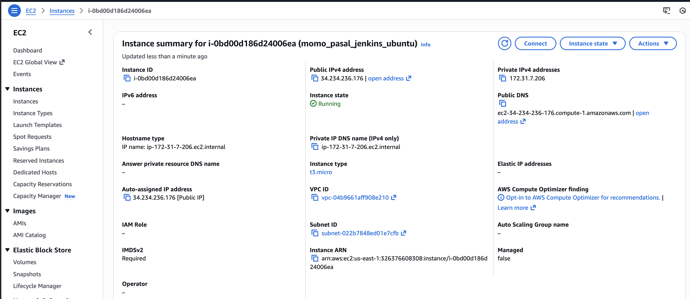


### Push to github repo

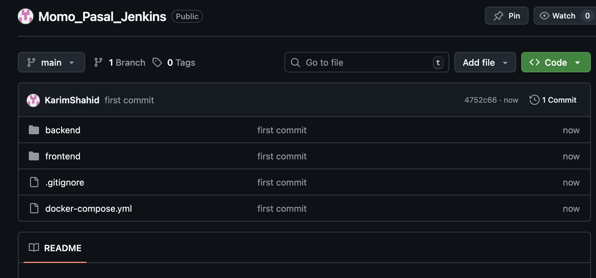

## Server Configs (first time only)

### Install Docker

https://docs.docker.com/engine/install/ubuntu/

```bash
# Add Docker's official GPG key:
sudo apt update
sudo apt install ca-certificates curl
sudo install -m 0755 -d /etc/apt/keyrings
sudo curl -fsSL https://download.docker.com/linux/ubuntu/gpg -o /etc/apt/keyrings/docker.asc
sudo chmod a+r /etc/apt/keyrings/docker.asc

# Add the repository to Apt sources:
sudo tee /etc/apt/sources.list.d/docker.sources <<EOF
Types: deb
URIs: https://download.docker.com/linux/ubuntu
Suites: $(. /etc/os-release && echo "${UBUNTU_CODENAME:-$VERSION_CODENAME}")
Components: stable
Signed-By: /etc/apt/keyrings/docker.asc
EOF

sudo apt update
```

```bash
sudo apt install docker-ce docker-ce-cli containerd.io docker-buildx-plugin docker-compose-plugin
```

Check if docker is running

```bash
sudo docker run hello-world
```

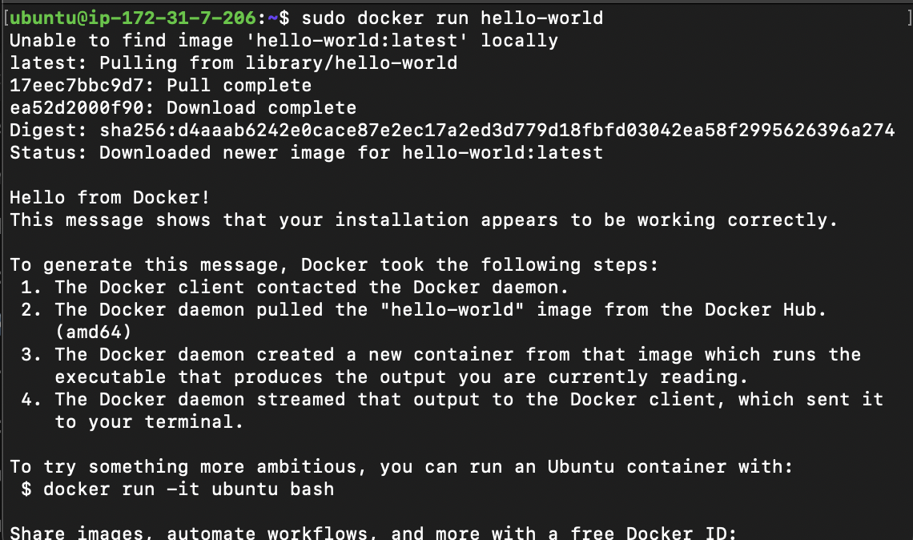

### Allow EC2 user to run Docker

```bash
sudo usermod -aG docker ec2-user

newgrp docker
```

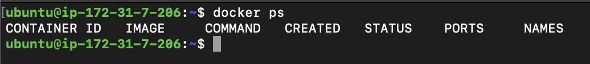

since docker ps is running without error, we can presume to be successful.

### Install Docker Compose

```bash
sudo apt-get install docker-compose-plugin
```

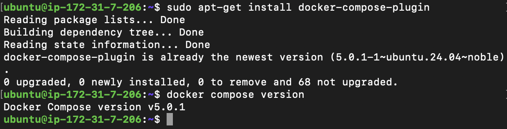

### Docker Configs

Create project directory

```bash
mkdir momo-app
cd momo-app
```

- Keeps everything organized
- Easier maintenance

Create a docker-compose.yml for the ec2

```bash
nano docker-compose.yml
```

```yaml
services:
  backend:
    image: karimshahid/backend:latest    # Docker Hub image
    container_name: momo-backend
    restart: always
    ports:
      - 4000:4000                    # EC2 port mapping
    networks:
      - momo-network

  frontend:
    image: karimshahid/frontend:latest   # Docker Hub image
    container_name: momo-frontend
    restart: always
    ports:
      - 80:80                           # EC2 port 80 -> container 80
    depends_on:
      - backend
    networks:
      - momo-network

networks:
  momo-network:
    driver: bridge
```

## Create pipeline

### Configure Docker Hub and AWS .pem File Credentials

Create new PAT in docker hub and use it here.

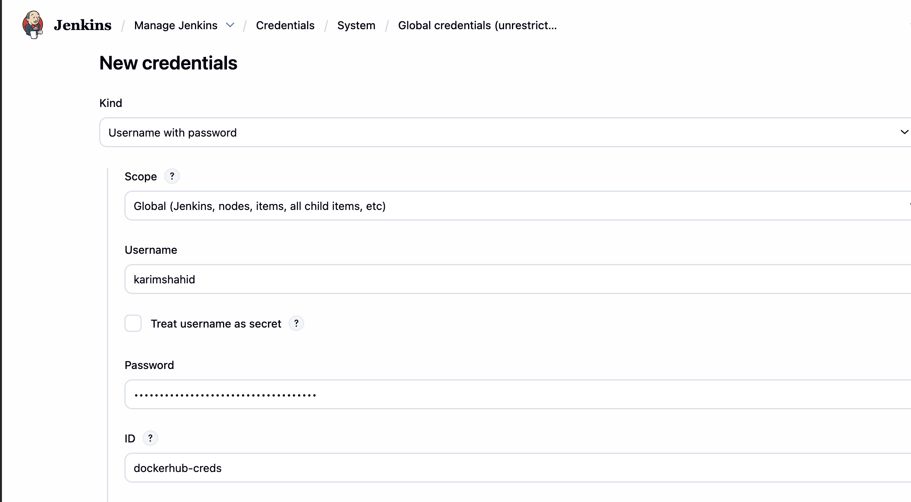

Use the Aws .pem file here

Username = ubuntu because we are using Ubuntu server.


### Configure parameters

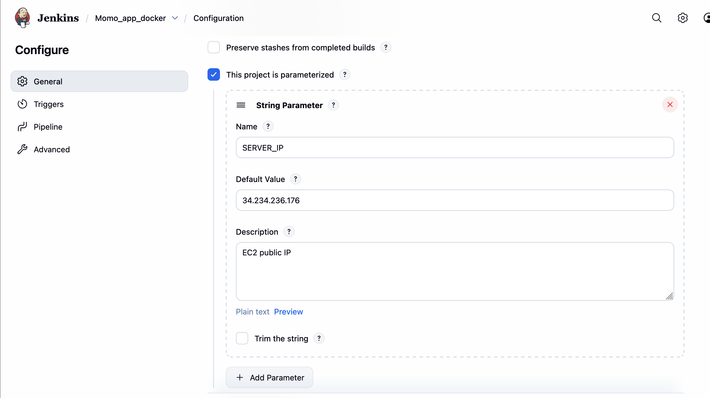

### Configure Pipeline

Add the git repo

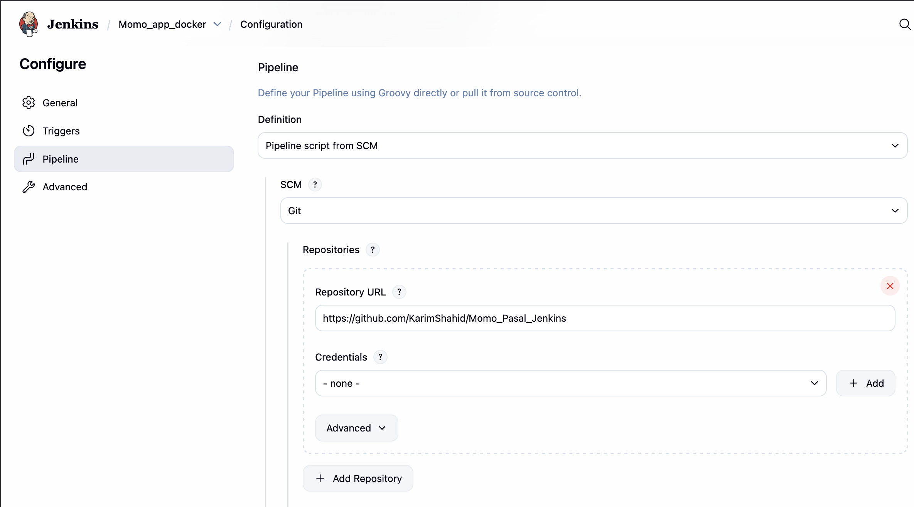

Add the branch name AND Add the script path name

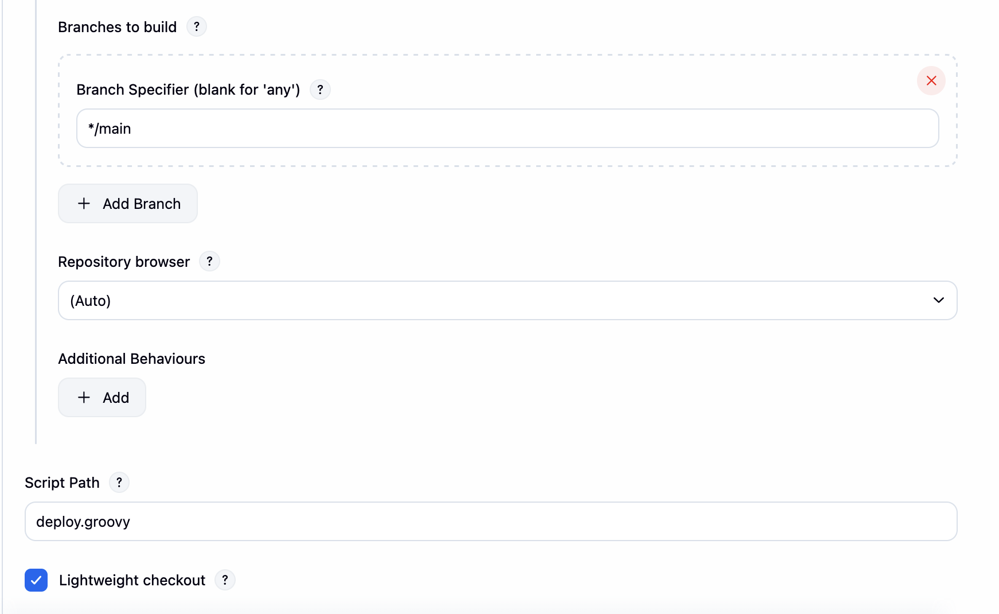

deploy.groovy

```groovy
pipeline {
    agent any

    parameters {
        string(
            name: 'SERVER_IP',
            defaultValue: '34.234.236.176',
            description: 'EC2 public IP'
        )
    }

    environment {
        FRONTEND_IMAGE = "karimshahid/frontend:latest"
        BACKEND_IMAGE  = "karimshahid/backend:latest"
    }

    stages {
        stage('Checkout Code') {
            steps {
                git branch: 'main',
                    url: 'https://github.com/KarimShahid/Momo_Pasal_Jenkins.git'
            }
        }

        stage('Build Backend Image') {
            steps {
                sh "docker build --platform linux/amd64 -t ${BACKEND_IMAGE} ./backend"
            }
        }

        stage('Build Frontend Image') {
            steps {
                script {
                    sh """
                    docker build --platform linux/amd64 \
                      --build-arg VITE_API_URL=http://${params.SERVER_IP}:4000/api \
                      -t ${FRONTEND_IMAGE} \
                      ./frontend
                    """
                }
            }
        }

        stage('Docker Login') {
            steps {
                withCredentials([usernamePassword(
                    credentialsId: 'dockerhub-creds',
                    usernameVariable: 'DOCKER_USER',
                    passwordVariable: 'DOCKER_PASS'
                )]) {
                    sh 'echo $DOCKER_PASS | docker login -u $DOCKER_USER --password-stdin'
                }
            }
        }

        stage('Push Images') {
            steps {
                sh """
                docker push ${BACKEND_IMAGE}
                docker push ${FRONTEND_IMAGE}
                """
            }
        }

        stage('Deploy to EC2') {
            steps {
                sshagent(['ec2-ssh']) {
                    sh """
                    ssh -o StrictHostKeyChecking=no ubuntu@${params.SERVER_IP} \\
                    'cd ~/momo-app &&
                     docker compose pull &&
                     docker compose down &&
                     docker compose up -d'
                    """
                }
            }
        }
    }

    post {
        success {
            echo "✅ Deployment completed successfully"
        }
        failure {
            echo "❌ Deployment failed"
        }
    }
}
```

<aside>
⚠️

Make sure that docker is running!

</aside>

## Final Result

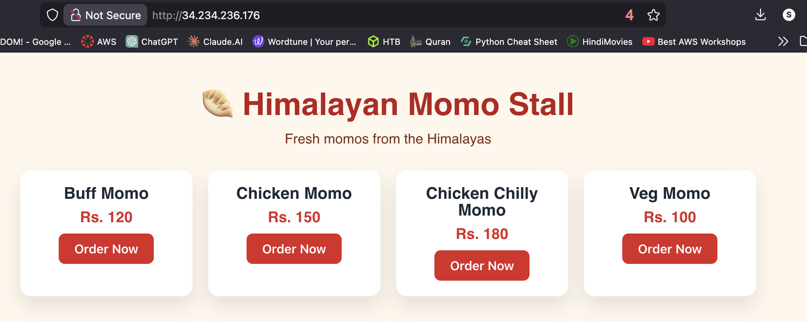