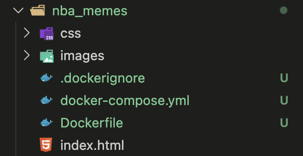
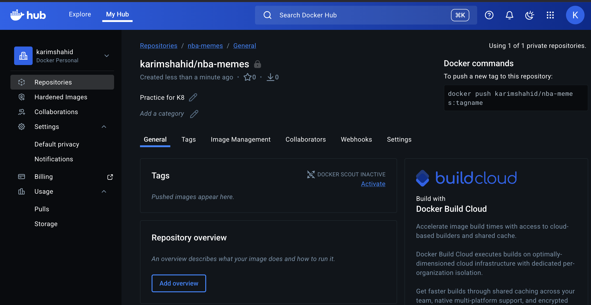
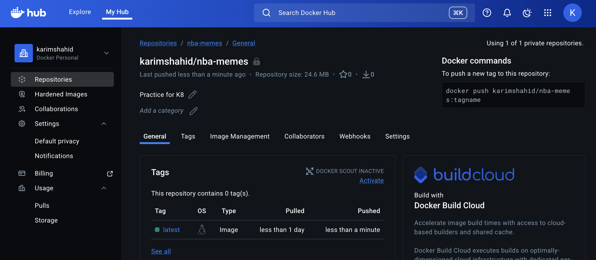
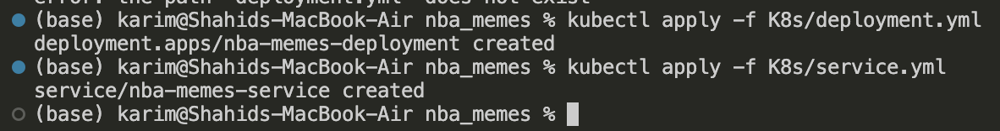
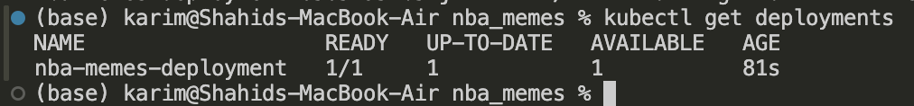
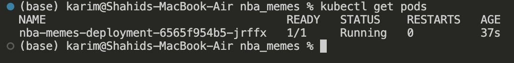
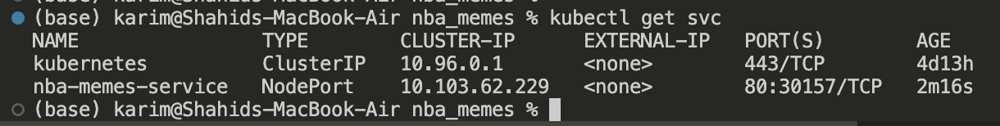
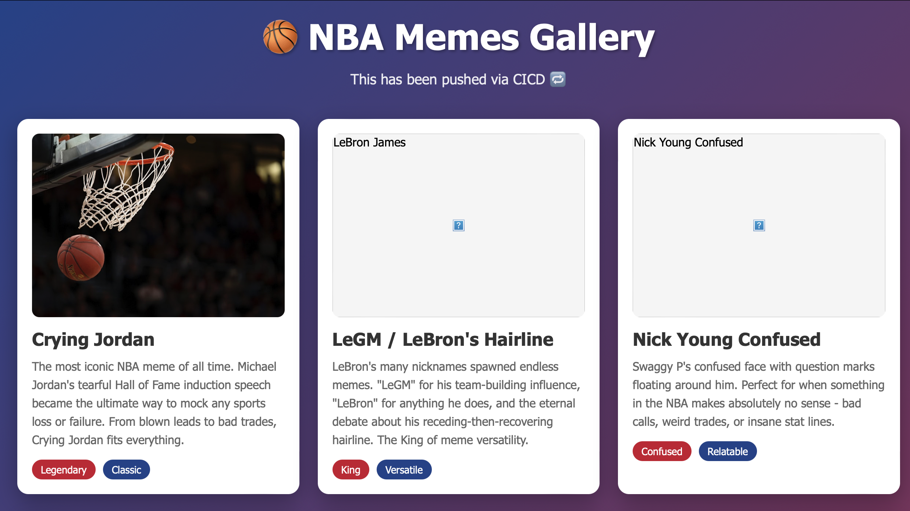

# K8: Deploy from a private Container Registry

## Objectives

- **Dockerize the app**
- **Push image to a *private* container registry**
- **Create Kubernetes Deployment**
- **Expose it using a Kubernetes Service**
- **Verify everything works**

## Pre-requisites

- Working web app



- Docker Login
- K8 (minikube)

## Upload the web app to docker hub

### Create a private repo in the docker hub



### Login in to docker hub

```bash
docker login
```

### Build image locally

tags as per `image:` field in the compose.yml

```bash
docker compose build
```

### Upload image

→ to Docker Hub ( private  or public)

```bash
docker push karimshahid/nba-memes:latest
```

- `karimshahid` → Docker Hub account
- `nba-memes` → repository name
- `latest` → tag (optional, defaults to `latest`)

### Output



## K8

## Create secret

```bash
kubectl create secret docker-registry my-dockerhub-secret \
  --docker-username=karimshahid \
  --docker-password=<your-docker-hub-password-or-token> \
  --docker-email=<your-email@example.com>
```

<aside>
❗

Use PAT from the docker hub for the password

</aside>

This secret allows Kubernetes to **authenticate and pull your private image**.

## deployment.yaml

```bash
apiVersion: apps/v1
kind: Deployment
metadata:
  name: nba-memes-deployment
  labels:
    app: nba-memes
spec:
  replicas: 1  # no of pods
  selector:
    matchLabels:
      app: nba-memes
  template:
    metadata:
      labels:
        app: nba-memes
    spec:
      containers:
        - name: nba-memes
          image: karimshahid/nba-memes:latest    # Private Docker Hub image
          ports:
            - containerPort: 80
          resources:
            requests:
              cpu: "100m"
              memory: "128Mi"
            limits:
              cpu: "500m"
              memory: "512Mi"
          readinessProbe:
            httpGet:
              path: /
              port: 80
            initialDelaySeconds: 5
            periodSeconds: 10
          livenessProbe:
            httpGet:
              path: /
              port: 80
            initialDelaySeconds: 10
            periodSeconds: 20
      imagePullSecrets:
        - name: my-dockerhub-secret   # reference the secret we created
        
```

**Step by step explanation:**

- **apiVersion** → `apps/v1` is the version for Deployments
- **kind** → `Deployment` tells K8s we want a Deployment (manages pods + replicas)

Deployments manage **pods** and allow scaling, rolling updates, and self-healing.

- **metadata.name** → unique name for the Deployment
- **metadata.labels**→ Labels are key-value pairs used to organize and select objects. Here, it labels this Deployment as `app=nba-memes`.

- **spec.replicas** → number of pods to run (for redundancy / load balancing)

Kubernetes ensures **exactly this many pods** are running.

- **spec.selector.matchLabels** → Matches pods with the same label.

Ensures that the Deployment **manages the right pods**. Pods with `app=nba-memes` are controlled by this Deployment.

- **template.metadata.labels** → Labels for pods created by this Deployment

These labels **must match the selector** (`app=nba-memes`) or Kubernetes won’t know which pods belong to the Deployment.

- **spec.containers** → container spec inside the pod
    - `name` → container name
    - `image` → Docker Hub image to run (private repo)
    - `ports.containerPort` → the port inside the container
    
    > Used by Services and for documentation; must match the port the application is actually listening on (Nginx listens on 80).
    > 

- **resources.requests** → Minimum resources Kubernetes will guarantee to the pod.
    - `100m CPU` = 0.1 CPU
    - `128Mi memory` = 128 megabytes
- **resources.limits** → Maximum resources the pod can use.
    - `500m CPU` = 0.5 CPU
    - `512Mi memory` = 512 megabytes
- **Why important:**
    - Prevents one pod from using all cluster resources
    - Helps with scheduling, autoscaling, and stability

- **spec.container.readinessProbe:** Kubernetes checks if the pod is ready to **receive traffic**.
- **`httpGet`** → Sends an HTTP GET request to `http://pod-ip:80/readyz`.
- **`initialDelaySeconds: 5`** → Wait 5 seconds before starting probes.
- **`periodSeconds: 10`** → Check every 10 seconds.
- **Effect:** If the readiness probe fails, the pod is **not added to the Service** endpoints.

> Since `/readyz`  doesn’t exist. Use `/` instead
> 

- **spec.container.livenessProbe**: Kubernetes checks if the pod is **alive**.
- If the liveness probe fails, Kubernetes **kills and restarts the pod** automatically.
- **`httpGet`** → Requests `http://pod-ip:80/healthz`.
- **`initialDelaySeconds: 10`** → Wait 10 seconds before the first check.
- **`periodSeconds: 20`** → Check every 20 seconds.

> Since `/healthyz`  doesnt exist. Use `/` instead
> 

**imagePullSecrets:** Kubernetes needs credentials to pull from **private Docker Hub repo**.

## service.yml

```bash
apiVersion: v1
kind: Service
metadata:
  name: nba-memes-service
  labels:
    app: nba-memes
spec:
  selector:
    app: nba-memes      # Selects pods with this label so it must match pod labels
  ports:
    - protocol: TCP
      port: 80          # Cluster-internal port
      targetPort: 80    # Container port
  type: NodePort        # # Exposes service outside cluster via node port || change to LoadBalancer if running in cloud

```

- **apiVersion** → `v1` for Services
- **kind** → `Service`
- **metadata.name** → service name
- **spec.type** → `NodePort` exposes your service externally (good for local minikube or bare-metal)
- **spec.selector** → selects pods labeled `app: nba-memes`
- **ports:**
    - `port` → internal cluster port (other pods can talk to it on this port)
    - `targetPort` → container port inside the pod
    - `nodePort` → external port on each node for outside access

> Once deployed, you can access the app at: http://<node-ip>:30080
> 

## Apply

```bash
kubectl apply -f deployment.yml
kubectl apply -f service.yml
```



### Get deployments

```bash
kubectl get deployments
```



### Get pods

shows pods created

```bash
kubectl get pods
```



### Get services

shows service with NodePort

```bash
kubectl get svc
```



### How it all works together

1. **Deployment** ensures 1 pod is running `karimshahid/nba-memes:latest`
2. Kubernetes uses the **imagePullSecret** to authenticate with Docker Hub
3. **Service** exposes pods to the outside world
4. NodePort lets you visit your static site in the browser

## Test Access

```bash
minikube service nba-memes-service
```

